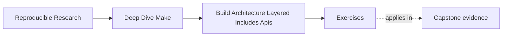
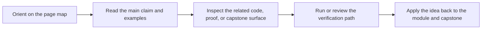

# Exercises

<!-- page-maps:start -->
## Page Maps

<!-- page-maps:end -->

Use these after reading the five core lessons and the worked example. The goal is not to
show off Make cleverness. The goal is to make your architecture reasoning visible.

Each exercise asks for three things:

- the architecture fact or boundary you are trying to establish
- the evidence or inspection path that would establish it
- the refactor or policy decision that follows from that evidence

## Exercise 1: Define a public target surface

Take a Make-based repository with several top-level targets and decide which ones should be
public and which ones should stay internal.

What to hand in:

- the public target list
- one sentence of contract meaning for each public target
- one target that should be demoted to internal and why

## Exercise 2: Split one Makefile into layers

You inherit a single large Makefile that mixes shell policy, source discovery, artifact
rules, and release logic.

Sketch a layered `mk/*.mk` design that separates those responsibilities.

What to hand in:

- the top-level include order
- one sentence describing the job of each layer
- one example of a mutation or override that the new structure should make easier to review

## Exercise 3: Decide whether a macro is justified

A teammate wants to replace three similar explicit rules with one macro plus `call` and
`eval`.

Explain how you would decide whether that abstraction improves the build or turns it into a
private language.

What to hand in:

- the invariant the macro would protect
- one reason to keep the explicit rules instead
- one inspection command or technique you would use after the refactor

## Exercise 4: Prepare the repository for growth

A second subsystem is about to be added under `src/lib/`, but the current build assumes a
flat `src/*.c` layout and flat output names.

Describe how you would redesign discovery and naming so the graph stays stable and
ownership stays legible.

What to hand in:

- the new discovery roots
- the new output naming or namespacing pattern
- one concrete collision or ambiguity the redesign prevents

## Exercise 5: Review a build architecture before it rots

Take an existing Make architecture and write a short review note focused on future risk
rather than current success.

What to hand in:

- one public API risk
- one layer-boundary risk
- one reuse or naming risk
- one recommendation that should be made before the next growth step lands

## Mastery standard for this exercise set

Across all five answers, the module wants the same habits:

- you name the architectural boundary being tested
- you choose inspection and evidence before proposing the cleanup
- you explain the cleanup in terms of API clarity, responsibility, reuse discipline, or growth safety

If an answer says only "the Makefiles need cleanup," keep going.
