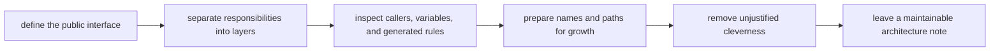
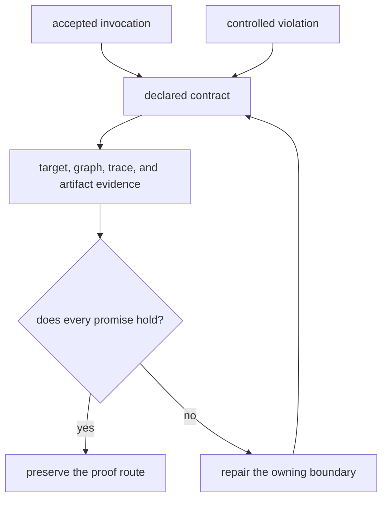

# Exercises

Use these after reading the five core lessons and the worked example. The goal is not to
show off Make cleverness. The goal is to make your architecture reasoning visible through
interfaces, ownership, and growth-safe structure.

Generate the shared evidence before beginning:

```sh
cd programs/reproducible-research/deep-dive-make/capstone
gmake architecture-contract-audit
```

Keep `summary.tsv`, `report.json`, the traces, and the workspaces open. Several exercises
ask you to move from those controlled models to a repository of your own.

## How to work through this set

Treat the ten exercises as one full lab day on build architecture review.

Before each answer:

1. name the interface or responsibility boundary you are testing
2. choose the inspection path that would make that boundary visible
3. predict the accepted and rejected observations before running the build
4. state what structural decision would follow if the evidence confirms your concern

If you skip the boundary question, architecture work collapses into vague cleanup talk.
This module is about making the Makefile itself reviewable as an interface.

Do the exercises in order. The day is one progression:

- Exercises 1-3 define the public target surface, include layers, and abstraction limits
- Exercises 4-6 prepare the build for growth and document the interface for contributors
- Exercises 7-9 audit automation, variable ownership, and macro inspection honestly
- Exercise 10 turns those ideas into one real refactor of a mixed-responsibility build

Keep one architecture packet as you go. By the end of the day it should contain:

- one public target contract list
- one supported-parameter and failure contract
- one include-layer ownership map
- one dependency-direction ledger
- one abstraction decision you can defend either way
- one total, injective, reversible, and stable namespace proof
- one automation audit against the public API
- one short architecture review naming a remaining risk

If those eight artifacts are missing, you are probably editing layout without improving the
build’s long-term interpretability.

## Recommended working layout

If you want one lab tree that can support the whole day, use something like:

```text
build-architecture-lab/
├── Makefile
├── mk/
├── src/
│   ├── app/
│   └── lib/
├── scripts/
├── .github/
├── notes/
└── artifacts/
```

Use this ownership map in every architecture answer:

| Responsibility | Owning file | Public consumer | Evidence that the boundary holds |
| --- | --- | --- | --- |

A file list without responsibilities is not an architecture explanation.

Also keep one caller map:

| Caller | Target invoked | Public or internal | Why that status is justified |
| --- | --- | --- | --- |

That second table matters because automation often becomes the real consumer of your build
interface long before humans read `help`.

Keep a third table for dependency direction:

| Consumer layer | Provider layer | Imported name or target | Allowed direction | Evidence |
| --- | --- | --- | --- | --- |

An include-order sketch is not a substitute. The ledger must expose variable assignments,
goal inspection, generated rules, and other meaning edges that do not appear in an
`include` line.


```mermaid
flowchart LR
  surface["define the public interface"]
  layers["separate responsibilities into layers"]
  inspect["inspect callers, variables, and generated rules"]
  grow["prepare names and paths for growth"]
  simplify["remove unjustified cleverness"]
  review["leave a maintainable architecture note"]

  surface --> layers --> inspect --> grow --> simplify --> review
```

Use that route on purpose. It keeps the day centered on ownership and interface clarity
instead of on cosmetic reshuffling.


```mermaid
flowchart TD
  accepted["accepted invocation"] --> contract["declared contract"]
  rejected["controlled violation"] --> contract
  contract --> evidence["target, graph, trace, and artifact evidence"]
  evidence --> decision{"does every promise hold?"}
  decision -->|yes| preserve["preserve the proof route"]
  decision -->|no| repair["repair the owning boundary"]
  repair --> contract
```

Use both branches in every exercise where a rejection case is requested. Passing evidence
shows the intended route works; rejected evidence shows the check can distinguish a lie.

## Exercise 1: Define a public target surface

Start with the `public-api/private-caller` specimen. Compare its `help` output with
`automation-private.sh`, then run that caller. Decide which target is a promise, which
target is merely reachable, and which promised evidence the caller bypasses.

Extend the control with `PROFILE=ordinary|strict`. Reject any other value before artifact
work. Make `verify` record the effective profile without exposing `internal-build`.

What to hand in:

- the exact help output and caller command
- a table classifying `help`, `verify`, and `internal-build`
- the caller's exit status and the two expected artifact-presence observations
- the audit finding that justifies your classification
- a five-field contract covering invocation, parameters, results, side effects, and failure
- accepted evidence for `PROFILE=strict` and rejected evidence for one misspelling
- one repair that does not enlarge the public API

Study note:
Reachability is a property of Make's graph. Public status is a compatibility promise.
Successful use of a private target does not turn it into a sound interface.

## Exercise 2: Split one Makefile into layers

Compare the two `include-ownership` specimens. They already have identical `mk/*.mk`
layouts, yet only one keeps release policy inside the release branch. Explain why the
file split fails to enforce the intended boundary, then apply the same analysis to one
Makefile that mixes policy, discovery, artifact rules, and release logic.

Add one prerequisite shared by ordinary and release branches. Run `all release`,
`release all`, and a parallel combined-goal invocation. Decide whether the shared artifact
must be policy-neutral or needs policy-specific output paths. Then add the result to a
dependency-direction ledger.

What to hand in:

- the four artifact flag values from the paired specimens
- the assignment and scope responsible for each pair of values
- a proposed include order and responsibility table for your Makefile
- one executable check showing ordinary policy is unchanged by a release-only decision
- the three combined-goal traces and the policy promised for the shared prerequisite
- a repair that removes goal-order dependence
- one forbidden dependency direction and a rejection check for it
- one sentence distinguishing include order from variable scope

Study note:
Identical filenames and include order can still enforce different contracts. Ownership is
established by where a value propagates and by evidence from the affected targets.

## Exercise 3: Decide whether a macro is justified

Compare the `explicit-rules` and `bounded-macro` specimens from the abstraction audit.
Treat the explicit rules as a contract baseline, not as the automatically preferred
implementation. Prove whether the macro preserves that contract.

Trace one generated recipe through raw definition, call expansion, parsed rule, recipe-time
Make expansion, and shell expansion. Replace any fixed scratch name with a target- and
process-local candidate, then interrupt a producer and inspect both final and candidate
paths.

What to hand in:

- a target, prerequisite, policy, publication, and owner table for the explicit model
- the bounded macro’s owner list and call-domain output
- the evaluated target/prerequisite map from both models
- a byte-level comparison of both artifact pairs
- an expansion ledger for automatic variables, shell variables, and shell process ID
- a failed-publication trace proving no partial final artifact or shared candidate remains
- a search proving the macro performs no ordinary parse-time I/O
- a keep/remove decision with one stated limit of the evidence

Study note:
Line count is not a contract. The macro earns consideration only after its evaluated graph
and artifacts match the explicit baseline.

## Exercise 4: Prepare the repository for growth

Run both `output-ownership` specimens. Trace how two sources named `util.txt` become either
one flat output or two namespaced outputs. Then extend the control with a third source root
that uses the same basename.

Add a deeper owner, one documented second extension, one unsupported extension, and either
a symlink or generated source. State the domain policy before running discovery. Produce a
machine-readable forward and reverse map.

What to hand in:

- the evaluated source and output lists for both original models
- source count and unique-output count for each model
- the contents and owner of every produced artifact
- the third root's discovery and path-mapping rule
- one assertion each for totality and injectivity
- a reverse-map check that reconstructs every supported source exactly
- extension, symlink, and generated-source acceptance or rejection evidence
- a stability observation showing an unrelated source does not rename existing outputs

Study note:
Sorting can make a collision deterministic without preserving ownership. Count unique
outputs and inspect artifact identity; do not infer safety from stable ordering.

## Exercise 5: Review a build architecture before it rots

Choose one architecture claim from the course audit bundles and review the corresponding
surface in another Make repository. Keep the investigation bounded enough that another
learner can rerun it without your explanation.

Your claim must involve dependency direction, not only final artifact bytes. Classify
import, meaning, and graph edges. Inject one semantic feedback loop—for example, discovery
that inspects a public goal—and prove the gate rejects it.

What to hand in:

- one claim naming its owner and consumer
- one observation that would falsify the claim
- the smallest source, evaluated-graph, and runtime evidence needed
- a dependency ledger with allowed and forbidden directions
- the changed owner’s downstream evidence cone
- a defect/control comparison or controlled mutation
- rejection evidence for the feedback loop and the repaired one-way route
- an accept, repair, or defer record with a remaining limit and future trigger

Study note:
Separate observations from conclusions. Preserve complete raw evidence in the packet, but
quote only the entries that support the decision.

## Midday self-check

Before you move into interface publishing, automation audits, and macro inspection, make
sure your packet can already answer these questions cleanly:

- which targets are truly public and why
- which include layer owns policy, discovery, and artifact edges respectively
- which abstraction you would reject even if it reduced duplication
- which path collision, unsupported input, or renaming instability your mapping rejects
- which dependency direction your review gate forbids

If you cannot answer those four questions in plain language, return to Exercises 1-5 and
make the packet more explicit before continuing.

## Exercise 6: Publish a useful `help` target

Extend a disposable copy of the public-API control with public targets for building,
testing, verifying build invariants, cleaning, and showing help. Keep `internal-build`
reachable but private. Write one script that uses only the help output to select the
verification route.

Give each public route a stable outcome, supported parameters, promised evidence, and
failure meaning. Emit a tab-separated contract view for machine callers; keep the human
help readable rather than forcing callers to scrape prose.

What to hand in:

- the explicit public-target list
- the human help and machine-readable contract output
- the script's selected target and exit status
- the artifacts that prove the selected target fulfilled its contract
- a negative check showing `internal-build` is absent from help
- an unsupported-parameter call that fails before publication
- one compatibility consequence of renaming a listed target

Study note:
If help only repeats names, the caller still needs source knowledge. A useful description
states the outcome or evidence the target promises.

## Exercise 7: Audit automation against the public API

Audit two environments. First compare `automation-private.sh` and
`automation-declared.sh` with their Makefile's help output and artifacts. Then search a
repository's CI, release, and developer scripts for Make invocations and apply the same
test.

Include recursive Make calls in the search. For one supported parameter, prove whether the
parent forwards its effective value explicitly. Contrast that with an ambient environment
value that the child should not inherit as an undocumented API.

What to hand in:

- the search command
- a table of caller, target, and public or internal status
- a promised-evidence column for every public invocation
- the two specimen findings and the observation that distinguishes them
- one repaired repository caller with before-and-after command lines
- parent and child traces for a supported parameter and a rejected ambient value
- evidence that the repaired caller receives the full public contract

Study note:
Do not repair a private call by listing every helper in `help`. Either move the caller to
an existing promise or deliberately design a new stable contract.

## Exercise 8: Make variable ownership inspectable

Start from `include-ownership/global-mutation`. Explain why the ordinary artifact receives
`-DRELEASE`, repair the release decision without changing the include filenames, and test
the repair from clean state. Then choose one variable that several includes mutate in
another repository and assign its ownership using the same method.

Make an ordinary and specialized target share one prerequisite. Use both goal orders and
parallel execution to expose inheritance ambiguity. Choose and justify one repair:
policy-neutral shared output, distinct policy paths, or a narrowly justified `private`
target-specific variable.

What to hand in:

- the old global mutation and repaired target-scoped assignment
- ordinary and release artifact contents before and after repair
- `$(origin ...)`, `$(flavor ...)`, or `gmake -p` evidence for your repository variable
- the target branches allowed to specialize that variable
- the shared prerequisite’s values under both goal orders and parallel execution
- the repaired ownership rule and why its output identity is honest
- one case where command-line override is supported and one invariant that must reject it

Study note:
Variable database output proves the evaluated value; target artifacts prove where that
value propagated. Use both when scope is the contract under review.

## Exercise 9: Inspect a macro instead of trusting it

Start from `bounded-macro`. Add a third owner and confirm the expected rule appears. Then
inject one unrelated target or policy assignment into the macro body and show which
evidence surface exposes the side effect.

Capture all five expansion views for one call. Add a deliberately incorrect dollar escape
and predict whether it disappears during evaluation, reaches the shell literally, or
changes the wrong variable. After diagnosing it, restore the bounded macro and run two
independent publishers against a controlled fixture.

What to hand in:

- the third owner’s source, generated target, and artifact contents
- the relevant `gmake -npRr all` entries before and after mutation
- help output compared with every generated callable target
- artifact modes before and after mutation
- raw definition, call-expanded text, parsed database entry, recipe trace, and shell trace
- the incorrect-escape prediction and observed failure
- candidate paths from both publishers and proof that neither is shared
- the rejection-test result and a repair that restores one-responsibility generation

Study note:
Inspect both dispatched artifacts and undispatched target surface. A successful `all` run
cannot prove that the macro generated nothing else.

## Exercise 10: Refactor a growing build

Take a Makefile that exhibits or could exhibit private automation calls, hidden parameter
contracts, cross-layer policy mutation, shared-prerequisite ambiguity, lossy output
mapping, opaque generation, and reverse layer dependencies. Preserve baseline evidence,
repair each boundary independently, and add rejection checks that make a dishonest repair
fail.

What to hand in:

- a before-and-after contract table with target, parameter, policy, mapping, publication,
  and dependency-direction observations
- human help, machine-readable contract output, and the actual automation command
- ordinary, release, combined-goal, and recursive-call policy values
- forward and reverse maps proving totality, injectivity, reversibility, and stability
- macro expansion and interrupted-publication evidence
- clean-run, no-op, parallel-run, and rejection-test evidence
- a review note naming one remaining architecture risk and its future proof route

Study note:
Do not accept a new tree as the result. Accept changed observations, preserved public
meaning, and tests that fail when the claimed ownership boundaries are violated.

## Before you read the answers

Do not open `exercise-answers.md` until you can already point to:

- one clear public target contract
- one include layer with a single responsibility
- one macro you kept or rejected for a reason you can defend
- one future-growth risk you can already see
- one automation caller that forced you to clarify the interface
- one shared prerequisite whose policy identity you can defend
- one rejected dependency direction

If you do not yet have those seven things, the answer page will sound stronger than it can
teach.

## Mastery standard for this exercise set

Across all ten answers, the module wants the same habits:

- you name the architectural boundary being tested
- you choose inspection and evidence before proposing the cleanup
- you explain the cleanup in terms of API clarity, responsibility, reuse discipline, or
  growth safety
- you prove one rejected case instead of presenting passing output alone

If an answer says only "the Makefiles need cleanup," keep going.
