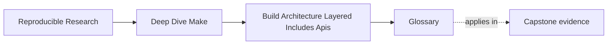
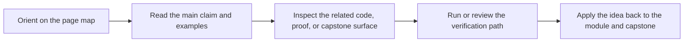

# Glossary

<!-- page-maps:start -->
## Page Maps

<!-- page-maps:end -->

Use this glossary to keep the language of Module 07 stable while you move between the core
lessons, worked example, and exercises.

The goal is not more jargon. The goal is to make sure the same architectural fact keeps the
same name whenever you explain a public target, an include boundary, or a macro reuse
decision.

## How to use this glossary

If a build-architecture discussion starts drifting into vague phrases like "the Makefiles
are kind of modular" or "this target is sort of public," stop and look up the term doing
the most work in the argument. Module 07 becomes much clearer when the team agrees on the
right nouns.

## Terms in this module

| Term | Meaning in this module |
| --- | --- |
| build API | The small set of public targets that humans and automation are meant to rely on. |
| call site | The place where a Make macro is invoked with arguments, often the best place to judge whether the abstraction is helping or obscuring. |
| component namespace | A naming scheme such as `build/app/*` or `build/lib/*` that keeps ownership visible and avoids collisions. |
| discovery root | A directory boundary that the build intentionally searches when assembling source or generated file lists. |
| hidden mutation | A variable or rule change that occurs across layers in a way that is hard to see or review. |
| implementation target | A target that exists to support the build internally and is not part of the stable public contract. |
| include layer | A `mk/*.mk` file with a bounded architectural role, such as shared policy, discovery, or core target definitions. |
| interface drift | The gradual expansion or mutation of the public target surface without deliberate design. |
| namespacing | A naming discipline that keeps targets and outputs distinct across subsystems or stages. |
| optional layer | An include file such as `mk/local.mk` that may extend convenience behavior but is not required for core correctness. |
| policy layer | The part of the build that defines tools, shell rules, flags, or global options rather than graph shape. |
| private language | A build design that relies so heavily on macros, hidden conventions, or historical knowledge that ordinary targets are no longer easy to explain. |
| public target | A target whose name and meaning are intended to remain stable for users, scripts, or CI. |
| responsibility boundary | The line that says which file, layer, or abstraction owns a specific architectural concern. |
| reuse invariant | The correctness rule or repeated shape a macro is meant to enforce, such as atomic publication or a standard compile rule. |
| rooted discovery | Discovery restricted to explicit directories that are part of the build contract, usually combined with stable ordering. |
| top-level surface | Another way to talk about the public API exposed from the top-level `Makefile`. |
| override hazard | A place where variable mutation or include order can silently change behavior without a clear architectural contract. |

## The vocabulary standard for this module

When you explain a Module 07 incident, aim to say things like:

- "CI is calling a private target"
- "`mk/objects.mk` owns discovery and mapping"
- "that macro protects one compile invariant"
- "the output naming needs a component namespace"
- "this layer introduces hidden mutation"

Those sentences are far more useful than saying only "the Makefiles are messy."
