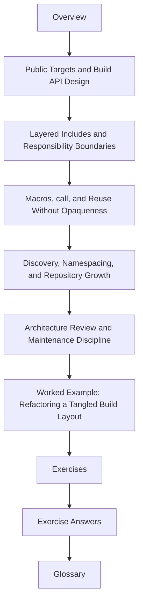

# Module 07: Build Architecture, Layered Includes, and Build APIs

Once a Make build starts working, teams usually try to reuse it, extend it, and share it.
That is where many repositories become hard to explain:

- the main `Makefile` turns into a catalog of private helper targets
- `mk/*.mk` files mutate each other in surprising ways
- macros compress duplication while also hiding the graph
- CI, release scripts, and humans all start depending on different unofficial entrypoints

Module 07 is about scaling a Make build without turning it into a private language.

## What this module is for

By the end of Module 07, you should be able to explain five things clearly:

- which targets are part of the public build API and which ones are implementation details
- how to split `mk/*.mk` files by responsibility instead of habit
- how to reuse rule shapes with macros without making the graph unreadable
- how naming and discovery rules keep a growing repository coherent
- how to review a build architecture before it rots into folklore

## Study route



Read the module in that order the first time. Later, go directly to the page that matches
the architecture or reuse problem you are facing.

## The ten files in this module

1. Overview (`index.md`)
2. [Public Targets and Build API Design](public-targets-and-build-api-design.md)
3. [Layered Includes and Responsibility Boundaries](layered-includes-and-responsibility-boundaries.md)
4. [Macros, call, and Reuse Without Opaqueness](macros-call-and-reuse-without-opaqueness.md)
5. [Discovery, Namespacing, and Repository Growth](discovery-namespacing-and-repository-growth.md)
6. [Architecture Review and Maintenance Discipline](architecture-review-and-maintenance-discipline.md)
7. [Worked Example: Refactoring a Tangled Build Layout](worked-example-refactoring-a-tangled-build-layout.md)
8. [Exercises](exercises.md)
9. [Exercise Answers](exercise-answers.md)
10. [Glossary](glossary.md)

## How to use the file set

| If you need to... | Start here |
| --- | --- |
| define which targets humans and automation may rely on | [Public Targets and Build API Design](public-targets-and-build-api-design.md) |
| split a large build into `mk/*.mk` layers without hidden mutation | [Layered Includes and Responsibility Boundaries](layered-includes-and-responsibility-boundaries.md) |
| reduce duplication without turning the build into a macro puzzle | [Macros, call, and Reuse Without Opaqueness](macros-call-and-reuse-without-opaqueness.md) |
| keep source discovery and target names stable as the repository grows | [Discovery, Namespacing, and Repository Growth](discovery-namespacing-and-repository-growth.md) |
| review a build layout before it becomes institutional folklore | [Architecture Review and Maintenance Discipline](architecture-review-and-maintenance-discipline.md) |
| see the whole module in one realistic refactor story | [Worked Example: Refactoring a Tangled Build Layout](worked-example-refactoring-a-tangled-build-layout.md) |
| test your own understanding | [Exercises](exercises.md) |
| compare your reasoning against a reference | [Exercise Answers](exercise-answers.md) |
| stabilize the module vocabulary | [Glossary](glossary.md) |

## The running question

Carry this question through every page:

> if a new engineer opens this build next year, can they tell which targets are public,
> which files own policy, and how the graph is assembled without reading tribal knowledge?

Good Module 07 answers usually mention one or more of these:

- a stable public target surface
- include layers with one clear responsibility each
- reuse patterns that still leave the expanded graph inspectable
- deterministic naming and discovery rules
- architecture review questions that catch hidden assumptions early

## Commands to keep close

These commands form the evidence loop for Module 07:

```sh
make help
make --trace all
make -p
make -n all
```

You are not trying to make the build look tidy. You are trying to make its structure
legible under inspection.

## Learning outcomes

By the end of this module, you should be able to:

- publish a small, stable build API for humans and CI
- structure `mk/*.mk` files so policy, graph shape, and optional surfaces stay separate
- use macros where they enforce invariants rather than hiding behavior
- grow repository naming and discovery rules without introducing collisions or drift
- review a build architecture for clarity, override safety, and long-term maintainability

## Exit standard

Do not move on until all of these are true:

- you can name the public targets without hesitation
- you can explain why each include layer exists
- you can defend one macro as clarity-enhancing rather than graph-obscuring
- you can show how naming and discovery stay stable as the tree grows
- you can review one build layout and point to at least one architectural risk before it becomes a bug

When those feel ordinary, Module 07 has done its job.
