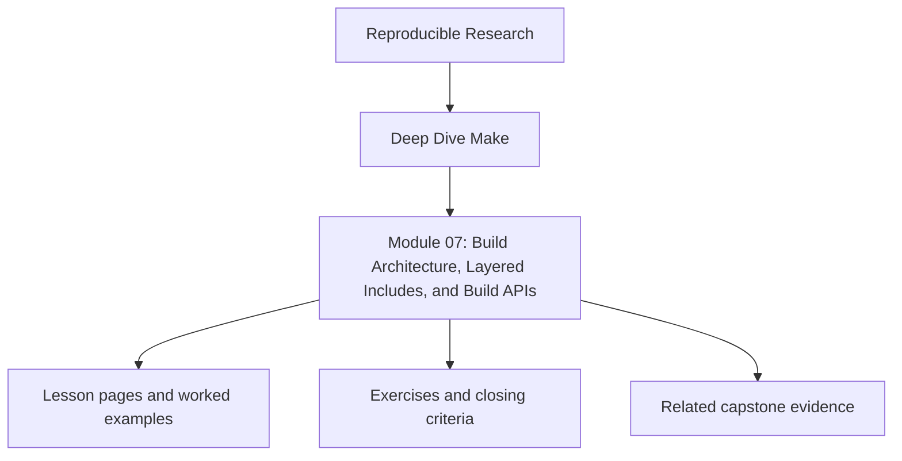
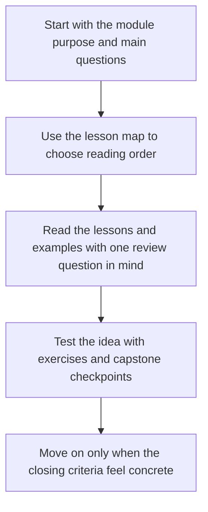

<a id="top"></a>

# Module 07: Build Architecture, Layered Includes, and Build APIs


<!-- page-maps:start -->
## Module Position




<!-- page-maps:end -->

Read the first diagram as a placement map: this page sits between the course promise, the lesson pages listed below, and the capstone surfaces that pressure-test the module. Read the second diagram as the study route for this page, so the diagrams point you toward the `Lesson map`, `Exercises`, and `Closing criteria` instead of acting like decoration.

Once a build works, teams immediately try to reuse it. This is where Makefiles often
decay into include tangles, hidden overrides, and pseudo-frameworks that are impossible to
audit. Module 07 is about reuse that preserves truth instead of diluting it.

The point is not to make Make clever. The point is to make larger builds explainable.

Capstone exists here as corroboration. The local layering exercises should make the
architecture legible before you compare them to the reference build layout.

### Before You Begin

This module works best after Modules 02-06, when you already trust the graph and now need
to scale the build without turning it into a private language.

Use this module if you need to learn how to:

* define a stable public target surface for other humans and tools
* split `mk/*.mk` files by responsibility instead of habit
* reuse rule shapes without obscuring graph structure

### At a glance

| Focus | Learner question | Capstone timing |
| --- | --- | --- |
| public targets | "Which entrypoints can humans and CI rely on?" | use capstone help after you define your own API |
| include layering | "Which file is allowed to set policy?" | inspect the reference layout once the local split feels clear |
| reusable macros | "How do I reduce duplication without hiding behavior?" | compare your local choices to `capstone/mk/*.mk` |

Proof loop for this module:

```sh
make -p | less
make --trace all
make help
```

Capstone corroboration:

* inspect target boundaries in `capstone/Makefile`
* inspect layer separation in `capstone/mk/*.mk`
* use `make -C capstone help`

The module is doing its job only if you can point to a layer boundary and explain why it
exists without appealing to habit.

---

<a id="toc"></a>
## 1) Table of Contents

1. [Table of Contents](#toc)
2. [Learning Outcomes](#outcomes)
3. [How to Use This Module](#usage)
4. [Core 1 — Public Targets as a Stable Build API](#core1)
5. [Core 2 — Layered `mk/` Includes Without Hidden Mutation](#core2)
6. [Core 3 — Macros, `call`, and Reuse That Stays Auditable](#core3)
7. [Core 4 — Discovery, Namespacing, and Repository Growth](#core4)
8. [Core 5 — Reviewing Build Architecture Before It Rots](#core5)
9. [Capstone Sidebar](#capstone)
10. [Exercises](#exercises)
11. [Closing Criteria](#closing)

---

<a id="outcomes"></a>
## 2) Learning Outcomes

By the end of this module, you can:

* define a stable public target surface for a larger Make-based system
* split build logic across `mk/*.mk` layers without creating graph mutation surprises
* use macros for repeated rule shapes while keeping expansion inspectable
* scale source discovery and naming conventions without recursive-make drift
* review a build architecture for API clarity, override safety, and future maintenance

[Back to top](#top)

---

<a id="usage"></a>
## 3) How to Use This Module

Take one medium-sized local project and split it into:

```
project/
  Makefile
  mk/
    common.mk
    targets.mk
    objects.mk
    release.mk
  src/
  include/
  build/
```

Then answer three questions in code:

1. Which targets are public?
2. Which include layers are allowed to set policy?
3. Which macros reduce duplication without hiding the graph?

If you cannot answer those by inspection, the architecture is already too clever.

[Back to top](#top)

---

<a id="core1"></a>
## 4) Core 1 — Public Targets as a Stable Build API

A serious Make system should have a small public surface:

* `all`
* `test`
* `selftest`
* `clean`
* any explicitly documented release or audit targets

Everything else is implementation detail.

The moment teams start calling internal helper targets from CI or release scripts, the
build stops having an API and starts having archaeology.

[Back to top](#top)

---

<a id="core2"></a>
## 5) Core 2 — Layered `mk/` Includes Without Hidden Mutation

Use include layers for separation of concerns, not for surprise behavior.

A safe layering pattern looks like this:

* `common.mk` defines tools, flags, and shared shell discipline
* `objects.mk` discovers sources and maps outputs deterministically
* `targets.mk` defines the real build graph
* `release.mk` adds optional packaging or publication surfaces

Each layer should have one job. Includes should add declared structure, not mutate earlier
lists in ways only `make -p` can reveal.

[Back to top](#top)

---

<a id="core3"></a>
## 6) Core 3 — Macros, `call`, and Reuse That Stays Auditable

Macros are justified when they enforce invariants or reduce repeated, truthful rule
shapes. They are dangerous when they create graph edges nobody can read.

Healthy macro use:

* one macro for atomic publication
* one macro for a repeated compile or package pattern
* bounded use of `call` with explicit arguments
* quarantined `eval`, only when the generated structure remains inspectable and optional

The review standard is simple: another engineer should still be able to explain the graph
with `make -p` and the final expanded rules.

[Back to top](#top)

---

<a id="core4"></a>
## 7) Core 4 — Discovery, Namespacing, and Repository Growth

As repositories grow, two things break first:

* unstable discovery order
* target-name collisions

Architecture rules that help:

* root all discovery from known directories
* sort discovered lists before they affect graph structure
* namespace generated outputs by directory or component
* keep one top-level DAG even when the repository has many subsystems

“Recursive make” is not evil because it uses recursion. It is dangerous when it hides the
real graph behind disconnected local truths.

[Back to top](#top)

---

<a id="core5"></a>
## 8) Core 5 — Reviewing Build Architecture Before It Rots

Review questions for larger Make systems:

* Which targets are public, and are they documented?
* Which files define policy, and which define graph shape?
* Which overrides are safe, and which would change semantics invisibly?
* Which macros enforce a rule, and which merely compress syntax?
* Could a newcomer locate the path from source discovery to final artifact publication?

If the answer to the last question is no, the build has become a private language.

[Back to top](#top)

---

<a id="capstone"></a>
## 9) Capstone Sidebar

Use the capstone as the reference architecture:

* `Makefile` defines the public target surface
* `mk/common.mk`, `mk/objects.mk`, `mk/stamps.mk`, and related files separate concerns
* repros remain outside the main build API
* helper macros reinforce correctness rather than obscure it

[Back to top](#top)

---

<a id="exercises"></a>
## 10) Exercises

1. Split one medium Makefile into `mk/*.mk` layers and document the public targets.
2. Replace one copy-pasted rule family with a macro that still leaves the graph auditable.
3. Introduce deterministic discovery for a growing source tree and prove stable ordering.
4. Review one legacy Make architecture and write down the private assumptions it currently hides.

[Back to top](#top)

---

<a id="closing"></a>
## 11) Closing Criteria

You pass this module only if you can demonstrate:

* a documented public target surface
* a layered include structure with clear ownership
* at least one reusable macro that enforces correctness instead of hiding truth
* deterministic discovery and naming that survives repository growth

[Back to top](#top)

## Directory glossary

Use [Glossary](glossary.md) when you want the recurring language in this module kept stable while you move between lessons, exercises, and capstone checkpoints.
