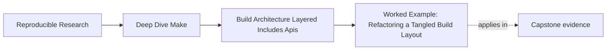
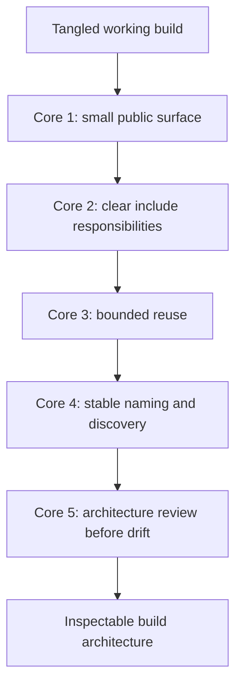

# Worked Example: Refactoring a Tangled Build Layout


<!-- page-maps:start -->
## Page Maps




<!-- page-maps:end -->

The five core lessons in Module 07 are easiest to trust when they appear in one build that
still works but is getting harder to explain.

This example starts with exactly that kind of build:

- it builds successfully
- developers rely on many target names nobody has reviewed
- CI calls a helper target directly
- include files have grown by habit
- macros removed duplication but also buried ownership

That is a very normal point in the life of a Make-based system.

## The incident

Assume you inherit a build with these complaints:

1. no one agrees which top-level targets are public
2. CI calls `build-objects` because it was convenient once
3. `mk/common.mk` and `mk/release.mk` both append to the same flags in unclear ways
4. object discovery and naming work today, but a new subsystem is about to be added
5. there is one macro that "defines everything," but only one maintainer feels safe
   touching it

This is enough to start a real architecture refactor.

## The starting layout

The repository looks like this:

```text
Makefile
mk/
  common.mk
  helpers.mk
  release.mk
src/
  main.c
  util.c
build/
```

And the top-level file roughly looks like this:

```make
include mk/common.mk
include mk/helpers.mk
include mk/release.mk

.PHONY: all test clean build-objects publish verify help

all: app

build-objects:
	$(foreach obj,$(OBJS),$(MAKE) $(obj);)

verify:
	@echo verify
```

This is not absurd. It is just not very well-bounded.

## Step 1: identify the public API

The first thing to repair is not layering. It is the interface.

Ask:

- which targets should humans rely on
- which targets should CI rely on
- which targets are just implementation helpers

Suppose the answer becomes:

- public: `all`, `test`, `selftest`, `clean`, `help`
- internal: `build-objects`, any object-level helper, any packaging helper

Then the top-level contract should start to reflect that:

```make
.PHONY: all test selftest clean help
```

And CI should stop calling `build-objects` directly.

This is Core 1:

- make the interface small
- demote private helpers
- stop letting automation depend on archaeology

## Step 2: give the include layers real jobs

The old include set:

- `common.mk`
- `helpers.mk`
- `release.mk`

does not say enough about ownership. "helpers" is usually a warning name because it can
contain anything.

A stronger split might become:

```text
Makefile
mk/
  common.mk
  objects.mk
  targets.mk
  release.mk
```

With responsibilities:

- `common.mk`: shell discipline, tools, shared paths
- `objects.mk`: rooted discovery and object mapping
- `targets.mk`: core artifact graph
- `release.mk`: optional release or publication surfaces

Now the include order tells a story instead of merely listing files.

This is Core 2:

- each layer gets one explainable job
- include order becomes part of the architecture
- hidden mutation becomes easier to spot

## Step 3: shrink the macro boundary

Suppose `helpers.mk` contained a macro that generated compilation, linking, and packaging
rules together.

That is usually too much abstraction in one place. The first repair is not "remove all
macros." The first repair is to ask what invariant actually deserves reuse.

Maybe the repository really only needs one bounded compile macro:

```make
define compile_object
$1: $2 include/app.h | $$(@D)/
	$$(CC) $$(CPPFLAGS) $$(CFLAGS) -c $$< -o $$@
endef
```

With explicit call sites:

```make
$(eval $(call compile_object,build/main.o,src/main.c))
$(eval $(call compile_object,build/util.o,src/util.c))
```

That is much easier to defend than one macro that effectively owns the whole build.

This is Core 3:

- use reuse to protect invariants
- keep call sites explicit
- refuse abstraction that becomes a second language

## Step 4: fix discovery and naming before the repository grows

The current discovery may be:

```make
SRCS := $(wildcard src/*.c)
OBJS := $(patsubst src/%.c,build/%.o,$(SRCS))
```

That works today. But the team is about to add `src/lib/*.c`.

Instead of waiting for collisions, redesign now:

```make
APP_SRCS := $(sort $(wildcard src/app/*.c))
LIB_SRCS := $(sort $(wildcard src/lib/*.c))

APP_OBJS := $(patsubst src/app/%.c,build/app/%.o,$(APP_SRCS))
LIB_OBJS := $(patsubst src/lib/%.c,build/lib/%.o,$(LIB_SRCS))
```

This is not premature generality. It is a small architectural fence against obvious
growth pressure.

This is Core 4:

- rooted discovery
- sorted lists
- namespaced outputs
- one coherent story about how more code joins the build

## Step 5: review the refactor like an architecture change

At this point the refactor looks better, but Module 07 insists on one more habit:

review the architecture, not only the diff.

Ask:

- are the public targets now obvious
- do the layer names communicate ownership
- can a newcomer explain the compile macro
- will a new subsystem fit the naming rules
- where could hidden mutation still creep in

This is Core 5. The architecture is not "done" just because the build passes.

## A healthier top-level shape

After the refactor, the top-level file may be closer to this:

```make
include mk/common.mk
include mk/objects.mk
include mk/targets.mk
-include mk/local.mk

.PHONY: all test selftest clean help

all: app

test:
	+$(MAKE) -C tests run

selftest:
	+$(MAKE) -C tests build-invariants

clean:
	rm -rf build dist app
```

And the internal architecture becomes:

- `common.mk` owns shared policy
- `objects.mk` owns discovery and mapping
- `targets.mk` owns the core graph
- `local.mk` is optional and visibly optional

That is a much easier system to evolve.

## What each core contributed



This is why the module is organized as five cores and then one worked example. The example
is where the design advice becomes operational.

## What you should say at the end

A strong summary sounds like this:

> The build was not broken at the graph level, but its architecture was drifting. The
> public surface was too large, CI depended on a helper target, include files did not have
> clear responsibility boundaries, a macro owned too much behavior, and discovery would not
> scale cleanly. We repaired the architecture by publishing a smaller API, splitting layers
> by job, shrinking the macro boundary, and adopting namespaced discovery before growth
> forced a more painful rewrite.

That is a much stronger explanation than "we cleaned up the Makefiles."

## What to practice after this example

Take one real Make repository and retell its architecture in the same order:

1. define the public targets
2. name the include layers and their responsibilities
3. identify one macro that should be reduced or one repeated pattern worth abstracting
4. check whether discovery and naming survive one more subsystem
5. write one short architecture review note about the remaining risk

If you can do that cleanly, Module 07 has started to change how you refactor build layouts.
