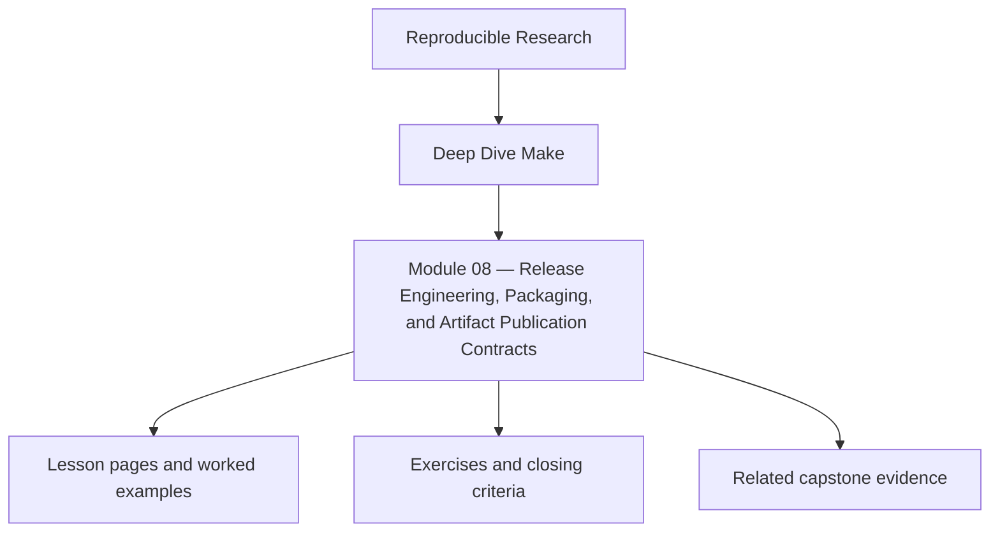
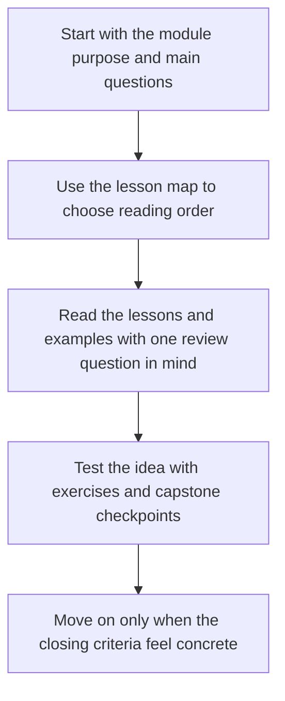

<a id="top"></a>

# Module 08 — Release Engineering, Packaging, and Artifact Publication Contracts


<!-- page-maps:start -->
## Module Position




<!-- page-maps:end -->

Read the first diagram as a placement map: this page sits between the course promise, the lesson pages listed below, and the capstone surfaces that pressure-test the module. Read the second diagram as the study route for this page, so the diagrams point you toward the `Lesson map`, `Exercises`, and `Closing criteria` instead of acting like decoration.

Building something locally is not the same as delivering it. Module 08 is about the
moment a build becomes an artifact contract: release directories, package boundaries,
checksums, manifests, and publication steps that other humans and systems are allowed to
trust.

This is where “the build finished” becomes “the artifact is fit to publish.”

Capstone exists here as corroboration. The local release exercises should make the
artifact boundary and evidence story clear before you inspect the reference build.

### Before You Begin

This module works best after Modules 03-07, when your build already converges and you are
ready to separate build truth from release truth.

Use this module if you need to learn how to:

* define what a publishable artifact actually contains
* separate release evidence from release identity
* make `dist` and `install` behave like contracts instead of shell rituals

### At a glance

| Focus | Learner question | Capstone timing |
| --- | --- | --- |
| release targets | "What promise does `dist` actually make?" | inspect capstone only after your local target names are stable |
| publishable layout | "Which files belong in the artifact and why?" | compare bundle shape after you define your own release surface |
| checksums and attestations | "How do I record evidence without changing identity?" | use capstone attest once you understand the separation locally |

Proof loop for this module:

```sh
make dist
make install DESTDIR=/tmp/deep-dive-make-check
make -q dist
```

Capstone corroboration:

* inspect `dist` and `attest` in `capstone/Makefile`
* inspect packaging helper flow under `capstone/scripts/`
* compare release-oriented outputs after `make -C capstone hardened`

If `dist` still means "do a lot of shell stuff," stay in the local exercise until it
means one clear contract.

---

<a id="toc"></a>
## 1) Table of Contents

1. [Table of Contents](#toc)
2. [Learning Outcomes](#outcomes)
3. [How to Use This Module](#usage)
4. [Core 1 — Release Targets as Contracts](#core1)
5. [Core 2 — Packaging Inputs, Layouts, and Publication Boundaries](#core2)
6. [Core 3 — Checksums, Manifests, and Attestations](#core3)
7. [Core 4 — Safe Install and Distribution Workflows](#core4)
8. [Core 5 — Debugging Broken Releases](#core5)
9. [Capstone Sidebar](#capstone)
10. [Exercises](#exercises)
11. [Closing Criteria](#closing)

---

<a id="outcomes"></a>
## 2) Learning Outcomes

By the end of this module, you can:

* define release-oriented targets with stable behavior guarantees
* separate build outputs from publishable artifacts and installation layouts
* generate checksums, manifests, and attestations without poisoning artifact identity
* make install or packaging steps idempotent and auditable
* diagnose whether a release defect comes from build truth, packaging truth, or publication truth

[Back to top](#top)

---

<a id="usage"></a>
## 3) How to Use This Module

Extend a working project with a release surface:

```
project/
  Makefile
  build/
  dist/
  scripts/
    mkdist.sh
```

Define at least four targets:

* `all`
* `test`
* `dist`
* `install`

Then make each one answer a clear question:

* `all`: what is built?
* `test`: what proves it behaves?
* `dist`: what is the published bundle?
* `install`: where is it laid out, and what assumptions does that imply?

[Back to top](#top)

---

<a id="core1"></a>
## 4) Core 1 — Release Targets as Contracts

Release targets should be boring to call and easy to trust. A good release target:

* has explicit inputs
* publishes to a declared location
* does not silently depend on shell state or current directory accidents
* can be re-run without smearing old outputs into new bundles

If `dist` means “build a tarball,” then it should always mean that. If it sometimes also
tests, signs, cleans, and deploys, it is not a contract. It is a gamble.

[Back to top](#top)

---

<a id="core2"></a>
## 5) Core 2 — Packaging Inputs, Layouts, and Publication Boundaries

Artifacts usually need more than binaries:

* licenses
* configuration templates
* docs
* manifests
* generated metadata

Treat the package layout as a declared graph, not a shell script afterthought. Packaging
is a modeling problem:

* what belongs in the bundle?
* what is derived metadata?
* what must stay outside because it is diagnostic only?

The safest publication rule is still the same one you learned earlier: stage in a temp
location, then publish atomically.

[Back to top](#top)

---

<a id="core3"></a>
## 6) Core 3 — Checksums, Manifests, and Attestations

Release engineering often mixes two different truths:

* artifact identity
* artifact evidence

Checksums and manifests often belong to the published bundle. Toolchain attestations or
host diagnostics may belong beside the artifact but not inside its identity unless that is
an explicit policy.

Make this distinction visible. Otherwise teams end up with bundles that rebuild every run
because a timestamp-heavy attestation file was treated as a semantic input.

[Back to top](#top)

---

<a id="core4"></a>
## 7) Core 4 — Safe Install and Distribution Workflows

An install target is a publication act with side effects. Treat it with the same care as
any other boundary:

* stage before publishing
* make overwrite behavior explicit
* allow dry-run preview where possible
* document ownership of destination paths

Idempotent install behavior matters. If running `make install` twice leaves a different
system than running it once, your boundary is lying.

[Back to top](#top)

---

<a id="core5"></a>
## 8) Core 5 — Debugging Broken Releases

Release failures usually fall into one of these classes:

* build output was wrong
* packaging selected the wrong inputs
* manifest or checksum did not match the published tree
* install step mutated the destination in an unsafe order
* artifact evidence polluted artifact identity

The fix is not “rerun dist.” The fix is to determine which truth boundary failed:

1. build truth
2. package truth
3. publish truth

[Back to top](#top)

---

<a id="capstone"></a>
## 9) Capstone Sidebar

Use the capstone to inspect:

* `attest` and portability-related targets
* scripts that package or summarize build outputs
* the distinction between correctness artifacts and diagnostic artifacts
* how selftests protect release-oriented surfaces from drift

[Back to top](#top)

---

<a id="exercises"></a>
## 10) Exercises

1. Add a `dist` target that bundles binaries plus a manifest without including unstable diagnostics.
2. Make an `install` target idempotent and document its destination contract.
3. Break a release by polluting the artifact with unstable metadata, then repair the boundary.
4. Add checksum verification and prove serial/parallel builds publish the same release bundle.

[Back to top](#top)

---

<a id="closing"></a>
## 11) Closing Criteria

You pass this module only if you can demonstrate:

* a stable release target with explicit inputs
* an artifact publication boundary that is atomic
* manifests or checksums that match the published tree
* a clear separation between artifact identity and supporting evidence

[Back to top](#top)
