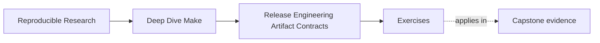
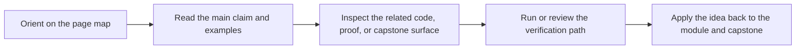

# Exercises

<!-- page-maps:start -->
## Page Maps

<!-- page-maps:end -->

Use these after reading the five core lessons and the worked example. The goal is not to
show off packaging commands. The goal is to make your release-boundary reasoning visible.

Each exercise asks for three things:

- the release contract or truth boundary you are trying to establish
- the evidence or inspection path that would establish it
- the policy or repair decision that follows from that evidence

## Exercise 1: Write a clear `dist` contract

Choose one repository and define what `dist` should promise in one sentence.

What to hand in:

- the target meaning
- the declared inputs to that target
- one thing the target should deliberately not do

## Exercise 2: Design a publishable bundle tree

A project needs to ship:

- one binary
- one license
- one README
- one bundle manifest

Design the release tree and explain why each file belongs inside it.

What to hand in:

- the intended bundle layout
- one file that should stay outside the bundle
- the publication step after which the artifact becomes trustworthy

## Exercise 3: Separate identity from evidence

A teammate wants to package host information and build timestamps directly into the release
bundle because "more provenance is better."

Explain how you would separate artifact identity from supporting evidence.

What to hand in:

- one file that should count as artifact identity
- one file that should live beside the artifact instead
- one sentence explaining why mixing them would destabilize releases

## Exercise 4: Make `install` safe to rerun

You inherit an `install` target that writes straight into a real destination and behaves
unpredictably on rerun.

Describe how you would redesign it to make the destination contract explicit and safer to
test.

What to hand in:

- the destination-root variable or staging approach
- one idempotence expectation
- one command you would run to inspect the installed tree safely

## Exercise 5: Diagnose one release failure

Pick one of these symptoms:

- wrong bundle contents
- checksum mismatch
- unstable release identity
- unsafe install behavior
- drift in release-target meaning

Write the debugging path you would use to identify the failed truth boundary and repair it.

What to hand in:

- the likely failed boundary
- the first evidence command
- the likely contract or publication repair

## Mastery standard for this exercise set

Across all five answers, the module wants the same habits:

- you name the release promise or truth boundary being tested
- you choose inspection and evidence before proposing the fix
- you explain the fix in terms of contract, package boundary, evidence policy, or publish safety

If an answer says only "release engineering is important," keep going.
