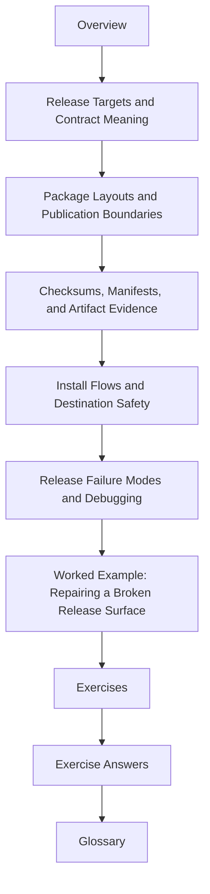

# Module 08: Release Engineering and Artifact Contracts

Building something locally is not the same as delivering it. Module 08 is about the point
where a build becomes a release contract:

- which files belong in a publishable artifact
- which targets are allowed to create that artifact
- which evidence travels with it
- and which publication steps other humans and systems are allowed to trust

This module turns "the build finished" into "the release boundary is clear."

## What this module is for

By the end of Module 08, you should be able to explain five things clearly:

- what a release-oriented target such as `dist` or `install` actually promises
- how to define a package layout as a contract instead of a shell ritual
- how to keep checksums, manifests, and attestations useful without polluting artifact identity
- how to make install and publication steps safe and repeatable
- how to diagnose whether a broken release came from build truth, package truth, or publish truth

## Study route



Read the module in that order the first time. Later, return directly to the page that
matches the release or publication problem you are facing.

## The ten files in this module

1. Overview (`index.md`)
2. [Release Targets and Contract Meaning](release-targets-and-contract-meaning.md)
3. [Package Layouts and Publication Boundaries](package-layouts-and-publication-boundaries.md)
4. [Checksums, Manifests, and Artifact Evidence](checksums-manifests-and-artifact-evidence.md)
5. [Install Flows and Destination Safety](install-flows-and-destination-safety.md)
6. [Release Failure Modes and Debugging](release-failure-modes-and-debugging.md)
7. [Worked Example: Repairing a Broken Release Surface](worked-example-repairing-a-broken-release-surface.md)
8. [Exercises](exercises.md)
9. [Exercise Answers](exercise-answers.md)
10. [Glossary](glossary.md)

## How to use the file set

| If you need to... | Start here |
| --- | --- |
| define what `dist`, `install`, or another release target actually means | [Release Targets and Contract Meaning](release-targets-and-contract-meaning.md) |
| decide what belongs inside a published bundle | [Package Layouts and Publication Boundaries](package-layouts-and-publication-boundaries.md) |
| separate artifact identity from supporting evidence | [Checksums, Manifests, and Artifact Evidence](checksums-manifests-and-artifact-evidence.md) |
| make installation steps safe, idempotent, and inspectable | [Install Flows and Destination Safety](install-flows-and-destination-safety.md) |
| debug a broken release without guessing which truth boundary failed | [Release Failure Modes and Debugging](release-failure-modes-and-debugging.md) |
| see the whole module in one realistic release incident | [Worked Example: Repairing a Broken Release Surface](worked-example-repairing-a-broken-release-surface.md) |
| test your own understanding | [Exercises](exercises.md) |
| compare your reasoning against a reference | [Exercise Answers](exercise-answers.md) |
| stabilize the module vocabulary | [Glossary](glossary.md) |

## The running question

Carry this question through every page:

> what exact promise does this release step make, and which files or side effects are part
> of that promise?

Good Module 08 answers usually mention one or more of these:

- a release target with a stable meaning
- a package boundary that includes the right files and excludes the wrong ones
- evidence that travels with the release without redefining it
- an install step that treats the destination as a contract
- a failure classified by the truth boundary it violated

## Commands to keep close

These commands form the evidence loop for Module 08:

```sh
make dist
make install DESTDIR=/tmp/release-check
make -q dist
make --trace dist
```

The point is not to produce artifacts once. The point is to make publication behavior
legible and repeatable.

## Learning outcomes

By the end of this module, you should be able to:

- publish release-oriented targets with explicit, stable contract meaning
- model release bundle layout as a declared graph and publication boundary
- generate checksums and manifests that help verification without destabilizing identity
- make install behavior safe to rerun and easy to inspect
- diagnose release defects by separating build truth, package truth, and publish truth

## Exit standard

Do not move on until all of these are true:

- you can say what `dist` promises in one sentence
- you can justify why each file belongs inside or outside a release bundle
- you can explain which evidence is part of artifact identity and which is only adjacent proof
- you can run an install route twice without changing the destination unexpectedly
- you can classify one broken release by the exact truth boundary that failed

When those feel ordinary, Module 08 has done its job.
