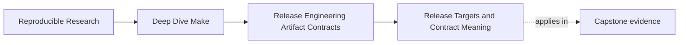

# Release Targets and Contract Meaning


<!-- page-maps:start -->
## Page Maps




<!-- page-maps:end -->

Release-oriented targets often start life as convenience commands:

- "bundle the outputs"
- "copy things to `dist/`"
- "do whatever we need before publishing"

That may work for one maintainer. It does not scale well to a team or to automation.

The problem is not that the targets exist. The problem is that they often mean too many
things at once:

- build if needed
- maybe run tests
- maybe package docs
- maybe checksum
- maybe deploy

At that point the target name stops being a contract and starts being a ritual.

This page is about replacing that ritual with targets that say what they mean.

## The sentence to keep

When you define a release-oriented target, ask:

> what exact promise does this name make to the caller, and what does it deliberately not
> promise?

That question keeps target meaning stable.

## Release targets are interfaces, not shortcuts

By Module 08, the build already has public targets such as:

- `all`
- `test`
- `selftest`
- `clean`

Release targets belong in the same category of interface design. If users or CI call:

- `dist`
- `install`
- `release-check`
- `package`

then those names are contracts. Changing their meaning carelessly is a breaking change.

That is why release engineering belongs in the course-book arc. It is not "extra shell
work after the build." It is another API boundary.

## Target meaning should be narrow enough to explain

A strong release target can be explained in one sentence.

Examples:

- `dist`: produce the publishable distribution bundle under `dist/`
- `install`: lay out the artifact tree under the requested destination
- `release-check`: run the validations required before publication

That is much better than targets that quietly do five unrelated jobs.

For example, a target named `dist` should not unpredictably:

- rebuild half the tree in a special mode
- run network publication
- install onto the local machine
- clean unrelated outputs

If those jobs are needed, they should usually have their own clearly named targets or be
composed intentionally by a higher-level target.

## Boring release targets are a good sign

This is one of the few places in the course where "boring" is praise.

A healthy release target:

- has explicit inputs
- publishes to a declared location
- can be rerun without smearing old outputs into new outputs
- does not rely on the caller's current directory luck or shell history

The target should feel almost disappointingly clear. That is what makes it safe to trust.

## A small `dist` contract

Suppose the project ships:

- one binary
- a license
- one manifest

A healthy target might look like:

```make
.PHONY: dist

dist: dist/app.tar.gz

dist/app.tar.gz: app LICENSE dist/manifest.txt | dist/
	tar -czf $@ app LICENSE dist/manifest.txt
```

The important part is not the exact packaging command. The important part is that the
target name maps to one obvious publication outcome.

The caller can now say:

> `make dist` means "create the distribution archive."

That is a contract.

## A release target should declare its inputs

Teams often speak about release targets as if they just "collect whatever the build made."
That is too vague.

A release contract should answer:

- which files must exist before packaging starts
- which metadata is part of the bundle
- which directory is the publication root

For example, `dist/app.tar.gz` may depend on:

- `app`
- `LICENSE`
- `dist/manifest.txt`

Those are explicit release inputs. Without that clarity, packaging becomes harder to audit
and much easier to accidentally change.

## Higher-level orchestration should stay visible

Sometimes a repository really does need a composed target:

- `release-check`
- `publish-prep`
- `hardened`

That is fine. The important architectural move is to keep the composition visible:

```make
.PHONY: release-check

release-check: test selftest dist
```

This is healthy because:

- the target name has one clear purpose
- the sub-targets remain inspectable
- the contract is visible in the prerequisites

That is very different from a shell recipe that performs a long sequence of hidden actions.

## `install` is not just "copy files somewhere"

One reason Module 08 splits release topics carefully is that `install` often gets treated
as a casual side effect.

It is not casual.

`install` should answer:

- what tree is being installed
- where it is being laid out
- what overwrite or idempotence behavior is expected

That means `install` deserves the same contract discipline as `dist`, not less.

We will go deeper on that in a later core, but it is important to name it here.

## A weak release target smells like this

Be suspicious when a release target:

- changes directories several times without declaring why
- mixes validation, packaging, install, and deploy in one recipe
- depends on the operator's shell state or random environment files
- leaves different outputs behind depending on what happened in previous runs

Those are not only implementation issues. They are contract failures.

## A practical naming check

Before you add or keep a release target, ask:

1. can I explain this target in one sentence
2. does the name match that sentence
3. could another human call it without reading shell scripts first
4. if CI called it, would that be a stable decision
5. does it publish to one declared location or boundary

If the answers are weak, the target meaning is weak too.

## Why this page comes before package layout

Teams often jump directly into bundle contents. That is premature if the target names
themselves are unstable.

You need to know what `dist` or `install` promises before you can reason about what those
targets should package or publish.

That is why Module 08 starts here.

## Failure signatures worth recognizing

### "`dist` does different things depending on who runs it"

That often means the contract depends on ambient shell or directory state.

### "We cannot tell whether `release-check` includes packaging or only validation"

That means the target naming or dependency structure is too vague.

### "CI calls a release helper target directly"

That usually means the release API surface is not designed clearly enough.

### "Rerunning `make dist` leaves a different result because old outputs leaked through"

That means the target is not publishing through a stable boundary.

## A review question that improves release targets

Take one release-oriented target and ask:

1. what exact artifact or side effect it promises
2. where that result appears
3. what declared inputs it depends on
4. whether its name matches its meaning
5. whether it can be safely consumed by humans and CI as a stable interface

If those answers are weak, the target needs redesign before the bundle details even matter.

## What to practice from this page

Choose one repository and write down:

1. the release-oriented target names
2. one sentence of contract meaning for each
3. one target whose meaning is too broad or vague
4. one improvement to make the surface more stable
5. one reason that would make later release debugging easier

If you can do that cleanly, you are treating release targets as interfaces rather than
convenient shell entrypoints.

## End-of-page checkpoint

Before leaving this lesson, make sure you can explain:

- why release targets are contracts rather than rituals
- why narrow target meaning is easier to trust
- why declared inputs matter for release surfaces too
- how composed targets can stay clear without hiding their sub-steps
- how to recognize a release target whose meaning has become too broad
