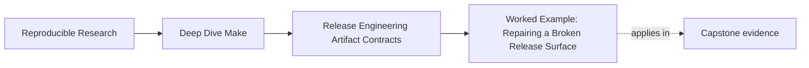
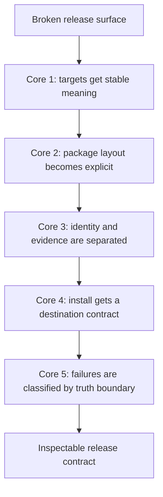

# Worked Example: Repairing a Broken Release Surface


<!-- page-maps:start -->
## Page Maps




<!-- page-maps:end -->

The five core lessons in Module 08 make the most sense when they all appear in one release
surface that still works often enough to mislead people.

This example starts with exactly that kind of system:

- the project builds successfully
- `make dist` usually creates an archive
- `make install` seems fine on one machine
- but release evidence and release identity are mixed together
- and nobody is fully sure what the release targets actually promise

That is a realistic place for a team to discover it needs release engineering discipline.

## The incident

Assume you inherit a repository with these complaints:

1. `make dist` produces an archive, but the archive contents keep drifting
2. the checksum changes even when the binary and docs appear unchanged
3. `make install` works under one destination and behaves oddly when rerun
4. CI calls `dist` expecting only packaging, but the target also runs extra checks and local
   cleanup as side effects

That is enough to begin.

## The starting release sketch

The build roughly looks like this:

```make
.PHONY: dist install

dist:
	@mkdir -p dist
	@cp app dist/app
	@cp LICENSE dist/LICENSE
	@date > dist/build-info.txt
	@tar -czf dist/app.tar.gz -C dist app LICENSE build-info.txt
	@sha256sum dist/app.tar.gz > dist/app.tar.gz.sha256

install:
	@cp app /usr/local/bin/app
	@cp LICENSE /usr/local/share/licenses/app/LICENSE
```

This is not a ridiculous Makefile. It is just not yet a trustworthy release surface.

## Step 1: narrow the target meaning

The first repair is not in the archive contents. It is in the target contract.

If `dist` is supposed to mean "produce the release archive," then it should not
unpredictably:

- clean other outputs
- mutate local install paths
- run unrelated checks that belong in another target

So you first write down a cleaner contract:

- `dist`: produce the publishable archive and its declared verification files
- `release-check`: run the validations required before publication

Now the top-level interface is already easier to reason about.

This is Core 1:

- target names get one stable meaning
- composition stays visible instead of hidden in one shell ritual

## Step 2: model the package layout explicitly

The old `dist` target archives files directly from `dist/`, which also contains sidecar
files and any leftovers from previous runs.

A healthier pattern is to stage the bundle tree:

```make
DIST_STAGE := dist/tmp

dist/app.tar.gz: app LICENSE capstone/README.md dist/manifest.txt | dist/
	@rm -rf $(DIST_STAGE)
	@mkdir -p $(DIST_STAGE)/bin $(DIST_STAGE)/share/doc
	@cp app $(DIST_STAGE)/bin/app
	@cp LICENSE $(DIST_STAGE)/LICENSE
	@cp capstone/README.md $(DIST_STAGE)/share/doc/README.md
	@cp dist/manifest.txt $(DIST_STAGE)/manifest.txt
	@tar -czf $@ -C $(DIST_STAGE) .
```

Now the bundle shape is explicit and inspectable.

This is Core 2:

- package contents are modeled deliberately
- the staging tree becomes the pre-publication boundary
- stray files stop leaking into the archive just because they happen to be nearby

## Step 3: separate identity from evidence

The old target wrote:

```make
@date > dist/build-info.txt
```

and then packaged that file into the archive.

That means the archive identity now changes every run, even if nothing semantically
important changed.

A healthier split is:

- keep the archive contents stable
- keep a bundle manifest and checksum with the artifact
- move unstable host or timing data into sidecar evidence if it is truly needed

For example:

```make
dist/manifest.txt: app LICENSE capstone/README.md | dist/
	@printf '%s\n' 'bin/app' 'LICENSE' 'share/doc/README.md' > $@

dist/app.tar.gz.sha256: dist/app.tar.gz
	@sha256sum $< > $@

dist/app.attest.txt: dist/app.tar.gz | dist/
	@printf 'compiler=%s\nhost=%s\n' '$(CC)' "$$(uname -s)" > $@
```

Now:

- the checksum verifies the archive identity
- the manifest describes bundle contents
- the attestation is adjacent evidence, not part of the archive itself

This is Core 3.

## Step 4: repair the install boundary

The old install route wrote directly into `/usr/local` during ordinary testing. That makes
review awkward and reruns risky.

A healthier install contract introduces explicit destination rooting:

```make
PREFIX ?= /usr/local
INSTALL_ROOT := $(DESTDIR)$(PREFIX)

.PHONY: install

install: app LICENSE
	@mkdir -p $(INSTALL_ROOT)/bin
	@mkdir -p $(INSTALL_ROOT)/share/licenses/app
	@cp app $(INSTALL_ROOT)/bin/app
	@cp LICENSE $(INSTALL_ROOT)/share/licenses/app/LICENSE
```

Now you can test:

```sh
make install DESTDIR=/tmp/release-check
find /tmp/release-check -type f | sort
```

This is Core 4:

- installation becomes inspectable
- the destination tree is explicit
- reruns can be evaluated against an idempotence expectation

## Step 5: debug the release by truth boundary

At this point, the original complaints can be reclassified cleanly:

1. drifting archive contents
   likely class: package truth
2. checksum drift with unchanged core files
   likely class: identity/evidence confusion
3. odd rerun behavior for install
   likely class: publish truth
4. `dist` doing too much
   likely class: release-target contract drift

That reclassification is the real payoff of Core 5. It keeps the repair from turning into
random reruns of `dist`.

## The repaired release sketch

After the cleanup, the release surface is closer to this:

```make
DIST_STAGE := dist/tmp
PREFIX ?= /usr/local
INSTALL_ROOT := $(DESTDIR)$(PREFIX)

.PHONY: dist release-check install

release-check: test selftest dist

dist: dist/app.tar.gz dist/app.tar.gz.sha256

dist/manifest.txt: app LICENSE capstone/README.md | dist/
	@printf '%s\n' 'bin/app' 'LICENSE' 'share/doc/README.md' > $@

dist/app.tar.gz: app LICENSE capstone/README.md dist/manifest.txt | dist/
	@rm -rf $(DIST_STAGE)
	@mkdir -p $(DIST_STAGE)/bin $(DIST_STAGE)/share/doc
	@cp app $(DIST_STAGE)/bin/app
	@cp LICENSE $(DIST_STAGE)/LICENSE
	@cp capstone/README.md $(DIST_STAGE)/share/doc/README.md
	@cp dist/manifest.txt $(DIST_STAGE)/manifest.txt
	@tar -czf $@ -C $(DIST_STAGE) .

dist/app.tar.gz.sha256: dist/app.tar.gz
	@sha256sum $< > $@

dist/app.attest.txt: dist/app.tar.gz | dist/
	@printf 'compiler=%s\nhost=%s\n' '$(CC)' "$$(uname -s)" > $@

install: app LICENSE
	@mkdir -p $(INSTALL_ROOT)/bin
	@mkdir -p $(INSTALL_ROOT)/share/licenses/app
	@cp app $(INSTALL_ROOT)/bin/app
	@cp LICENSE $(INSTALL_ROOT)/share/licenses/app/LICENSE
```

This version is not fancy. It is much easier to explain and test.

## What each core contributed



This is why the module is organized as five cores and then one worked example. The example
is where release engineering stops sounding abstract.

## What you should say at the end

A strong summary sounds like this:

> The release surface was drifting because `dist` meant too much, the bundle layout was
> assembled implicitly, unstable diagnostics were packaged into artifact identity, and
> install wrote directly into the destination without an explicit contract. We repaired the
> target meanings, staged the bundle tree, split identity from evidence, and made the
> install root explicit. After that, release failures became classifiable as build truth,
> package truth, or publish truth instead of "release weirdness."

That is much stronger than "we cleaned up the dist target."

## What to practice after this example

Take one real release surface and retell it in the same order:

1. define the release target meanings
2. write down the bundle tree
3. separate identity from evidence
4. define the install destination contract
5. classify one current release defect by truth boundary

If you can do that cleanly, Module 08 has started to change how you think about publication.
