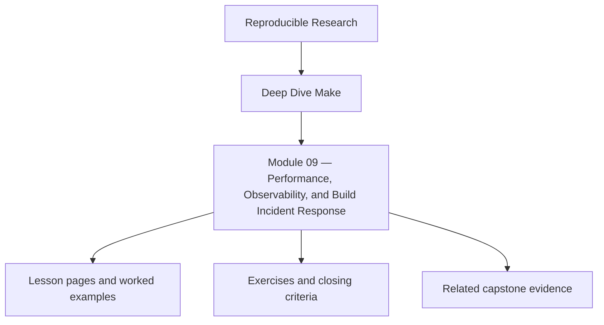
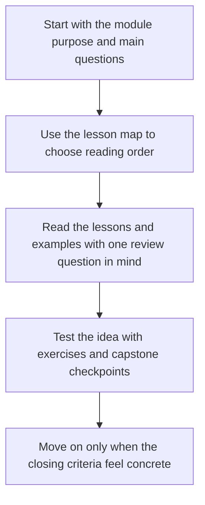

<a id="top"></a>

# Module 09 — Performance, Observability, and Build Incident Response


<!-- page-maps:start -->
## Module Position




<!-- page-maps:end -->

Read the first diagram as a placement map: this page sits between the course promise, the lesson pages listed below, and the capstone surfaces that pressure-test the module. Read the second diagram as the study route for this page, so the diagrams point you toward the `Lesson map`, `Exercises`, and `Closing criteria` instead of acting like decoration.

By this point the build is correct, layered, and publishable. Module 09 deals with the
moment it becomes slow, noisy, or operationally brittle. The point is not premature
optimization. The point is to keep a trustworthy build understandable when time pressure
hits.

You are not optimizing Makefiles for sport. You are protecting engineering feedback loops.

Capstone exists here as corroboration. The local measurement and incident drills should
already tell a coherent story before you inspect the reference build guardrails.

### Before You Begin

This module works best after Modules 02-08, when the build is already truthful and the
real question is how to keep it understandable under time pressure.

Use this module if you need to learn how to:

* tell parse cost from recipe cost and diagnostic noise
* build an incident ladder another engineer can follow
* tune the system without hiding correctness defects

### At a glance

| Focus | Learner question | Capstone timing |
| --- | --- | --- |
| measurement | "Am I paying parse cost, recipe cost, or observability cost?" | inspect capstone after you can measure one local build clearly |
| incident triage | "What is the next diagnostic move under pressure?" | use capstone selftests and repros once the ladder is familiar |
| safe tuning | "Did I remove waste or just hide evidence?" | compare with capstone guardrails after local experiments |

Proof loop for this module:

```sh
make trace-count
make --trace -n all
make -p > build/make.dump
```

Capstone corroboration:

* run `make -C capstone trace-count`
* run `make -C capstone discovery-audit`
* inspect `capstone/tests/run.sh` for measurement guardrails

This module is successful when the learner can separate symptoms from causes before
changing the build.

---

<a id="toc"></a>
## 1) Table of Contents

1. [Table of Contents](#toc)
2. [Learning Outcomes](#outcomes)
3. [How to Use This Module](#usage)
4. [Core 1 — Measuring Parse Time, Recipe Time, and Trace Volume](#core1)
5. [Core 2 — Observability for Build Behavior](#core2)
6. [Core 3 — Incident Triage for Slow or Flaky Builds](#core3)
7. [Core 4 — Tuning Without Hiding Truth](#core4)
8. [Core 5 — Building an Operational Runbook](#core5)
9. [Capstone Sidebar](#capstone)
10. [Exercises](#exercises)
11. [Closing Criteria](#closing)

---

<a id="outcomes"></a>
## 2) Learning Outcomes

By the end of this module, you can:

* distinguish parse-time cost from recipe cost and graph-shape cost
* add observability that helps incident response without changing build semantics
* diagnose flaky or slow builds with a repeatable triage ladder
* remove wasteful shell-outs, unstable discovery, and churny graph generation
* write an operational runbook another engineer can use under pressure

[Back to top](#top)

---

<a id="usage"></a>
## 3) How to Use This Module

Take a working build and instrument it with:

* one timing measurement for parse or dry-run work
* one trace-count or log-volume signal
* one reproducible “slow build” scenario
* one incident note showing how you isolated the cause

The purpose is to separate symptoms from causes before you optimize anything.

[Back to top](#top)

---

<a id="core1"></a>
## 4) Core 1 — Measuring Parse Time, Recipe Time, and Trace Volume

Three different costs are often mixed together:

* parse-time work
* recipe execution
* debug signal volume

Measure them separately. A build that spends its time in `$(shell find ...)` has a
different problem from a build whose compiler step is expensive. A build that emits too
much trace may still be correct but operationally unusable during incidents.

Healthy performance work begins with a cost model, not a hunch.

[Back to top](#top)

---

<a id="core2"></a>
## 5) Core 2 — Observability for Build Behavior

Observability in a Make-based system should answer:

* what ran
* why it ran
* which inputs changed
* where time went

Good observability surfaces:

* `--trace`
* `-p`
* stable manifests
* bounded diagnostic targets such as `trace-count` or `discovery-audit`

Bad observability surfaces:

* ad hoc shell `echo`s embedded everywhere
* unstable timestamps mixed into semantic outputs
* debug targets that mutate the real build state

[Back to top](#top)

---

<a id="core3"></a>
## 6) Core 3 — Incident Triage for Slow or Flaky Builds

Use a fixed triage ladder:

1. confirm the symptom
2. reproduce with the same target and inputs
3. preview with `-n`
4. explain with `--trace`
5. inspect the evaluated world with `-p`
6. isolate whether the defect is graph truth, shell behavior, or environmental drift

Most “Make is flaky” incidents are really one of these:

* unstable discovery
* missing or dishonest prerequisites
* shared output paths
* parse-time shelling out on every invocation
* a build helper that silently changed behavior

[Back to top](#top)

---

<a id="core4"></a>
## 7) Core 4 — Tuning Without Hiding Truth

Allowed optimizations:

* cache expensive discovery behind truthful manifests
* move repeated shell work into generator scripts with explicit inputs
* reduce trace volume while preserving diagnostic targets
* simplify graph generation when expansion churn becomes the real bottleneck

Forbidden optimizations:

* phony ordering to suppress a race
* skipping rebuilds by hiding inputs
* mutable temp files shared across targets
* removing diagnostics because they reveal a real issue

Fast wrong builds are still wrong.

[Back to top](#top)

---

<a id="core5"></a>
## 8) Core 5 — Building an Operational Runbook

A mature build should ship with a runbook that answers:

* how to verify convergence
* how to compare serial and parallel outputs
* how to inspect discovery and variable provenance
* how to collect evidence before editing the Makefile
* when to escalate from repair to migration

If this knowledge lives only in one maintainer's head, the build is not operationally
healthy no matter how elegant the Makefile looks.

[Back to top](#top)

---

<a id="capstone"></a>
## 9) Capstone Sidebar

Use the capstone to inspect:

* `trace-count`, `discovery-audit`, and selftest surfaces
* the balance between proof artifacts and human-readable diagnostics
* performance guardrails in tests and comments
* repros that turn incident patterns into repeatable learning

[Back to top](#top)

---

<a id="exercises"></a>
## 10) Exercises

1. Measure one expensive parse-time habit and replace it with a truthful manifest or script boundary.
2. Add one bounded observability target that helps explain rebuilds without mutating outputs.
3. Write a short incident runbook for a flaky `-j` failure and prove it on a repro.
4. Reduce trace or shell churn without changing graph semantics.

[Back to top](#top)

---

<a id="closing"></a>
## 11) Closing Criteria

You pass this module only if you can demonstrate:

* a repeatable measurement of build cost
* at least one observability surface that helps incident response
* a documented triage ladder for slow or flaky builds
* one optimization that preserves truth while improving feedback time

[Back to top](#top)
