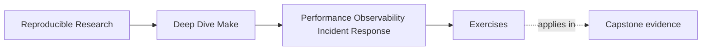

# Exercises

<!-- page-maps:start -->
## Page Maps

<!-- page-maps:end -->

Use these after reading the five core lessons and the worked example. The goal is not to
produce more diagnostics for their own sake. The goal is to make your measurement,
observability, and incident-response reasoning visible.

Each exercise asks for three things:

- the operational fact or boundary you are trying to establish
- the evidence or command that would establish it
- the tuning or response decision that follows from that evidence

## Exercise 1: Split one "slow build" complaint into layers

Take one build route and describe how you would tell whether the cost is mainly parse-time,
recipe-time, or evidence-surface overhead.

What to hand in:

- the commands you would run
- the three measurements or observations you would compare
- one sentence explaining how different results would change the diagnosis

## Exercise 2: Add one bounded observability surface

Your repository has many ad hoc debug prints inside recipes, but no named diagnostic route.

Design one observability surface that would help incidents without mutating semantic
outputs.

What to hand in:

- the question the surface should answer
- the target name or command route you would add
- one current debug habit that should be removed instead

## Exercise 3: Write a triage ladder for one flaky symptom

Choose one flaky symptom such as:

- "rebuild happens for no obvious reason"
- "`-j` occasionally fails"
- "CI and local behave differently"

Write the first five steps of the evidence ladder you would follow.

What to hand in:

- the measurable symptom
- the ordered triage steps
- one sentence explaining why editing the Makefile should not be the first move

## Exercise 4: Propose one truth-preserving optimization

You identify repeated parse-time shell work as a likely cost. Explain one optimization that
reduces that waste without hiding real inputs or dropping rebuilds.

What to hand in:

- the expensive habit
- the truthful replacement boundary
- one command you would use afterward to prove the build is still honest

## Exercise 5: Write a small operational runbook entry

Take one build route and write a short runbook entry another engineer could use under
pressure.

What to hand in:

- one convergence or sanity check
- one serial/parallel comparison or resolved-state inspection
- one escalation trigger
- one thing the responder should avoid doing too early

## Mastery standard for this exercise set

Across all five answers, the module wants the same habits:

- you name the cost or incident boundary being tested
- you choose evidence before choosing edits
- you explain the response in terms of measurement, observability quality, or truth-preserving tuning

If an answer says only "the build should be easier to debug," keep going.
