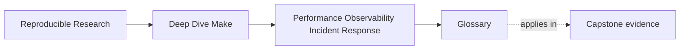

# Glossary

<!-- page-maps:start -->
## Page Maps

<!-- page-maps:end -->

Use this glossary to keep the language of Module 09 stable while you move between the core
lessons, worked example, and exercises.

The goal is not more jargon. The goal is to make sure the same operational fact keeps the
same name whenever you explain cost, evidence, or incident response.

## How to use this glossary

If a build-operations discussion starts drifting into vague phrases like "the build is kind
of slow" or "we have some debug info somewhere," stop and look up the term doing the most
work in the argument. Module 09 becomes much clearer when the team agrees on the right
nouns.

## Terms in this module

| Term | Meaning in this module |
| --- | --- |
| dry-run timing | A timing measurement taken from `make -n`, useful for estimating parse and decision work without recipe execution. |
| evidence surface | Any route or artifact that helps explain build behavior, such as trace output, a database dump, or a bounded audit target. |
| evidence-surface cost | The operational cost of producing or using build evidence, including trace volume and human scan burden. |
| incident ladder | A fixed sequence of evidence-gathering steps used to narrow a build problem before edits begin. |
| incident boundary | The likely class of failure, such as graph truth, environment drift, or observability/operational noise. |
| observability target | A named route such as `trace-count` or `discovery-audit` that answers one explicit question about build behavior. |
| parse and evaluation cost | Time spent reading makefiles, expanding variables, resolving includes, and constructing the build's internal world. |
| recipe cost | Time spent in the external commands the build runs, such as compilers, tests, packaging, or generators. |
| runbook | A short operational guide another engineer can follow to respond to a build incident under pressure. |
| serial/parallel comparison | A check that compares normal and `-j` behavior to surface races, shared outputs, or publication problems. |
| symptom confirmation | Turning a vague complaint into a measurable claim before investigation continues. |
| trace-count | A bounded measurement of how much trace output a route emits, useful as a proxy for evidence-surface size. |
| truth-preserving optimization | A performance improvement that removes waste without hiding semantic inputs, diagnostics, or rebuild obligations. |
| triage | The process of narrowing a build problem by moving through a stable ladder of evidence. |
| debug by mutation | A bad habit where observability is achieved by changing semantic outputs or build behavior instead of using dedicated evidence surfaces. |

## The vocabulary standard for this module

When you explain a Module 09 incident, aim to say things like:

- "the cost is mostly parse and evaluation"
- "this route needs a bounded observability target"
- "the next step in the incident ladder is `--trace`"
- "that optimization removed waste without hiding inputs"
- "this needs escalation because the evidence no longer narrows the boundary"

Those sentences are much more useful than saying only "the build is flaky and slow."
