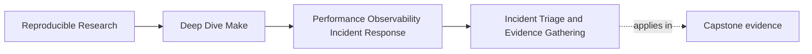
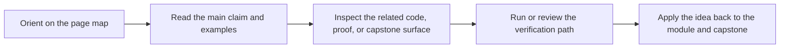

# Incident Triage and Evidence Gathering


<!-- page-maps:start -->
## Page Maps




<!-- page-maps:end -->

Build incidents often feel urgent for a simple reason: they interrupt normal engineering
feedback.

When that happens, teams easily fall into an unhelpful pattern:

- rerun the build
- delete directories
- try serial mode
- add prints
- blame Make

Those actions are understandable. They are not a triage method.

This page is about a calmer alternative:

> follow a fixed evidence ladder before you change the system.

That one habit prevents a lot of wasted motion.

## The sentence to keep

When a build is slow or flaky, ask:

> what is the smallest next step that increases evidence without increasing guesswork?

That question keeps incidents moving in the right direction.

## Triage is about narrowing, not proving genius

The goal of incident triage is not to solve the whole problem in one leap. The goal is to
narrow the space of plausible causes.

That means the ladder should move from:

- symptom confirmation
- to reproduction
- to explanation
- to boundary isolation

Not from:

- symptom
- to arbitrary edits

That is why this page is one of the most practical in the module.

## A useful incident ladder

Here is a strong default sequence:

1. confirm the symptom
2. reproduce with the same target and assumptions
3. preview with `-n` if the question is about intended actions
4. explain with `--trace` if the question is about causality
5. inspect the evaluated world with `-p` if the question is about variables or rules
6. decide whether the boundary is graph truth, environment drift, or operational noise

This ladder is intentionally simple. It is not the only valid approach. It is a stable one
that another engineer can learn and repeat.

## Step 1: confirm the symptom

Many incident reports begin with language like:

- "the build is weird"
- "CI flaked"
- "it rebuilt for no reason"

Those are not actionable symptoms yet.

A stronger confirmation sounds like:

- `make -q all` returns `1` after a supposedly successful run
- `make -j4 all` fails one run in five with a shared-output error
- `/usr/bin/time -p make -n all` jumped from `0.3s` to `2.8s`

That is already an improvement because it turns a feeling into a measurable claim.

## Step 2: reproduce the same route

Once you have a measurable symptom, keep the route stable.

This means being disciplined about:

- target name
- environment assumptions
- parallelism level
- clean versus incremental state

If the team keeps changing those while investigating, the incident quickly becomes harder
to reason about.

The point here is not stubbornness. It is preserving a stable question long enough to get
evidence.

## Step 3: preview intent with `-n`

If the issue is about what Make intends to do, preview first:

```sh
make -n all
```

This is useful for questions like:

- what commands would run
- whether a target is considered out of date
- whether a route is unexpectedly large

`-n` is not the answer to every incident. It is a preview tool. Use it when the incident is
about intended actions rather than already-observed recipe side effects.

## Step 4: explain causality with `--trace`

If the issue is "why did this run?" or "why did this rebuild?", move quickly to:

```sh
make --trace all
```

This helps you see:

- which prerequisite relationship triggered work
- where the rule came from
- which target became eligible and why

That is much stronger evidence than human memory of what "should" have happened.

## Step 5: inspect the evaluated world with `-p`

If the incident smells like:

- variable drift
- include-order confusion
- implicit rule surprise
- rule-selection ambiguity

then `-p` is often the right next move:

```sh
make -p > build/make.dump
```

This changes the question from:

> why is Make doing something strange

to:

> what rule and variable world is Make actually operating in

That is a much stronger debugging stance.

## Step 6: isolate the failure boundary

After you gather the first evidence, try to classify the incident by boundary:

- graph truth
- environment or contract drift
- operational evidence noise

Examples:

- hidden prerequisite or shared output path -> graph truth
- different tool versions or shell behavior -> environment drift
- trace volume too large to use -> operational evidence cost

This is where triage becomes architecture-aware instead of purely procedural.

## A small incident example

Suppose the report is:

> "the build keeps rebuilding `app` even when nothing changed"

A calm triage sequence might be:

1. `make all`
2. `make -q all; echo $?`
3. `make --trace all`
4. if needed, `make -p > build/make.dump`

This is stronger than:

1. `rm -rf build`
2. rerun
3. hope it stops

The difference is not attitude. It is evidence.

## Incident ladders should be learnable by someone else

One of the reasons the course emphasizes fixed triage ladders is that they transfer.

If only one maintainer knows how to debug the build, the build is operationally fragile
even if the Makefiles are elegant.

That is why a good ladder should be:

- short enough to remember
- explicit enough to teach
- specific enough to avoid random thrashing

This is the bridge from personal debugging to team operations.

## Failure signatures worth recognizing

### "Every incident starts with a clean build"

That often means the team is skipping boundary isolation and losing useful incremental
evidence.

### "We add prints before we know what question we are answering"

That usually means observability is being improvised instead of used.

### "People keep changing flags during reproduction"

That often means the investigation is changing the question faster than it is gathering evidence.

### "No one knows when to use `-n`, `--trace`, or `-p`"

That means the triage ladder has not been taught or stabilized.

## A review question that improves incident response

Take one recent build incident and ask:

1. what the first measurable symptom really was
2. whether reproduction stayed stable
3. whether the next command increased evidence or only changed conditions
4. whether the team identified the right failure boundary before editing
5. how the same incident should be triaged next time

If those answers are weak, the incident process is weak too.

## What to practice from this page

Choose one flaky or slow build symptom and write a triage note:

1. the measurable symptom
2. the exact reproduction route
3. the next evidence command
4. the likely boundary class
5. the reason that command comes before editing the build

If you can do that cleanly, you are already doing better incident response than many teams.

## End-of-page checkpoint

Before leaving this lesson, make sure you can explain:

- why triage is about narrowing the problem space
- why symptom confirmation comes before edits
- when `-n`, `--trace`, and `-p` belong in the ladder
- how to classify a build incident by boundary
- why a learnable triage ladder is part of operational health
