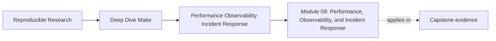
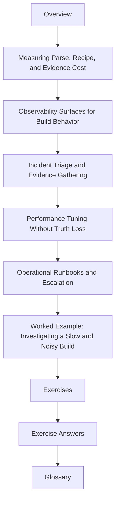

# Module 09: Performance, Observability, and Incident Response


<!-- page-maps:start -->
## Page Maps




<!-- page-maps:end -->

By this point the build is correct, layered, and publishable. Module 09 is about the moment
it becomes slow, noisy, or operationally brittle under real team pressure.

This module is not about tuning for sport. It is about protecting engineering feedback
loops:

- understanding where time really goes
- making build behavior observable without changing its meaning
- responding to incidents with a repeatable ladder instead of guesswork
- tuning costs without hiding correctness defects

## What this module is for

By the end of Module 09, you should be able to explain five things clearly:

- how to separate parse cost, recipe cost, and observability cost
- which observability surfaces actually help a build incident
- how to triage a slow or flaky build without skipping straight to edits
- which performance changes preserve truth and which ones merely hide it
- how to write a runbook another engineer can use under time pressure

## Study route



Read the module in that order the first time. Later, return directly to the page that
matches the incident or tuning question you are facing.

## The ten files in this module

1. Overview (`index.md`)
2. [Measuring Parse, Recipe, and Evidence Cost](measuring-parse-recipe-and-evidence-cost.md)
3. [Observability Surfaces for Build Behavior](observability-surfaces-for-build-behavior.md)
4. [Incident Triage and Evidence Gathering](incident-triage-and-evidence-gathering.md)
5. [Performance Tuning Without Truth Loss](performance-tuning-without-truth-loss.md)
6. [Operational Runbooks and Escalation](operational-runbooks-and-escalation.md)
7. [Worked Example: Investigating a Slow and Noisy Build](worked-example-investigating-a-slow-and-noisy-build.md)
8. [Exercises](exercises.md)
9. [Exercise Answers](exercise-answers.md)
10. [Glossary](glossary.md)

## How to use the file set

| If you need to... | Start here |
| --- | --- |
| figure out whether the cost is parse-time, recipe-time, or observability overhead | [Measuring Parse, Recipe, and Evidence Cost](measuring-parse-recipe-and-evidence-cost.md) |
| improve what the build tells you without mutating the build itself | [Observability Surfaces for Build Behavior](observability-surfaces-for-build-behavior.md) |
| respond to a slow or flaky build incident calmly | [Incident Triage and Evidence Gathering](incident-triage-and-evidence-gathering.md) |
| make the build faster without teaching it to lie | [Performance Tuning Without Truth Loss](performance-tuning-without-truth-loss.md) |
| leave behind an operational path others can follow | [Operational Runbooks and Escalation](operational-runbooks-and-escalation.md) |
| see the whole module in one realistic incident narrative | [Worked Example: Investigating a Slow and Noisy Build](worked-example-investigating-a-slow-and-noisy-build.md) |
| test your own understanding | [Exercises](exercises.md) |
| compare your reasoning against a reference | [Exercise Answers](exercise-answers.md) |
| stabilize the module vocabulary | [Glossary](glossary.md) |

## The running question

Carry this question through every page:

> what exact evidence would tell me where the cost or failure lives before I change the
> build?

Good Module 09 answers usually mention one or more of these:

- a measurement that separates layers instead of blending them
- an observability surface that reveals why the build behaved the way it did
- an incident ladder that narrows causes before edits begin
- a tuning move that keeps all semantic inputs visible
- a runbook that another engineer can follow without folklore

## Commands to keep close

These commands form the evidence loop for Module 09:

```sh
make --trace -n all
make -p > build/make.dump
/usr/bin/time -p make -n all >/dev/null
/usr/bin/time -p make all >/dev/null
```

The point is not to collect output for its own sake. The point is to know which evidence
answers which question.

## Learning outcomes

By the end of this module, you should be able to:

- measure distinct build costs instead of talking about "slowness" in the abstract
- add observability surfaces that help incidents without changing build semantics
- run a repeatable triage ladder for flaky or slow builds
- tune shell-outs, discovery, and diagnostic overhead without hiding real graph issues
- publish an operational runbook that others can use under pressure

## Exit standard

Do not move on until all of these are true:

- you can show one measurement that separates parse and recipe cost
- you can point to one observability surface that meaningfully helps incidents
- you can follow a triage ladder without skipping to edits
- you can justify one performance change as truth-preserving
- you can hand another engineer a runbook they could actually use

When those feel ordinary, Module 09 has done its job.
