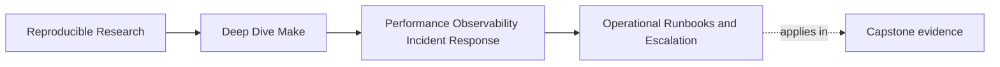

# Operational Runbooks and Escalation


<!-- page-maps:start -->
## Page Maps




<!-- page-maps:end -->

By the time a Make build reaches production usefulness, one question becomes unavoidable:

> if the maintainer who understands the build best is unavailable, can another engineer
> still respond to an incident competently?

If the answer is no, the build is operationally weak even if the Makefiles are beautiful.

This page is about turning build knowledge into a runbook that transfers.

## The sentence to keep

When you write a runbook, ask:

> what exact sequence should another engineer follow before they edit the build or escalate
> the incident?

That is the difference between operational support and folklore.

## A runbook is not a memoir

Weak runbooks often read like this:

- remember that this used to fail on CI once
- ask the maintainer if `-j` is involved
- maybe run a few commands

That is institutional memory, not an operational tool.

A useful runbook should give:

- a reproducible starting point
- a fixed evidence ladder
- a set of expected outputs or interpretations
- an escalation rule when the ladder stops helping

This is why Module 09 ends here. The module is not complete until the knowledge becomes
transferable.

## What a build runbook should usually answer

A serious build runbook often needs to answer at least these questions:

- how do I confirm convergence
- how do I compare serial and parallel behavior
- how do I inspect resolved variables or rules
- how do I collect evidence without mutating the system
- when is the incident large enough to escalate

Those questions are stable even as the exact repository evolves.

## A simple runbook skeleton

One practical shape is:

1. symptom confirmation
2. standard evidence commands
3. interpretation hints
4. common boundary classifications
5. escalation criteria

That keeps the runbook short enough to use while still being concrete enough to matter.

## Convergence belongs near the top

One of the most useful operational checks is still:

```sh
make all
make -q all; echo $?
```

This belongs in a runbook because it answers a very important question quickly:

- did the build settle after a successful run

That is not the answer to every incident. It is one of the fastest sanity checks you can
teach another engineer to use.

## Serial and parallel comparison should be explicit

Many build incidents become clearer when the runbook teaches a comparison like:

```sh
make clean
make all
make clean
make -j4 all
```

followed by an artifact or behavior comparison.

This is operationally valuable because it gives the responder a standard test for:

- hidden races
- shared output paths
- publication-order bugs

Without that explicit step, engineers often improvise their own parallel tests and make the
incident harder to compare.

## Runbooks should map questions to commands

One strong habit is to pair questions with the right surface:

| If you need to know... | Start with... |
| --- | --- |
| why a target rebuilt | `make --trace <target>` |
| what Make believes about variables and rules | `make -p` |
| whether the build converges | `make -q` after a successful run |
| whether the issue is parse-time or recipe-time | timed `make -n` versus timed `make all` |
| whether parallelism changes behavior | serial versus `-j` comparison |

This is a very practical way to make the runbook teach judgment rather than just list tools.

## Escalation should not be vague

A good runbook also says when the responder should stop treating the incident as a local
repair and escalate.

Reasonable escalation triggers might include:

- the incident cannot be reproduced with a stable route
- the likely failure boundary crosses tool ownership lines
- the evidence suggests environment or infrastructure drift beyond the repository contract
- the fix would require weakening correctness to recover speed

These criteria matter because they protect the build from panicked shortcuts under pressure.

## A small runbook example

```text
1. Confirm the symptom with the reported target and parallelism level.
2. Run `make -n <target>` if the question is about intended work.
3. Run `make --trace <target>` if the question is about causality.
4. Run `make -p > build/make.dump` if the question is about resolved state.
5. Compare serial and parallel behavior if flakiness is reported.
6. Escalate if the issue cannot be reproduced or if the likely cause crosses repository boundaries.
```

This is not a full runbook. It is already much more operational than "debug it like last
time."

## Runbooks should preserve evidence discipline

One easy way to ruin a runbook is to fill it with commands that change the system too early:

- `rm -rf build`
- rebuild from scratch
- disable parallelism
- comment out rules

Those steps may eventually be necessary. They should not be the first moves.

The runbook should teach responders to gather evidence before changing conditions so that
the investigation remains explainable.

## A runbook should have a human reader in mind

The audience for a runbook is not the original author on their best day. It is usually:

- a teammate under time pressure
- someone less familiar with the build
- someone trying to avoid making the problem worse

That means the runbook should:

- avoid inside jokes and maintainers-only shorthand
- use stable target names
- explain what success or failure of a command means
- avoid depending on history lessons

This is a pedagogy issue as much as an operations issue.

## Failure signatures worth recognizing

### "Only one person knows which commands to run first"

That means the build knowledge has not been operationalized.

### "Our runbook starts with destructive cleanup"

That usually means the runbook is skipping evidence discipline.

### "People escalate too late and keep trying random edits"

That means escalation criteria are too vague or missing.

### "The runbook lists commands but not what they mean"

That means it is not yet teaching interpretation.

## A review question that improves runbooks

Take one build runbook and ask:

1. whether a teammate could follow it without private context
2. whether the first commands gather evidence or destroy it
3. whether each command is tied to a specific question
4. whether escalation criteria are visible
5. whether the runbook uses stable target names and surfaces

If those answers are weak, the runbook is weak too.

## What to practice from this page

Write a small runbook for one build route that includes:

1. one convergence check
2. one serial/parallel comparison
3. one resolved-state inspection command
4. one escalation trigger
5. one sentence explaining what the responder should avoid doing too early

If you can do that cleanly, you are moving from personal debugging skill to operational
support skill.

## End-of-page checkpoint

Before leaving this lesson, make sure you can explain:

- why runbooks are part of build health
- what a useful runbook usually needs to answer
- why convergence and serial/parallel comparison belong near the top
- why escalation criteria should be explicit
- why operational transfer is different from one maintainer "just knowing the system"
