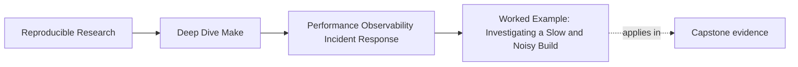
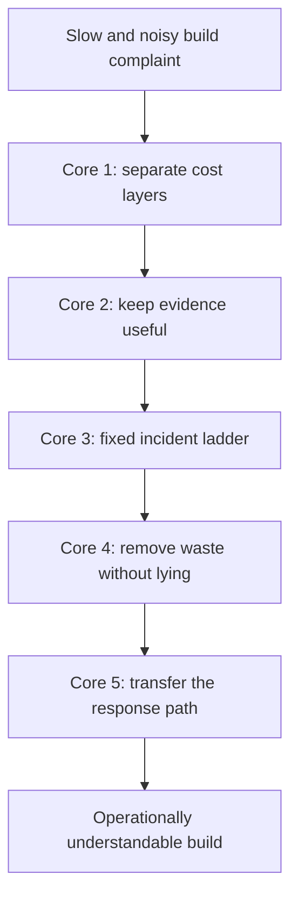

# Worked Example: Investigating a Slow and Noisy Build


<!-- page-maps:start -->
## Page Maps




<!-- page-maps:end -->

The five core lessons in Module 09 make the most sense when they appear in one incident
that feels familiar:

- the build still works
- but it suddenly feels slower
- the trace output is painful to use
- and the team is not sure whether the problem is in Make, the tools, or the observability
  surface itself

This example starts from exactly that situation.

## The incident

Assume you inherit a repository with these complaints:

1. a normal `make all` route now feels slow compared with last month
2. `make --trace all` produces far more output than the team can comfortably inspect
3. one maintainer says the problem is parse-time shelling out
4. another says the compiler got slower
5. a third person wants to "optimize" by suppressing rebuilds and removing diagnostics

That is a realistic operational moment. The goal is to sort it out without guessing.

## The starting habits

The repository currently has patterns like:

```make
SRCS := $(shell find src -name '*.c' | sort)
TOOLS := $(shell command -v python3)

.PHONY: trace-count
trace-count:
	@make --trace all 2>&1 | wc -l
```

And the team has fallen into these debugging habits:

- rerun the build several times
- sometimes clean first
- sometimes add prints
- sometimes force `-j1`

That is enough to start the refactor.

## Step 1: split the cost question

The first repair is not to the Makefile. It is to the diagnosis.

Run:

```sh
/usr/bin/time -p make -n all >/dev/null
/usr/bin/time -p make all >/dev/null
make --trace all > build/trace.log
wc -l build/trace.log
```

Suppose the results are:

```text
make -n all   -> 2.6s
make all      -> 3.1s
trace lines   -> 4200
```

That immediately suggests:

- parse/evaluation cost is a large part of the problem
- recipe cost exists but does not dominate
- evidence-surface cost is high too

This is Core 1:

- the complaint "slow build" has been split into real cost layers

## Step 2: inspect the observability surface

The huge trace count is a problem in its own right, but do not "fix" it by hiding
everything.

Instead ask:

- which output is high-value evidence
- which output is routine noise
- whether a named diagnostic route would be better than letting every route spill verbose data

Maybe the repository currently has scattered debug `echo`s inside several recipes. The
repair could be:

- remove the always-on prints
- keep `--trace` for causality
- keep a bounded `trace-count` target
- add one discovery audit target for resolved source lists

This is Core 2:

- observability becomes intentional
- evidence remains available
- semantic outputs stay clean

## Step 3: follow the incident ladder

The next question is whether the slow behavior comes from the graph model or from the
environment.

A calm triage ladder now looks like:

1. confirm the symptom with timings
2. preview with `make -n all`
3. explain one route with `make --trace all`
4. inspect the evaluated world with `make -p > build/make.dump`
5. classify the likely boundary

This keeps the team from jumping straight to edits such as:

- removing prerequisites
- disabling diagnostics
- forcing serial mode

This is Core 3.

## Step 4: identify a truth-preserving optimization

The parse-time cost clue points to:

```make
SRCS := $(shell find src -name '*.c' | sort)
```

Maybe this is repeated across multiple files.

A truth-preserving optimization is to move source listing into one stable script or manifest
boundary instead of shelling out repeatedly during parse:

```make
build/discovery.manifest: scripts/list_sources.py src/ | build/
	@python3 scripts/list_sources.py src > $@.tmp
	@cmp -s $@.tmp $@ 2>/dev/null || mv $@.tmp $@
	@rm -f $@.tmp
```

Now the build can:

- reduce repeated parse-time shell work
- keep discovery explicit
- preserve the truth boundary

This is Core 4:

- the tuning removes waste
- it does not hide inputs or suppress necessary rebuilds

## Step 5: write the runbook the team actually needed

At this point the team has a much better understanding, but the real operational win is to
capture it.

A useful runbook note might now say:

1. measure `make -n all` and `make all`
2. capture `--trace` into `build/trace.log`
3. compare trace line count against the expected band
4. if parse cost dominates, inspect discovery and repeated shell work
5. do not disable diagnostics or drop inputs as a first performance response

This is Core 5:

- the knowledge leaves the maintainer's head
- the next responder inherits a stable first move

## The repaired sketch

The repository is now closer to this operational model:

```make
build/discovery.manifest: scripts/list_sources.py src/ | build/
	@python3 scripts/list_sources.py src > $@.tmp
	@cmp -s $@.tmp $@ 2>/dev/null || mv $@.tmp $@
	@rm -f $@.tmp

.PHONY: trace-count
trace-count:
	@make --trace -n all 2>&1 | wc -l

.PHONY: discovery-audit
discovery-audit: build/discovery.manifest
	@cat build/discovery.manifest
```

And the team has a clearer incident sequence:

- measure
- trace
- inspect
- classify
- then change

That is a much healthier system than one where everyone reaches for a different trick.

## What each core contributed



This is why the module is organized as five cores and then one worked example. The example
is where the operational advice becomes a reusable incident story.

## What you should say at the end

A strong summary sounds like this:

> The build felt slow, but measurement showed the main cost was parse and evaluation rather
> than recipe execution. The observability surface was also too noisy to use well. We
> replaced repeated parse-time shell work with a truthful manifest boundary, kept a bounded
> set of diagnostic routes, and wrote a runbook that teaches the next responder how to
> measure, trace, inspect, and classify before editing the build.

That is much stronger than "we optimized the Makefiles."

## What to practice after this example

Take one real build complaint and retell it in the same order:

1. split the cost or symptom into layers
2. inspect the current evidence surface
3. follow a fixed triage ladder
4. identify one truth-preserving optimization
5. capture the response path in a short runbook

If you can do that cleanly, Module 09 has started to change how you respond under build
pressure.
