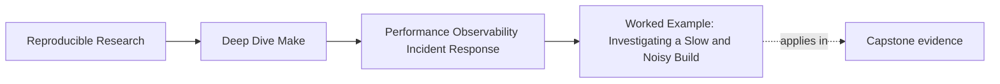
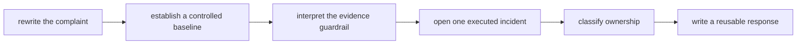

# Worked Example: Investigating a Slow and Noisy Build

<!-- page-maps:start -->
## Page Maps


```mermaid
graph LR
  family["Reproducible Research"]
  program["Deep Dive Make"]
  section["Performance Observability Incident Response"]
  page["Worked Example: Investigating a Slow and Noisy Build"]
  capstone["Capstone evidence"]

  family --> program --> section --> page
  page -.applies in.-> capstone
```


```mermaid
flowchart LR
  claim["rewrite the complaint"] --> baseline["establish a controlled baseline"]
  baseline --> guardrail["interpret the evidence guardrail"]
  guardrail --> incident["open one executed incident"]
  incident --> classify["classify ownership"]
  classify --> runbook["write a reusable response"]
```
<!-- page-maps:end -->

This worked example uses the course capstone. It does not ask you to imagine a repository
or accept invented timings. You will:

1. turn "slow and noisy" into separate claims
2. establish clean and no-op evidence on the reference build
3. inspect its bounded trace guardrail
4. generate an executed parallel incident bundle
5. distinguish successful exit status from truthful output ownership
6. write the first runbook branch

Run the commands from the repository root. They use `gmake` because macOS commonly reserves
`make` for an older GNU Make. On Linux, use `make` only after `make --version` confirms GNU
Make 4.3 or newer.

Set a shell variable only to keep the commands readable:

```sh
CAPSTONE=programs/reproducible-research/deep-dive-make/capstone
```

The variable is local convenience, not part of the build contract.

## The report

Assume a teammate files this message:

> The capstone build is slow, the trace is noisy, and parallel execution looks suspicious.
> Can we reduce the diagnostics and force serial mode?

There are at least three claims hidden inside it:

| Complaint | Measurable claim | First evidence |
| --- | --- | --- |
| slow | one named route and state exceeds a stated baseline | repeated clean, no-op, or dry-run samples |
| noisy | one evidence surface is too large or hard to interpret | state-aware trace volume plus usability inspection |
| suspicious under parallelism | a pressure route changes output or correctness | governed serial/parallel comparison or incident repro |

The proposed changes do not follow yet. Removing diagnostics could hide causality. Forcing
serial mode could hide an ownership defect. First, classify each claim.

## Preserve the starting context

Create the incident packet:

```sh
mkdir -p artifacts/module09-incident
git rev-parse HEAD > artifacts/module09-incident/revision.txt
git status --short > artifacts/module09-incident/worktree.txt
gmake --version > artifacts/module09-incident/make-version.txt
```

Write `artifacts/module09-incident/incident.md` in this shape:

```text
Route under review: capstone `all`
Build states: clean and no-op
Parallel concern: controlled shared-output repro
Observed claim: not yet established
Expected contract: `all` converges; selftest proves serial/parallel equivalence
Proposed shortcuts to evaluate: remove diagnostics; force serial execution
```

Notice the phrase "not yet established." A ticket is not a baseline.

## Read the public route before measuring it

Discover the capstone surface:

```sh
gmake -C "$CAPSTONE" help \
  > artifacts/module09-incident/help.txt
gmake -C "$CAPSTONE" perf PERFORMANCE_RUNNER=local-course-machine \
  > artifacts/module09-incident/perf-command.txt 2>&1
```

The relevant target meanings are:

- `all` builds the application, dynamic binaries, and a convergence sentinel
- `trace-report` records a clean planning trace with attribution and usability checks
- `selftest` checks convergence and serial/parallel equivalence
- `incident-audit` executes one controlled failure specimen and saves a review bundle
- `perf` executes governed clean, no-op, and dry-run scenarios and writes review evidence
- `performance-selftest` proves the evidence gates accept truth and reject controlled drift

This reading step matters. Timing an undocumented helper would not establish the cost of
the public build contract.

## Read the experiment contract before the numbers

The command writes:

```text
artifacts/performance/reproducible-research/deep-dive-make/current/
├── PERFORMANCE_EVIDENCE_GUIDE.md
├── evidence.json
├── incremental-policy.tsv
├── incremental-summary.tsv
├── incremental-work.json
├── logs/
├── manifest.json
├── route.txt
├── scenarios.tsv
└── summary.tsv
```

Read `scenarios.tsv` first:

```text
# scenario	state	jobs	route
clean-build	clean	4	all
converged-noop	converged	1	all
converged-dry-run	converged	1	dry-run-all
```

Now the words *clean*, *no-op*, and *dry-run* have executable meanings. The collector, not
the learner's memory, establishes each precondition.

Cleaning is appropriate for `clean-build` because the experiment contract explicitly asks
for a clean route. It would still be the wrong first action on an unpreserved production
incident.

## Predict and inspect the change-impact matrix

Before opening generated evidence, use the graph to predict:

| Input | Expected impact |
| --- | --- |
| `src/util.c` | util object, app, `all` |
| `include/util.h` | main and util objects, app, `all` |
| `include/sub.h` | main and sub objects, app, `all` |
| `scripts/gen_dynamic_h.py` | generated header, both dynamic binaries, `all` |
| `src/dynamic/dyn1.c` | only `dyn1` and `all` |

Now read `incremental-policy.tsv`. Check both sides of every row. “Must remain” is not filler:
it is how the policy catches collateral rebuilds.

Open `incremental-summary.tsv` next. A passing local run has this shape:

```text
input                     result  missing  unexpected
src/util.c                PASS    -        -
include/util.h            PASS    -        -
include/sub.h             PASS    -        -
scripts/gen_dynamic_h.py  PASS    -        -
src/dynamic/dyn1.c        PASS    -        -
```

Do not infer equal fan-out from equal `PASS` results. The header rows rebuild two objects
because each header has two consumers. The generator script rebuilds a published header and
both consumers. The isolated dynamic source should not relink `app`.

Every row classifies the same governed outputs. Verify this by taking the union of
`must_rebuild` and `must_remain` for two different rows. If the unions differ, the narrower
row could hide an unobserved output.

Use `incremental-work.json` only after the summary. Each case retains:

- the input
- expected and observed rebuild sets
- missing and unexpected sets
- result
- its own raw trace

If the `include/util.h` row reports `build/main.o` as missing, search that case's trace for
`build/main.o` and inspect `build/main.d`. The likely boundary is discovered header
dependency evidence, not timing. If the `src/dynamic/dyn1.c` row unexpectedly includes
`app`, inspect paths between that input and the ordinary link route before accepting a
performance claim.

## Decide whether the evidence is attributable

Open `evidence.json` before `summary.tsv`. Find:

```json
{
  "context": {
    "compiler": {"command": "cc", "executable": "...", "version": "..."},
    "make": {"command": "gmake", "executable": "...", "version": "..."},
    "platform": "...",
    "python": "...",
    "repository": {
      "revision": "...",
      "status": "clean",
      "status_sha256": "..."
    },
    "runner": "local-course-machine"
  }
}
```

The exact values depend on your environment. The reasoning does not:

1. `revision` identifies the source graph that was measured.
2. `status=clean` says the revision is enough to reconstruct that source.
3. resolved tool identities expose a compiler or GNU Make change.
4. the runner label says which stable environment the operator intended to use.

If the status is `dirty`, keep the bundle as an observation but do not promote it to a
comparison baseline. Commit the intended source state or restore unrelated edits, confirm
the worktree is clean, and recollect. Do not erase `"dirty"` from the JSON; that would
change the report rather than repair its provenance.

## Inspect distributions after provenance

Open `summary.tsv`. Your values will differ, but its shape is stable:

```text
scenario  state  jobs  samples  minimum  median  maximum  spread  convergence
```

For each scenario, check:

- the sample count matches the policy you intended to run
- median is reported with minimum, maximum, and spread
- convergence is `PASS`
- no sample has a nonzero exit status in `evidence.json`
- the trusted-output inventory names all five declared outputs
- `incremental_work.result` is `PASS` inside the same evidence document
- the bound incremental case set contains all five policy inputs

The clean route describes full production cost. The no-op route describes an already
converged invocation. Dry-run localizes work before ordinary recipe execution but does not
isolate parsing.

If no compatible earlier bundle exists, write:

> A governed local baseline now exists. No performance regression has been established.

That is a completed finding, not a failure to diagnose.

## Prove that the gate can reject dishonesty

Run:

```sh
gmake -C "$CAPSTONE" performance-selftest \
  > artifacts/module09-incident/performance-selftest.txt 2>&1
```

The route checks four boundaries:

- execution context distinguishes clean, dirty, and unavailable provenance
- incremental policy rejects incomplete output classification
- the runner retains earlier cases when a later input exposes missing work
- capture rejects too few samples, failed routes, and failed incremental evidence
- comparison rejects missing input cases and non-first-case requested-work drift

A useful gate needs rejection paths at every boundary, not one passing demonstration.

You can also observe the public missing-baseline boundary:

```sh
if gmake -C "$CAPSTONE" performance-compare \
  > artifacts/module09-incident/missing-baseline.txt 2>&1; then
  printf '%s\n' 'unexpected comparison success' >&2
  exit 1
fi
```

Read the captured output. The failure is correct because a candidate timing cannot compare
itself with an unstated past.

## Rehearse a compatible comparison without inventing a regression

Preserve the first bundle, collect again under the same contract, and compare:

```sh
mkdir -p \
  artifacts/performance/reproducible-research/deep-dive-make/accepted-baseline
cp -R \
  artifacts/performance/reproducible-research/deep-dive-make/current/. \
  artifacts/performance/reproducible-research/deep-dive-make/accepted-baseline/

gmake -C "$CAPSTONE" perf PERFORMANCE_RUNNER=local-course-machine

gmake -C "$CAPSTONE" performance-compare \
  PERFORMANCE_BASELINE=../../../../artifacts/performance/reproducible-research/deep-dive-make/accepted-baseline/evidence.json
```

Read `current/comparison.json` in this order:

1. `execution_context` names both revisions and the matching tools and runner.
2. `incremental_work` names the input and matching expected and observed rebuild sets.
3. `semantic_equivalence` must be `PASS`.
4. scenario deltas come last.

Because both bundles measure the same revision, this rehearsal tests repeatability and the
comparison route. It does not prove a source-code improvement. A real candidate comparison
should name different clean revisions while keeping the other compatibility fields equal.

Suppose a later candidate is faster but comparison fails. Classify the failure before
looking at the delta:

| Failure | Decision |
| --- | --- |
| `compiler mismatch` | recollect both revisions with one compiler, or report a cross-toolchain observation |
| `candidate worktree is not clean` | establish an attributable candidate revision, then recollect |
| `observed_rebuild mismatch` | inspect the graph change; do not claim equivalent work |
| `trusted-output inventory mismatch` | treat this as a semantic change, not a speedup |

Do not weaken the comparator merely because the candidate number looks favorable.

## Inspect the trace evidence

Run:

```sh
gmake -C "$CAPSTONE" trace-report
```

Read `trace-evidence.json` before `trace.log`. Confirm the report says `state=clean-plan`,
`focus_target=all`, and `result=PASS`. Then inspect:

- whether `all` appears among planned targets
- whether rule locations identify the owning Makefiles
- whether the plan-line count is below the declared boundary
- whether the raw trace explains why representative targets would run

The target establishes clean state, so do not compare its count with a trace captured after
convergence. If focus or attribution fails, the evidence is unusable even when it is short.
If volume alone fails, inspect repeated low-value lines before changing the boundary. Do not
merge this conclusion with timing: trace usability and route cost remain separate claims.

## Generate a controlled incident

The capstone includes a repro where two targets append to one shared file. Generate its
incident bundle:

```sh
gmake -C "$CAPSTONE" incident-audit \
  REPRO_CASE=repro/shared-log-interleaving.mk
```

The bundle appears under:

```text
artifacts/audit/reproducible-research/deep-dive-make/incident/
```

Read these files in order:

1. `command.txt`
2. `run.txt`
3. `exit-status.txt`
4. `shared-log-interleaving.mk`
5. `INCIDENT_REVIEW_GUIDE.md`

An observed bundle contains:

```text
printf 'A\n' >> shared.log
printf 'B\n' >> shared.log
```

and:

```text
exit_status=0
```

That is the important surprise. The route can exit successfully while the graph still
models shared mutable output dishonestly.

## Classify from ownership, not from exit status

The copied repro contains:

```make
all: log1 log2

log1:
	printf 'A\n' >> shared.log

log2:
	printf 'B\n' >> shared.log
```

Ask the ownership question:

> Which target owns `shared.log`?

The honest answer is "neither owns it uniquely." Two independent targets mutate the same
path, and `shared.log` is not even a declared target. Parallel scheduling exposes the
problem, but parallelism did not create it.

Classify the incident:

| Field | Decision |
| --- | --- |
| boundary | graph truth and publication ownership |
| immediate risk | nondeterministic shared output |
| misleading signal | exit status `0` |
| mitigation | serial mode may reduce exposure but does not repair ownership |
| repair direction | one target owns the file, or each worker owns separate output followed by a declared merge |
| proof after repair | repeated pressure runs, stable content, one writer, and convergence |

Now the suggestion to force serial mode can be rejected as a completed fix. It changes the
scheduler while leaving two undeclared writers.

## Connect the repro back to the real build

Do not "repair" the controlled repro and stop. It is a teaching specimen. Use the real
capstone proof route:

```sh
gmake -C "$CAPSTONE" selftest-report
```

Read:

```text
artifacts/proof/reproducible-research/deep-dive-make/selftest/
├── summary.txt
├── settings.env
├── commands.txt
├── schedule-comparison.json
├── serial-inventory.json
├── parallel-inventory.json
├── hidden-input.txt
├── logs/
└── workspace/
```

The comparison classifies missing, unexpected, and changed artifacts before the two
inventories provide path-level detail. The command logs and preserved workspace keep a
failed stopping boundary reviewable. The repro demonstrates the failure class; the
selftest bundle demonstrates the production proof shape.

## Write the runbook branch

Add this to `artifacts/module09-incident/runbook.md`:

```text
Entry: a route differs under parallel execution or mutates one shared output.

Preserve:
- command, revision, Make version, job count, output, and artifact state
- do not clean before capture

Classify:
- search for every writer of the suspect path
- use target-attributed output and non-executing trace

If multiple targets write one path:
- stop publication of that output
- treat serial mode only as labeled mitigation
- repair to one owner or isolated worker outputs plus one merge target

Close when:
- repeated pressure runs pass
- serial and parallel artifact comparisons satisfy the contract
- the route converges
```

This branch can be used by someone who did not attend the class.

## The final decision

The original complaint does not produce one verdict:

- "slow" requires comparison with a controlled historical baseline; this exercise
  establishes the missing baseline
- "noisy" must be evaluated by trace usability and responder value, not dislike of output
- the parallel concern is real in the controlled repro, but serial mode is only mitigation
- removing diagnostics would weaken the evidence needed to classify the ownership defect

A strong incident summary is:

> We separated the broad complaint into cost, evidence, and pressure claims. The capstone
> now has a governed clean, no-op, and dry-run baseline whose scenarios, samples,
> provenance, requested work, convergence, and trusted outputs are reviewable. Its trace is
> evaluated by state, attribution, searchability, and bounded plan volume. The executed
> repro exits successfully but reveals
> two undeclared writers to one shared file, so the defect is output ownership rather than
> "too much parallelism." Serial execution is temporary mitigation; repair requires one
> publication owner and schedule-equivalence proof.

## Exit check

You have completed the example when you can point to:

- governed clean, no-op, and dry-run samples with their scenario contract
- revision, worktree, runner, and tool identities beside every timing distribution
- convergence and trusted-output evidence beside every timing distribution
- the declared and observed incremental rebuild scope
- one context rejection and one requested-work rejection you can explain
- the trace state, focus target, semantic checks, and one raw causal line
- the incident bundle's command, output, status, and copied makefile
- a classification that does not rely on exit status alone
- the selftest report that represents the repaired proof shape
- a runbook branch another learner could follow without you
