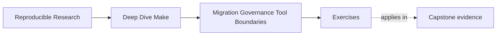
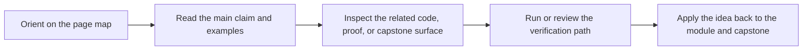

# Exercises

<!-- page-maps:start -->
## Page Maps

<!-- page-maps:end -->

Use these after reading the five core lessons and the worked example. The goal is to make
your review and migration judgment visible, not to produce generic build advice.

Each exercise asks for three things:

- the stewardship question you are answering
- the evidence or review artifact you would rely on
- the change, rule, or boundary decision that follows from that evidence

## Exercise 1: Write a first-pass build review

Choose one inherited Make-based repository. Write a short review that covers:

- public target meanings
- trusted outputs and their writers
- hidden inputs or stateful behavior
- one pressure finding from dry-run, trace, or serial/parallel comparison
- the top three risk classes you found

What to hand in:

- one page or less
- at least one concrete command you ran or would run
- the three risk classes in clear language such as graph truth, contract drift, or boundary
  risk

## Exercise 2: Sequence a safe migration

Pick one painful part of the build, such as release packaging, generated metadata, or test
orchestration. Design a migration plan that changes that part without deleting the old proof
surface too early.

What to hand in:

- the current contract in one sentence
- the smallest boundary move you would make first
- one proof surface you would preserve during the migration
- one retirement condition that must be true before the old route disappears

## Exercise 3: Write a governance note that could actually be enforced

Draft a short governance note for the repository. It should define:

- which targets are public
- what review bar applies to public-target changes
- one rule for new include files or macros
- one rule protecting proof surfaces

What to hand in:

- a note of six to ten lines
- wording another maintainer could apply during review
- one sentence explaining which kind of drift the note is meant to prevent

## Exercise 4: Diagnose one recurring antipattern

Pick one of these recurring smells:

- ritual target ordering instead of real edges
- multi-writer outputs
- opaque orchestration through wrappers
- meaningless stamps or manifests
- a release target that does too much

Explain how you would recognize it in a real repository and what the first honest recovery
move would be.

What to hand in:

- the antipattern name
- two signals that would confirm it
- the smallest repair you would try first
- one sentence on why that repair restores truth or ownership clarity

## Exercise 5: Make the tool-boundary argument

Choose one concern from a real build:

- compilation
- code generation
- packaging
- deployment
- release metadata
- remote publication

Argue whether Make should remain the owner, hand it off, or share it through a hybrid
boundary.

What to hand in:

- the concern you chose
- a one-paragraph argument
- the handoff artifact or interface if another tool becomes involved
- one sentence on what evidence would prove the boundary is working

## Mastery standard for this exercise set

Across all five answers, the module wants the same habits:

- you review behavior before proposing rewrites
- you preserve proof while changing boundaries
- you write governance in enforceable language
- you name antipatterns in terms of truth loss or ownership drift
- you justify tool boundaries by modeling fit, not by novelty

If an answer says only "this build should be cleaned up," keep going.
