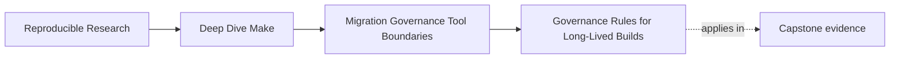

# Governance Rules for Long-Lived Builds


<!-- page-maps:start -->
## Page Maps




<!-- page-maps:end -->

This page turns good build taste into enforceable build rules.

If the build matters to more than one engineer, it needs governance: who may change what,
what must stay stable, and what every new addition must prove before it is trusted.

## Why governance matters here

Many teams do excellent repair work once and then quietly drift back into the same old
patterns:

- new public targets appear without review
- helper macros grow until nobody can explain them
- CI begins depending on internal routes
- audit commands disappear because they feel inconvenient
- release and install semantics change without anyone naming the break

That is not a lack of intelligence. It is a lack of rules.

Governance is how you keep the build from becoming a private superstition again.

## The sentence to keep

When a build change is proposed, ask:

> what contract, ownership boundary, or proof surface does this change touch, and what is
> the review bar for that kind of change?

That question is governance in one line.

## Build governance is mostly about change classes

Not every edit deserves the same review weight.

For example:

- fixing a typo in help text
- renaming a public target
- adding a new included layer
- changing release artifact contents
- removing a selftest or audit target

Those are all "docs or build changes" in one sense. They are not equal changes.

Governance starts by recognizing classes of change and assigning each class a review bar.

## A simple governance matrix

Use a matrix like this:

| Change class | Example | Expected review bar |
| --- | --- | --- |
| public contract change | rename `release-check`, alter `test` meaning | explicit maintainer review and updated docs |
| proof-surface change | remove `selftest`, alter audit target output | evidence that replacement exists and remains usable |
| architecture change | add a new include layer or macro abstraction | justification of responsibility boundary |
| product-output change | modify package contents or install destination | output comparison or artifact evidence |
| internal repair | fix a hidden edge in one helper rule | normal review with proof of correctness |

The exact categories can vary. What matters is that the team stops pretending all build
changes are interchangeable.

## Public targets need a promotion rule

A common source of governance drift is uncontrolled target growth.

If every useful helper becomes top-level and undocumented, the build surface gets noisy and
fragile. A better rule is:

Before a target becomes public, it must satisfy all of these:

1. its meaning can be explained in one sentence
2. a human or automation consumer actually needs it
3. the name is stable enough to support for a long time
4. its behavior is visible enough to debug
5. the team is willing to treat changes to it as interface changes

That promotion rule prevents accidental APIs.

## Includes and macros need boundaries too

Teams often govern target names and forget the supporting structure.

That is dangerous because long-lived build complexity often hides in:

- shared macros with magical side effects
- include layers that mix policy and mechanism
- variables whose scope is unclear
- helper files that become dumping grounds for every new case

Simple governance rules help a lot:

- each included file should own one responsibility
- macros should either compute text or define a rule pattern, not both invisibly
- new abstraction layers need a reason stronger than "the file got long"
- helper names should signal ownership and usage clearly

These rules do not make the build rigid. They make it teachable.

## Proof surfaces should be protected explicitly

One of the most expensive forms of drift is when teams slowly delete the very evidence that
helps them review the system.

Examples:

- `make --trace` guidance disappears from docs
- `selftest` stops running in CI
- a manifest or dump target is removed because it seems noisy
- serial/parallel comparison stops being part of review

Governance should name proof surfaces as first-class assets.

A rule worth adopting:

> no proof surface may be removed unless an equivalent or better one replaces it and the
> replacement is documented where maintainers already look.

That rule saves teams from trading clarity for short-term tidiness.

## Governance should define ownership, not just approval

Approval is only part of governance. Ownership matters just as much.

Someone should be able to answer:

- who curates public target meaning
- who reviews architecture changes in `mk/` or included files
- who decides whether a new tool boundary is justified
- who keeps proof routes usable
- who is responsible for migration retirement steps

If the answer is "everybody," the answer is often "nobody."

This does not require one heroic maintainer. It requires named stewardship.

## A small example of governance language

Here is a short build-governance note that is actually enforceable:

```text
Public targets are all, test, selftest, clean, help, release-check, and dist.
Changes to their names or meanings require maintainer review and docs updates.

New include files require a stated responsibility boundary.
New macros must document whether they compute text, define rules, or both.

Proof routes such as selftest, trace guidance, and artifact audits may not be removed
without a documented replacement.
```

That is not fancy policy writing. It is useful because another maintainer can apply it.

## Review questions that make governance real

When reading a build change, ask:

1. does this alter a public contract
2. does this hide or remove a proof surface
3. does this add abstraction without a clear ownership boundary
4. does this make CI or scripts depend on internals
5. does this change who owns a concern without naming the handoff

Those questions catch most governance drift early.

## Governance is also about what not to allow

Teams often write permissive guidelines and leave out the hard stops.

Add some clear "no" rules:

- no shared append-only log targets in parallel paths
- no new public targets without a contract sentence
- no release target that silently installs or deploys
- no removal of audit outputs before a replacement exists
- no new layer whose purpose is only to hide a messy rule

Those rules are blunt by design. They save review time.

## Failure signatures worth recognizing

### "The build keeps getting harder to explain, even though it still works"

That usually means architecture growth is happening without governance.

### "People are afraid to clean anything up because they do not know what is public"

That means public target governance is missing.

### "We lost a useful debug route during refactoring"

That is a proof-surface governance failure, not just a missed doc update.

### "Every maintainer uses different words for the same build concept"

That usually means the governance note is too vague to stabilize language.

## What this page wants you to leave with

Strong governance is not bureaucracy. It is shared memory written down.

A strong module answer sounds like this:

> We know which targets are public, which proof surfaces are protected, which layers own
> which responsibilities, and what review bar applies before those things can change.

That sentence describes a build a team can maintain for years.
