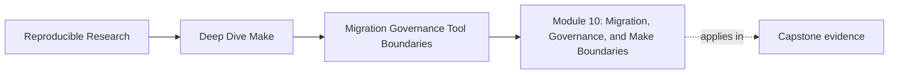
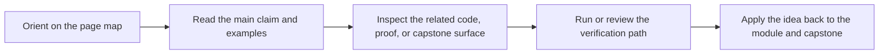
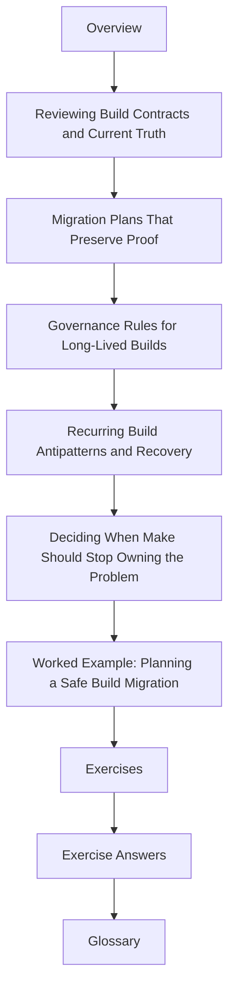

# Module 10: Migration, Governance, and Make Boundaries


<!-- page-maps:start -->
## Page Maps




<!-- page-maps:end -->

Module 10 is where the course stops asking, "Can you make this build work?" and starts
asking, "Can you inherit it responsibly?"

That is a different skill. A mature build engineer needs to review a legacy Make system,
separate design debt from broken truth, plan change without losing evidence, and say
plainly when Make should remain the owner of a concern and when it should not.

This module is about stewardship:

- reading a build as a long-lived product instead of a pile of commands
- planning repairs in an order that preserves proof
- defining rules future maintainers can actually follow
- recognizing anti-patterns before they turn into team folklore
- drawing honest tool boundaries instead of fashionable ones

## What this module is for

By the end of Module 10, you should be able to explain five things clearly:

- how to review a Make-based build without collapsing into style arguments
- how to stage a migration so each move keeps the build auditable
- what governance rules keep a build teachable and maintainable over time
- which recurring build smells are worth stopping immediately
- when Make is still the right owner and when another tool should take over

## Study route



Read the module in that order the first time. After that, jump directly to the page that
matches the stewardship question in front of you.

## The ten files in this module

1. Overview (`index.md`)
2. [Reviewing Build Contracts and Current Truth](reviewing-build-contracts-and-current-truth.md)
3. [Migration Plans That Preserve Proof](migration-plans-that-preserve-proof.md)
4. [Governance Rules for Long-Lived Builds](governance-rules-for-long-lived-builds.md)
5. [Recurring Build Antipatterns and Recovery](recurring-build-antipatterns-and-recovery.md)
6. [Deciding When Make Should Stop Owning the Problem](deciding-when-make-should-stop-owning-the-problem.md)
7. [Worked Example: Planning a Safe Build Migration](worked-example-planning-a-safe-build-migration.md)
8. [Exercises](exercises.md)
9. [Exercise Answers](exercise-answers.md)
10. [Glossary](glossary.md)

## How to use the file set

| If you need to... | Start here |
| --- | --- |
| review an inherited Makefile with discipline instead of taste-based debate | [Reviewing Build Contracts and Current Truth](reviewing-build-contracts-and-current-truth.md) |
| change a build without losing your ability to prove it still works | [Migration Plans That Preserve Proof](migration-plans-that-preserve-proof.md) |
| define what future maintainers are allowed to change casually and what they are not | [Governance Rules for Long-Lived Builds](governance-rules-for-long-lived-builds.md) |
| identify build patterns that repeatedly produce pain | [Recurring Build Antipatterns and Recovery](recurring-build-antipatterns-and-recovery.md) |
| choose honestly between keeping responsibility in Make or moving it elsewhere | [Deciding When Make Should Stop Owning the Problem](deciding-when-make-should-stop-owning-the-problem.md) |
| see the whole module in one realistic migration narrative | [Worked Example: Planning a Safe Build Migration](worked-example-planning-a-safe-build-migration.md) |
| pressure-test your own reasoning | [Exercises](exercises.md) |
| compare your reasoning against a reference | [Exercise Answers](exercise-answers.md) |
| keep the module vocabulary stable | [Glossary](glossary.md) |

## The running question

Carry this question through every page:

> what evidence would let me improve this build while keeping trust in its current and
> future behavior?

Strong Module 10 answers usually mention one or more of these:

- a review artifact that makes the present system legible
- a migration step that changes one boundary at a time
- a governance rule that protects public contracts and evidence surfaces
- an anti-pattern described in terms of truth loss or ownership drift
- a tool-boundary argument based on responsibility, not novelty

## Commands to keep close

These commands form the review loop for Module 10:

```sh
make -n all
make --trace all
make -p > build/review.dump
make -j1 all
make -j8 all
```

The exact targets may change from repository to repository. The point is stable evidence:
dry-run meaning, trace meaning, database meaning, and serial versus parallel behavior.

## Learning outcomes

By the end of this module, you should be able to:

- write an evidence-based review of a legacy Make build
- stage a migration without discarding convergence, traceability, or comparison checks
- define governance rules for public targets, includes, macros, and proof surfaces
- recognize recurring build failures as patterns instead of one-off anecdotes
- explain where Make should keep ownership and where it should hand off responsibility

## Exit standard

Do not move on until all of these are true:

- you can review one real Make system without defaulting to style complaints
- you can describe a migration sequence that preserves proof after each step
- you can write governance rules another maintainer could enforce
- you can name recurring anti-patterns and explain why they are costly
- you can defend one tool-boundary choice in terms of ownership and evidence

When those feel ordinary, Module 10 has done its job.
