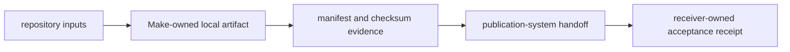
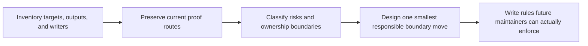
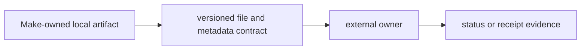

# Module 10: Migration, Governance, and Make Boundaries

Module 10 is where the course stops asking, "Can you make this build run?" and starts
asking, "Can you inherit it responsibly, change it safely, and explain when Make should
keep or lose ownership?"

That is a different skill.

A mature build steward needs to:

- review a Make system without collapsing into taste arguments
- separate broken truth from ordinary design debt
- move one boundary at a time without erasing the current proof routes
- write governance that future maintainers can actually enforce
- say plainly when Make is still the right owner and when another tool should take over

This module is about stewardship, not just repair.

## The repository you will reason about

Use one inherited repository throughout the session. It may be the course capstone, a
work repository you are allowed to inspect, or the worked report-build specimen later in
this module. It needs at least:

- one target called by humans or CI
- one trusted file artifact
- one helper or script boundary
- one proof route, even if that route is currently weak
- one ownership question that cannot be answered from the target name alone

Do not choose a repository so large that you can only discuss it abstractly. A useful
slice lets you trace one request from public target to published artifact and, if present,
to an external side effect.

The running case in this module separates three kinds of truth:


```mermaid
flowchart LR
  source["repository inputs"] --> local["Make-owned local artifact"]
  local --> evidence["manifest and checksum evidence"]
  evidence --> receiver["publication-system handoff"]
  receiver --> receipt["receiver-owned acceptance receipt"]
```

The migration and governance work will be judged by whether those truths stay distinct
and reviewable.

## Why this module matters

By the time a Make build becomes long-lived, the hard problems are rarely syntax
problems. They are stewardship problems:

- CI depends on helpers that were never meant to be public
- one release route now builds, packages, uploads, and mutates remote state
- a migration is needed, but nobody knows what evidence must survive the move
- maintainers can feel the build is risky, yet cannot explain exactly why
- "replace Make" and "leave it alone" both sound simpler than honest review

This module exists so those conversations stop being emotional and start becoming
evidence-based.

## The running question

Carry this question through every page:

> What evidence would let me improve this build while keeping trust in its current and
> future behavior?

Strong Module 10 answers usually mention one or more of these:

- a review artifact that makes the present system legible
- a migration step that moves one boundary while keeping a comparison route alive
- a governance rule that protects a public contract or proof surface
- an antipattern described in terms of truth loss or ownership drift
- a tool-boundary decision defended by modeling fit rather than novelty

## What this module is really for

By the end of the module, you should be able to explain five things clearly:

- how to review an inherited Make build without defaulting to style complaints
- how to stage a migration so each move keeps proof alive
- what governance rules keep a build teachable and maintainable over time
- which recurring build smells deserve immediate intervention
- when Make is still the most honest owner and when it is not

Those are course-closing skills. They depend on everything earlier in the program:
graph truth, parallel safety, determinism, target contracts, release boundaries, and
operational evidence.

## How to treat this module

Treat Module 10 as one serious stewardship session, not as a loose epilogue.

You are not required to replace Make.

You are required to understand one real Make system well enough that keeping, repairing,
or handing off a concern becomes a defendable decision.

If you finish the module with only opinions about "cleanups" or "modernization," you
have missed the point.

## Entry diagnostic

Before reading the core lessons, take ten minutes and answer these without searching the
module:

1. Which targets in your chosen repository are public contracts, and what evidence makes
   them public?
2. Which rule or external system is the sole writer for one trusted output?
3. What current behavior is contractual, and what observed behavior is merely a defect?
4. What proof would have to survive if one responsibility moved to another owner?
5. Where would a retry belong if remote publication failed after accepting the artifact?

Keep the answers. Revisit them after the worked example. A changed answer is useful
evidence that the module corrected your model; an unchanged vague answer is a signal to
repeat the relevant lesson.

## Knowledge this module assumes

Module 10 combines earlier ideas rather than reteaching them from scratch:

| Earlier capability | How it appears here |
| --- | --- |
| graph truth | deciding whether an inherited target models every meaning-changing input |
| parallel safety | distinguishing a real contract from behavior that works only under `-j1` |
| deterministic evidence | comparing artifact contents without confusing timestamps or paths |
| target contracts | identifying public promises and accidental helper APIs |
| generated-output ownership | separating one producer from packaging and publication consumers |
| release evidence | deciding what manifest, checksum, and acceptance record cross a boundary |
| incident evidence | preserving traces and failure signatures while implementation ownership moves |

If two or more rows feel unfamiliar, use the linked core pages as a guided review and
return here. The module assumes you can read Make; it does not assume you have led a
migration before.

## The live stewardship route

Use one inherited build review and one bounded handoff decision as the anchors for the
day:


```mermaid
flowchart LR
  review["Inventory targets, outputs, and writers"] --> characterize["Preserve current proof routes"]
  characterize --> classify["Classify risks and ownership boundaries"]
  classify --> move["Design one smallest responsible boundary move"]
  move --> govern["Write rules future maintainers can actually enforce"]
```

That route keeps change tied to trust instead of taste.

## Stewardship packet to build all day

Keep one packet as you work through the module. By the end it should contain:

- one first-pass build review
- one target/output ownership inventory
- one proof-preserving migration step
- one governance note with an enforcement path
- one tool-boundary decision record
- one bounded repair or migration sequence

If those artifacts are missing, you are probably talking about the build more than you
are stewarding it.

Add an evidence index so the packet can be reviewed without oral explanation:

| Claim | Artifact that must support it |
| --- | --- |
| current public behavior is understood | caller inventory and target contract table |
| current outputs have known owners | output/side-effect ownership ledger |
| the first boundary move is safe | baseline and replacement comparison results |
| an observed difference is intentional | explicit divergence record with approval owner |
| rollback remains possible | executable rollback trigger and preserved baseline route |
| the established route can be retired | retirement-gate results and caller search |
| the handoff is complete | sender evidence plus receiver acceptance receipt |

“Discussed in a meeting” is not an artifact. Record the command, output, or decision that
lets the next maintainer reconstruct the argument.

## Decide by responsibility, not by tool fashion

For each concern, compare the ownership it needs with the ownership Make can provide:

| Concern | Local file graph? | External state? | Long-running orchestration? | Likely owner |
| --- | ---: | ---: | ---: | --- |
| compile sources into objects | yes | no | no | Make |
| assemble and verify a local bundle | yes | no | no | Make |
| upload and retry against a remote service | partly | yes | possibly | workflow or publication tool |
| coordinate a distributed research pipeline | partly | yes | yes | workflow scheduler |

These are starting judgments, not universal answers. A handoff is justified when another
tool has a clearer responsibility model for the concern, not merely because it is newer.

Every proposed handoff should still have a visible contract:


```mermaid
flowchart LR
  make["Make-owned local artifact"] --> contract["versioned file and metadata contract"]
  contract --> external["external owner"]
  external --> receipt["status or receipt evidence"]
```

Without that contract, "migration" often means hidden coupling moved from one script to
another.

## Study route

Read the module in this order the first time:

1. [Reviewing Build Contracts and Current Truth](reviewing-build-contracts-and-current-truth.md)
2. [Migration Plans That Preserve Proof](migration-plans-that-preserve-proof.md)
3. [Governance Rules for Long-Lived Builds](governance-rules-for-long-lived-builds.md)
4. [Recurring Build Antipatterns and Recovery](recurring-build-antipatterns-and-recovery.md)
5. [Deciding When Make Should Stop Owning the Problem](deciding-when-make-should-stop-owning-the-problem.md)
6. [Worked Example: Planning a Safe Build Migration](worked-example-planning-a-safe-build-migration.md)
7. [Exercises](exercises.md)
8. [Exercise Answers](exercise-answers.md)
9. [Glossary](glossary.md)

That order matters because the worked example and practice surfaces are much more useful
once the review, migration, governance, smell, and tool-boundary vocabulary is already
stable.

## The file set in this module

| File | Why it exists |
| --- | --- |
| `index.md` | orient the stewardship day and define the packet you should leave with |
| `reviewing-build-contracts-and-current-truth.md` | teach first-pass review without style drift |
| `migration-plans-that-preserve-proof.md` | teach how to move one boundary while keeping evidence alive |
| `governance-rules-for-long-lived-builds.md` | turn taste into enforceable maintainer rules |
| `recurring-build-antipatterns-and-recovery.md` | help you recognize repeated forms of truth loss quickly |
| `deciding-when-make-should-stop-owning-the-problem.md` | teach honest tool-boundary decisions |
| `worked-example-planning-a-safe-build-migration.md` | show the whole module in one migration narrative |
| `exercises.md` | pressure-test your stewardship reasoning |
| `exercise-answers.md` | compare your reasoning against a reference shape |
| `glossary.md` | stabilize the vocabulary for review, migration, and boundary arguments |

## Commands to keep close

These commands form the review loop for Module 10:

```sh
make -n all
make --trace all
make -pn > artifacts/make-database.txt
make -j1 all
make -j8 all
rg -n 'make(\\s|.*\\s)(all|test|dist|publish)(\\s|$)' .github scripts docs
```

The exact targets may change from repository to repository. The point is stable evidence:
dry-run meaning, trace meaning, database meaning, serial-versus-parallel behavior, and
real callers. Store diagnostic products under the repository's `artifacts/` boundary,
not beside source or trusted outputs.

Do not run an unfamiliar publication or deployment target merely to discover what it
does. Start with source inspection, `make -n`, target-specific trace routes that are known
to be local, and an isolated fixture. Read-only review is a safety boundary.

## A full independent-study session

Budget one serious session:

| Work block | Approximate time | Result |
| --- | ---: | --- |
| entry diagnostic and repository choice | 20 minutes | bounded review subject |
| contract and current-truth review | 60 minutes | caller, output, and risk inventory |
| migration and governance lessons | 75 minutes | one proof bridge and enforceable rule |
| antipattern and tool-boundary lessons | 60 minutes | recovery decision and ownership argument |
| worked example | 60 minutes | complete migration reasoning trace |
| exercises and answer comparison | 90 minutes | reviewer-ready stewardship packet |

The times are guides. Do not shorten the evidence capture to stay on schedule. If the
repository is unfamiliar, split the work after the review packet and resume with that
packet as your context.

## Missed-class recovery route

If you are studying alone, use this order:

1. run the entry diagnostic before reading the module's conclusions
2. complete the review lesson against the chosen repository
3. read the migration and governance lessons together
4. reproduce the worked example's comparison and retirement reasoning
5. complete Exercises 1–5 before reading any answers
6. finish the ownership boundary and handoff exercises
7. ask a reviewer to reconstruct one decision using only your packet

The last check matters. Stewardship material is not standalone if its conclusions require
the absent instructor to explain unstated evidence.

## Learning outcomes

By the end of this module, you should be able to:

- write an evidence-based review of a legacy Make build
- stage a migration without discarding convergence, traceability, or comparison checks
- define governance rules for public targets, includes, macros, and proof surfaces
- recognize recurring build failures as patterns instead of one-off anecdotes
- explain where Make should keep ownership and where it should hand off responsibility

## Exit standard

Do not move on until all of these are true:

- you can review one real Make system without defaulting to style complaints
- you can describe a migration sequence that preserves proof after each step
- you can write governance rules another maintainer could actually apply
- you can name recurring anti-patterns and explain why they are costly
- you can defend one tool-boundary choice in terms of ownership and evidence
- you can complete the exercises and leave a durable stewardship packet another
  maintainer could repeat
- another maintainer can locate the evidence for each migration claim without asking you
  where it came from
- you can distinguish a compatible result, an intentional divergence, and an unresolved
  regression
- you can say who owns retries and acceptance evidence after a handoff

When those feel ordinary, Module 10 has done its job.
