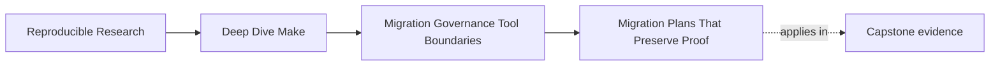
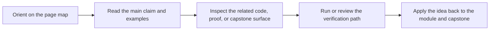

# Migration Plans That Preserve Proof


<!-- page-maps:start -->
## Page Maps




<!-- page-maps:end -->

This page is about changing an existing build without stepping into the most common trap:
rewriting faster than you can still prove what worked before and what works now.

Migration is not a synonym for replacement. It is a controlled sequence of boundary moves.

## The migration mistake that wastes months

Teams often discover real build pain and immediately jump to this conclusion:

> the safest path is to replace everything at once.

That is almost never the safest path.

A large rewrite can reduce visible clutter while destroying your ability to answer basic
questions:

- which behaviors were intentionally preserved
- which old failures were actually fixed
- which incidents are new regressions
- which proof steps still exist and which ones quietly disappeared

That is not migration discipline. That is a loss of memory.

## The sentence to keep

When you plan a build migration, ask:

> what is the smallest change that improves one boundary while preserving the evidence
> needed to trust the result?

That question keeps the sequence honest.

## Proof is part of the system, not an afterthought

In Module 10, "proof" means the concrete ways you verify the build still tells the truth.

Typical proof surfaces include:

- convergence checks
- serial versus parallel comparison
- `make -n` sanity checks
- `--trace` or similar explanation surfaces
- artifact manifests, checksums, or audit outputs
- selftests around target meaning and output ownership

If your migration deletes those and promises to rebuild them later, you are not preserving
proof. You are borrowing confidence against future work.

## A stable migration order

Most safe migrations follow this shape:

1. review the current build and classify the main risks
2. preserve or improve the proof harness before major structural edits
3. narrow public target meanings
4. isolate one boundary or subsystem at a time
5. compare old and new behavior with explicit evidence
6. retire the old route only after the new route has earned trust

This order may feel slow. It is slower than wishful thinking and faster than repeated
regression hunts.

## Preserve the old questions before changing the old answers

Imagine a legacy build where `release` is unreliable. A reckless migration says:

- replace the packaging scripts
- rename targets
- move outputs
- update CI
- trust manual testing

A safer migration begins differently:

- define what `release` is supposed to mean
- preserve one way to inspect its current behavior
- separate packaging proof from deployment side effects
- add a comparison route for old and new outputs

The key idea is simple: keep the diagnostic questions alive while you change the
implementation.

## Move one truth boundary at a time

A build usually has several boundaries mixed together:

- compile boundary
- generated-file boundary
- package boundary
- install boundary
- deployment or orchestration boundary

Trying to move all of them in one change makes review almost impossible.

Suppose a team wants to improve packaging and deployment. A disciplined migration says:

1. first make the package boundary explicit
2. prove archive identity and contents cleanly
3. only then decide whether deployment still belongs in Make

That is much safer than "replace release with a new pipeline."

## A small example of good sequencing

Start with this inherited target:

```make
.PHONY: release

release:
	@./scripts/build.sh
	@./scripts/test.sh
	@./scripts/package.sh
	@./scripts/deploy.sh
```

This is not one problem. It is four concerns hidden behind one name.

Bad migration:

- replace the whole route with a workflow engine
- keep the name `release`
- update docs later

Better migration:

1. define `release-check` as validation only
2. define `dist` as package publication only
3. move deployment behind a separate explicit route
4. compare old package outputs and new package outputs
5. retire the old monolithic `release` target when the public contract is clear

The better plan gives you observable seams. That is the real goal.

## Hybrid boundaries are often the honest answer

Many safe migrations are hybrids for a while.

Examples:

- Make still owns local build graph truth, but a script now owns manifest generation
- Make still drives compile and test, but release metadata is produced by a dedicated tool
- Make still orchestrates repository-local work, while deployment moves to a workflow
  system with its own state model

A hybrid is not a sign of weakness. It is often a sign the team is respecting boundaries
instead of pretending one tool should do everything.

The question is not whether the system becomes hybrid. The question is whether the handoff
is explicit and testable.

## Every migration step should answer three questions

Before approving a migration step, write down:

1. what exact behavior is changing
2. what proof will show the change is safe
3. what old route or contract remains in place until trust is earned

If you cannot answer the third question, the step is probably too large.

## Keep comparison routes boring and specific

One of the best migration habits is to add temporary comparison targets.

For example:

```make
.PHONY: compare-dist

compare-dist: legacy-dist new-dist
	@diff -ru build/legacy-dist build/new-dist
```

Or:

```make
.PHONY: compare-trace

compare-trace:
	@$(MAKE) --trace -f Makefile.legacy all > build/legacy.trace
	@$(MAKE) --trace -f Makefile.new all > build/new.trace
```

These targets are not glamorous. They are extremely valuable because they stop migration
discussions from turning into intuition contests.

## Do not remove observability to make the migration look cleaner

Teams sometimes hide useful evidence during migration because it feels temporary or messy:

- trace targets disappear
- dumps stop being generated
- selftests get skipped "until the new design settles"
- old audit commands are deleted before replacements exist

That is exactly backwards.

Migration is when you need observability the most. Even temporary comparison routes are
better than silent confidence.

## A practical migration template

For one subsystem, write the plan in this shape:

| Part | What to record |
| --- | --- |
| current contract | what the old route is supposed to produce or guarantee |
| current evidence | how you inspect the old route today |
| defect class | what is broken: truth, contract, parallel safety, environment, or boundary |
| intended change | what one boundary move will happen next |
| preserved proof | what command or artifact still lets you compare old and new |
| retirement condition | what must be true before the old route can disappear |

This format prevents migration plans from becoming vague roadmaps full of verbs like
"modernize" and "streamline."

## Failure signatures worth recognizing

### "We migrated it, but we can no longer explain the new output differences"

That usually means comparison routes were never built or were removed too early.

### "We cleaned up the target names and broke CI in the process"

That means public contract changes were bundled together with internal refactors.

### "The new system is clearer, but now nobody can run the old diagnostics"

That means proof was treated as optional scaffolding.

### "We are half-migrated forever"

That often means the handoff boundaries were never made explicit enough to retire old
routes with confidence.

## What this page wants you to say

A strong migration sentence sounds like this:

> We will preserve the current proof harness, narrow the public contract, move one boundary
> at a time, and keep comparison routes until the new owner has earned trust.

That is a much stronger plan than:

> We are going to rewrite the build so it is nicer.
