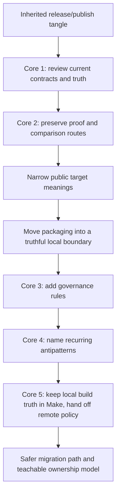

# Worked Example: Planning a Safe Build Migration

This example will follow one inherited Make-based build from first review to a migration
plan that changes the system without erasing the proof harness.

## The situation

Assume you inherit a repository used by a research team:

- `make all` builds analysis outputs and figures
- `make release` packages a report bundle
- `make publish` uploads the bundle to a shared location
- CI calls a mixture of public and helper targets
- only one maintainer really understands what the build is doing

The build mostly works, which is why it has lasted this long. It also causes recurring
pain:

1. `make release` sometimes changes files that `make all` did not touch
2. parallel runs occasionally leave partial outputs in `dist/`
3. CI calls `prepare-release` directly because it seemed convenient years ago
4. `publish` mixes packaging, copying, and remote upload
5. nobody knows whether the long-term answer is "fix the Makefile" or "replace it"

That is a realistic Module 10 problem.

## The starting sketch

The inherited shape looks roughly like this:

```make
.PHONY: all release publish prepare-release

all:
	@./scripts/render-analysis.sh

prepare-release:
	@./scripts/render-analysis.sh
	@./scripts/generate-metadata.sh

release:
	@./scripts/render-analysis.sh
	@./scripts/generate-metadata.sh
	@./scripts/package-report.sh

publish:
	@./scripts/render-analysis.sh
	@./scripts/generate-metadata.sh
	@./scripts/package-report.sh
	@./scripts/upload-report.sh
```

Nothing here is cartoonishly broken. That is exactly why it is a good teaching example.

## Step 1: write the review before the plan

You start with Core 1 and write a short review.

### Public target findings

| Target | Observed problem |
| --- | --- |
| `all` | meaning is plausible, but outputs are hidden behind one script |
| `prepare-release` | helper target has become a CI dependency without clear public status |
| `release` | rebuilds analysis, regenerates metadata, and packages in one route |
| `publish` | claims to be one target but spans local packaging and remote upload state |

### Output ownership findings

- analysis outputs are regenerated by several targets
- release metadata is refreshed during multiple routes
- packaging is not modeled as one explicit publication event
- `dist/` is trusted even though publication semantics are unclear

### Pressure findings

You run:

```sh
make -n release
make --trace release
make -j1 release
make -j8 release
```

That reveals:

- `release` and `publish` both rerun the same generation work
- `-j8` occasionally exposes partial bundle contents
- the trace is hard to follow because shell wrappers hide the boundary decisions

The review conclusion is not "rewrite it." The review conclusion is:

> the build has contract drift, multi-writer output behavior, and an unclear boundary
> between local package production and remote publication.

That is already a big improvement.

## Step 2: preserve proof before splitting targets

You now apply Core 2.

Before changing target names or scripts, they preserve ways to compare old and new
behavior:

```make
.PHONY: legacy-release-check compare-release-layout

legacy-release-check:
	@$(MAKE) -j1 release
	@$(MAKE) -j8 release

compare-release-layout:
	@find dist -type f | sort > build/current-release-layout.txt
```

These are not permanent design triumphs. They are migration proof surfaces.

The point is to preserve three questions:

- what files count as the current release output
- does serial and parallel behavior agree
- what changes after the next boundary move

Without that, every later edit becomes harder to trust.

## Step 3: narrow the target contracts

The next repair is not technical cleverness. It is target meaning.

You rewrite the public surface conceptually as:

- `all`: build the normal analysis outputs
- `release-check`: run the validations required before packaging
- `dist`: produce the report bundle and its sidecar evidence
- `publish`: hand an already built bundle to the remote publication route

This is a contract repair before it is an implementation repair.

It resolves two issues immediately:

- `prepare-release` no longer masquerades as a semi-public target
- `publish` no longer needs to pretend it owns local package production

## Step 4: move one boundary at a time

You do not redesign everything at once.

First boundary move:

- separate local packaging from remote upload

Second boundary move:

- make metadata generation produce a declared output

Third boundary move:

- ensure `dist` publishes the final bundle atomically

The important part is the order. Packaging must become truthful before the remote handoff
can be argued clearly.

## Step 5: sketch the repaired local build surface

After those moves, the shape is closer to this:

```make
.PHONY: all release-check dist publish

all: build/report.html build/figures.done

release-check: all
	@./scripts/validate-report.sh

dist: dist/report-bundle.tar.gz dist/report-bundle.tar.gz.sha256

dist/metadata.json: build/report.html scripts/generate-metadata.sh | dist/
	@./scripts/generate-metadata.sh > $@

dist/report-bundle.tar.gz: build/report.html build/figures.done dist/metadata.json | dist/
	@./scripts/package-report.sh $@

dist/report-bundle.tar.gz.sha256: dist/report-bundle.tar.gz
	@sha256sum $< > $@

publish: dist/report-bundle.tar.gz dist/report-bundle.tar.gz.sha256
	@./scripts/upload-report.sh dist/report-bundle.tar.gz
```

This is still not perfect. It is dramatically easier to review.

Why:

- `dist` now means local artifact production
- `publish` depends on already published local artifacts
- metadata has a declared output
- upload is no longer pretending to be the same thing as package creation

That is the migration win.

## Step 6: write governance before drift returns

Now you use Core 3 so the repaired surface does not dissolve a month later.

They add a short stewardship note with rules like these:

- public targets are `all`, `release-check`, `dist`, `publish`, `clean`, and `help`
- CI may call only public targets
- new include files need a clear responsibility sentence
- proof surfaces such as serial/parallel comparison and release layout checks cannot be
  removed without replacement
- `publish` may not regain local packaging side effects

Notice how specific that last rule is. Governance works best when it protects the exact
boundary that was hard-won during migration.

## Step 7: classify the recurring antipatterns

Using Core 4, you can now name what was wrong in the inherited system:

1. multi-writer outputs
   `render-analysis.sh` ran under several targets
2. overgrown release contract
   `release` and `publish` each meant too many things
3. opaque orchestration
   shell wrappers hid which outputs were actually being published
4. accidental public target
   `prepare-release` became a contract consumer without intentional promotion

Once these are named, future reviews become faster and calmer.

## Step 8: decide the real tool boundary

This is where Core 5 matters.

The team asks:

- should packaging stay in Make
- should upload stay in Make
- should deployment policy stay in Make

The answer is:

- Make should keep owning local analysis outputs, bundle construction, and artifact evidence
- the remote publication system should own authentication, approval, and remote state
- `publish` may remain a convenience entrypoint, but it should not pretend to define remote
  truth

That is a healthy hybrid boundary.

The module does not force a one-tool answer. It forces an honest one.

## The migration map in one diagram



This is the real value of the module. You now have a method, not just opinions.

## What a strong summary sounds like

A strong summary sounds like this:

> We reviewed the inherited build as a contract surface, preserved comparison routes before
> editing it, split local packaging from remote publication, declared metadata and bundle
> outputs explicitly, added governance rules so CI and maintainers use the intended public
> surface, and defined a hybrid boundary where Make owns local artifact truth while the
> remote service owns publication policy and state.

That is much stronger than:

> We cleaned up the release targets.

## What to practice after this example

Try the same exercise on one real repository:

- write the review first
- classify the top three risks
- propose one boundary move only
- define what proof you would preserve
- write one governance rule that protects the improvement

If you can do that without reaching for slogans, Module 10 is landing.
