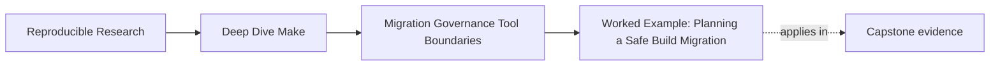
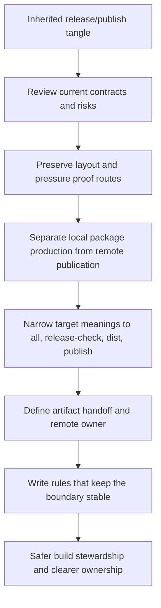

# Worked Example: Planning a Safe Build Migration

<!-- page-maps:start -->
## Page Maps


```mermaid
graph LR
  family["Reproducible Research"]
  program["Deep Dive Make"]
  section["Migration Governance Tool Boundaries"]
  page["Worked Example: Planning a Safe Build Migration"]
  capstone["Capstone evidence"]

  family --> program --> section --> page
  page -.applies in.-> capstone
```


```mermaid
flowchart LR
  review["review the inherited contract"] --> proof["preserve proof routes first"]
  proof --> split["split one boundary at a time"]
  split --> govern["write rules before drift returns"]
  govern --> handoff["name the final handoff and owner"]
```
<!-- page-maps:end -->

This example follows one inherited Make-based build from first review to a migration plan
that improves the system without deleting the evidence needed to trust it.

The point is not to produce the cleverest rewrite. The point is to show how a maintainer
can move a fragile build toward a clearer ownership model while keeping rollback honest.

## The repository you inherited

Assume you join a research team that relies on these commands:

- `make all` builds report outputs and figures
- `make release` builds a bundle for distribution
- `make publish` uploads that bundle to a shared location
- CI calls a mixture of public targets and old helpers
- only one long-time maintainer can explain the whole route confidently

The build usually works. It also causes repeated friction:

1. `release` sometimes changes files that `all` did not touch
2. parallel runs occasionally leave partial contents in `dist/`
3. CI calls `prepare-release` directly because it became a habit
4. `publish` mixes local packaging with remote upload state
5. nobody can tell whether the long-term answer is "fix Make" or "replace it"

That is a realistic Module 10 problem because the build is not catastrophically broken. It
is only untrustworthy enough to slow every future change.

## Capture a stewardship packet before touching the file

Before writing a migration plan, you create one packet with five sections:

| Section | Question it answers |
| --- | --- |
| public targets | what promises do current callers think they are using? |
| trusted outputs | which files or side effects are treated as real deliverables? |
| proof routes | how can current behavior be observed and compared? |
| ownership gaps | where are multiple writers or vague remote responsibilities hiding? |
| first safe move | what smallest boundary change would improve truth without deleting proof? |

This packet is small enough to build in one sitting and strong enough to guide later
review.

## The inherited build sketch

The current shape looks like this:

```make
.PHONY: all release publish prepare-release

all:
	@./scripts/render-analysis.sh

prepare-release:
	@./scripts/render-analysis.sh
	@./scripts/generate-metadata.sh

release:
	@./scripts/render-analysis.sh
	@./scripts/generate-metadata.sh
	@./scripts/package-report.sh

publish:
	@./scripts/render-analysis.sh
	@./scripts/generate-metadata.sh
	@./scripts/package-report.sh
	@./scripts/upload-report.sh
```

Nothing here is absurd. That is why it is a good teaching example. Weak inherited builds
often survive because the bad parts are spread across convenience rather than obvious
syntax errors.

## Step 1: review current contracts before proposing redesign

You start with a first-pass review.

### Public target findings

| Target | Current apparent meaning | Review finding |
| --- | --- | --- |
| `all` | build normal analysis outputs | plausible contract, but outputs are hidden behind one script |
| `prepare-release` | helper for release preparation | accidental semi-public target because CI calls it directly |
| `release` | prepare everything needed for distribution | mixes generation, metadata refresh, and packaging |
| `publish` | upload the release | actually rebuilds, repackages, and uploads in one route |

### Trusted-output findings

| Output or side effect | Why callers trust it | Problem |
| --- | --- | --- |
| `build/report.html` | expected analysis result | rewritten from several routes |
| metadata file | assumed part of release truth | generated without a clear published contract |
| `dist/` contents | treated as distributable release | partial and non-atomic under pressure |
| remote upload | treated as successful release completion | hidden behind the same target that rebuilds artifacts |

### Pressure findings

You run or plan to run:

```sh
make -n release
make --trace release
make -j1 release
make -j8 release
```

Those commands reveal:

- `release` and `publish` rerun the same generation work
- `-j8` can expose partial bundle contents
- shell wrappers hide which outputs are really being published

The review conclusion is:

> the build has contract drift, multi-writer output behavior, and a blurred boundary
> between local artifact production and remote publication.

That sentence is already more useful than "this Makefile is messy."

## Step 2: preserve proof before splitting boundaries

The next move is not structural cleanup. It is proof preservation.

You write or sketch three durable comparison routes:

```make
.PHONY: release-layout release-serial release-parallel

release-layout:
	@find dist -type f | sort > artifacts/release-layout.txt

release-serial:
	@$(MAKE) -j1 release

release-parallel:
	@$(MAKE) -j8 release
```

These routes answer three questions:

- what files currently define the release boundary?
- does serial behavior match parallel behavior?
- which artifacts must remain comparable while the migration is happening?

You are not promising to preserve every current behavior. Partial publication under `-j8`
is a defect, not a contract. What you are preserving is the ability to compare old and
new behavior honestly.

## Step 3: choose the first boundary move

A weak migration plan would try to rewrite the whole build. A strong one makes one
responsibility more truthful first.

You choose this first move:

> separate local package production from remote publication.

Why this move first:

- it resolves the biggest boundary blur
- it reduces the number of side effects under one target name
- it creates a cleaner place to preserve and compare evidence
- it does not require immediate replacement of every script

You do **not** start by redesigning the entire graph or replacing Make. The first move is
small enough to review and roll back.

## Step 4: write the migration sequence as reviewable slices

You turn the plan into a bounded sequence:

| Slice | Change | Proof kept alive | Rollback point |
| --- | --- | --- | --- |
| 1 | document current `release` and `publish` contracts | current dry-run, trace, and layout outputs | old routes still untouched |
| 2 | create a truthful local package target | serial/parallel comparison and layout snapshot | callers can still use old `release` |
| 3 | make metadata generation publish a declared file | direct inspection of metadata output | metadata can still be regenerated by old route if needed |
| 4 | make `publish` consume an already built artifact | artifact plus checksum prove handoff object | upload wrapper can still point at old package route temporarily |
| 5 | retire accidental helper entrypoints | CI call graph and target list | helper remains until callers are updated |

This table matters because it stops the migration from turning into a vague campaign.

## Step 5: narrow the target meanings

Before you perfect the implementation, you repair the public language.

You redefine the supported surface conceptually as:

- `all`: build the normal analysis outputs
- `release-check`: run validations required before packaging
- `dist`: produce the release artifact and sidecar evidence
- `publish`: hand an already built artifact to the remote publication route

This is a contract repair before it is a code repair.

Immediate benefits:

- `prepare-release` no longer masquerades as a semi-public contract
- `publish` stops pretending to own local package production
- maintainers can talk about local artifact truth separately from remote publication truth

## Step 6: sketch the repaired local boundary

After the first few slices, the build is closer to this:

```make
.PHONY: all release-check dist publish

all: build/report.html build/figures.done

release-check: all
	@./scripts/validate-report.sh

dist: dist/report-bundle.tar.gz dist/report-bundle.tar.gz.sha256

dist/metadata.json: build/report.html scripts/generate-metadata.sh | dist/
	@./scripts/generate-metadata.sh > $@

dist/report-bundle.tar.gz: build/report.html build/figures.done dist/metadata.json | dist/
	@./scripts/package-report.sh $@

dist/report-bundle.tar.gz.sha256: dist/report-bundle.tar.gz
	@sha256sum $< > $@

publish: dist/report-bundle.tar.gz dist/report-bundle.tar.gz.sha256
	@./scripts/upload-report.sh \
	  dist/report-bundle.tar.gz \
	  dist/report-bundle.tar.gz.sha256
```

This is still not a perfect final system. It is much easier to review because:

- `dist` now means local artifact production
- `publish` depends on an already built handoff object
- metadata has a declared output
- upload is no longer pretending to be the same thing as package construction

That is the real migration win.

## Step 7: make the handoff contract explicit

Now that the local boundary is clearer, you define the handoff to the remote owner.

| Handoff question | Example answer |
| --- | --- |
| what is handed over? | `dist/report-bundle.tar.gz` |
| what evidence travels with it? | checksum file and metadata manifest |
| who owns it before handoff? | Make-driven local package production |
| who owns it after handoff? | remote publication service |
| what counts as sender failure? | package or checksum was not produced correctly |
| what counts as receiver failure? | upload, approval, or remote publication failed |

This split matters because it lets incident review say whether the failure was local build
truth or remote publication truth.

## Step 8: write governance before drift returns

The repaired surface will rot quickly if you stop after the implementation.

You add rules such as:

- public targets are `all`, `release-check`, `dist`, `publish`, `clean`, and `help`
- CI may call only public targets
- new include files require a one-sentence responsibility statement
- proof routes such as layout comparison and serial/parallel release checks cannot be
  removed without a replacement
- `publish` may not regain local packaging side effects

Notice how specific the last rule is. Governance works best when it protects the exact
boundary that was hard to win during migration.

## Step 9: classify what went wrong so the next review is faster

Once the repaired surface exists, you can name the inherited problems clearly:

1. multi-writer outputs
   `render-analysis.sh` ran under several targets
2. overgrown release contract
   `release` and `publish` each meant too many things
3. opaque orchestration
   wrappers hid which outputs were actually being published
4. accidental public target
   `prepare-release` became a CI dependency without deliberate promotion
5. boundary confusion
   local package truth and remote publication truth were merged under one command

The next maintainer can now recognize these patterns earlier instead of rediscovering them
under pressure.

## Step 10: make the tool-boundary decision

The final question is whether Make should keep owning the whole route.

The answer is hybrid:

- Make should keep owning local analysis outputs, bundle construction, and artifact
  evidence
- the remote publication system should own authentication, approval, and remote state
- `publish` may remain a convenience entrypoint, but it should not pretend to define
  remote truth

That is stronger than both simplistic alternatives:

- "keep everything in Make"
- "replace Make entirely"

The module does not want a fashionable answer. It wants an honest one.

## The migration path in one diagram


```mermaid
flowchart TD
  inherited["Inherited release/publish tangle"] --> review["Review current contracts and risks"]
  review --> preserve["Preserve layout and pressure proof routes"]
  preserve --> firstmove["Separate local package production from remote publication"]
  firstmove --> publicsurface["Narrow target meanings to all, release-check, dist, publish"]
  publicsurface --> handoff["Define artifact handoff and remote owner"]
  handoff --> governance["Write rules that keep the boundary stable"]
  governance --> outcome["Safer build stewardship and clearer ownership"]
```

## What the learner should reuse from this example

Do not copy the target names mechanically. Reuse the sequence:

1. review current contracts and outputs
2. preserve proof before changing the graph
3. choose one narrow boundary move first
4. write rollback points into the plan
5. define the handoff object when ownership changes
6. add governance before the old drift patterns return

That sequence is what makes the example safe, not the particular repository.

## Exit check

You have absorbed the example when you can:

- explain why the first move was boundary clarification rather than full replacement
- name the proof routes that had to survive the migration
- separate local package truth from remote publication truth
- state the handoff contract between Make and the external owner
