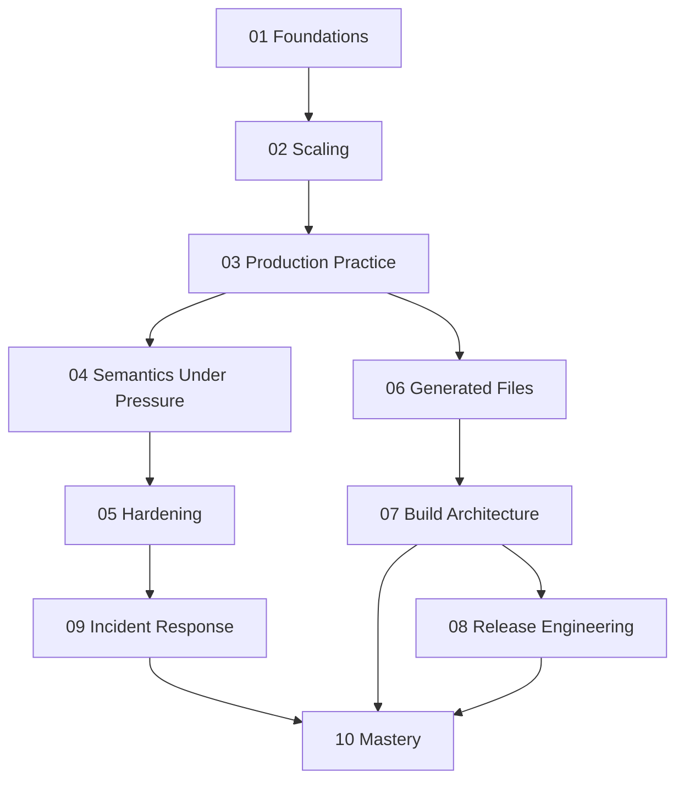

# Module Dependency Map

Deep Dive Make is not ten independent essays. Later modules assume earlier mental models,
and the course becomes much easier when that dependency shape is explicit.

---

## The Main Sequence

[Back to top](#top)

---

## Why The Sequence Looks Like This

| Module | Depends most on | Reason |
| --- | --- | --- |
| 01 Foundations | none | it establishes the graph model and rebuild truth |
| 02 Scaling | 01 | parallel safety only makes sense after graph truth |
| 03 Production Practice | 01-02 | deterministic discovery and selftests assume basic correctness |
| 04 Semantics Under Pressure | 01-03 | debugging semantics matter most once the build already has structure |
| 05 Hardening | 03-04 | you need a build contract before you can harden it |
| 06 Generated Files | 03-05 | generators become safe only when truth and boundaries are already clear |
| 07 Build Architecture | 02-06 | reusable structure depends on both graph truth and boundary discipline |
| 08 Release Engineering | 03-07 | release contracts depend on a stable build API and trustworthy outputs |
| 09 Incident Response | 03-08 | good triage assumes the build already expresses its contracts clearly |
| 10 Mastery | all earlier modules | migration and governance require the whole mental model |

[Back to top](#top)

---

## Fastest Safe Paths

### New learner

Read in order from Module 01 through Module 10.

### Working maintainer

Start with Modules 04, 05, and 09, then backfill earlier modules when you find a gap in
your mental model.

### Build steward

Start with Modules 03, 07, 08, 09, and 10, then revisit the earlier modules when a
policy or graph-truth question points back to fundamentals.

[Back to top](#top)

---

## Where The Capstone Helps Most

| Stage | Best capstone use |
| --- | --- |
| after 02 | inspect repros and discovery surfaces |
| after 03-05 | use `selftest`, `attest`, and contract files as a reference build |
| after 06-08 | inspect generator, architecture, and release boundaries |
| after 09-10 | review the capstone as a stewardship specimen |

[Back to top](#top)
