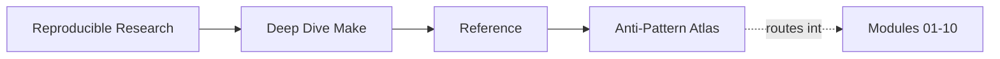
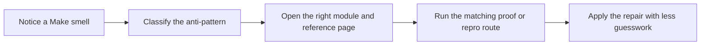

# Anti-Pattern Atlas

<!-- page-maps:start -->
## Page Maps

<!-- page-maps:end -->

This page is the missing failure crosswalk for Deep Dive Make. It exists because humans
rarely remember course structure by module title during a real build problem. They
remember symptoms, smells, and clumsy patterns.

Use this page when the question is “what kind of bad Make idea is this?” rather than
“which module was that in?”

---

## Common Anti-Patterns

| Anti-pattern | Why it is clumsy | Primary modules | First proof or repro route |
| --- | --- | --- | --- |
| phony targets used as ordering glue | it hides real edges behind fake structure | 01, 02 | `capstone-walkthrough` |
| stamp files used as wishful thinking | they model hope instead of declared state | 05, 06 | `capstone-contract-audit` |
| recursive Make used as architecture by default | it fragments the graph and hides ownership | 05, 07 | `inspect` |
| generated files treated as incidental side effects | consumers become stale or race-prone | 06 | `proof` |
| shared temp or append-only writes under `-j` | schedule changes meaning | 02, 09 | `capstone-incident-audit` |
| includes and overrides treated as folklore | debugging becomes guesswork | 04 | `capstone-tour` |
| release artifacts published without a declared contract | downstream trust becomes accidental | 08 | `proof` |
| observability added only after a failure | incident review loses causal evidence | 09 | `capstone-incident-audit` |
| Make kept as owner after its boundary is exceeded | governance and migration drift become chronic | 10 | `capstone-confirm` |

[Back to top](#top)

---

## Symptom To Anti-Pattern

| Symptom | Likely anti-pattern | Better question |
| --- | --- | --- |
| “`-j` breaks this sometimes” | hidden shared state or missing edges | which file or output has more than one writer |
| “I touched a file and nothing rebuilt” | hidden input or unmodeled boundary | what declared edge is missing |
| “Everything rebuilt and I do not know why” | unstable discovery, stamps, or precedence confusion | which target changed its meaning |
| “This release exists, but I do not trust it” | weak publication contract | what review bundle or manifest proves it |
| “No one knows where to change this build safely” | ownership collapse across `mk/*.mk` | which layer should own the change |

[Back to top](#top)

---

## Repair Direction

When you identify an anti-pattern, do not jump straight to rewriting everything.

Use this order:

1. name the failure class precisely
2. find the matching module and capstone proof route
3. inspect the owning boundary
4. apply the narrowest repair that restores build truth

This order keeps the course aligned with real maintenance work instead of theatrical
refactoring.

[Back to top](#top)

---

## Best Companion Pages

Use these with the atlas:

* [`concept-index.md`](concept-index.md) for where the idea is taught in full
* [`incident-ladder.md`](incident-ladder.md) for operational diagnosis order
* [`capstone-map.md`](../guides/capstone-map.md) for module-aware capstone routing
* [`repro-catalog.md`](../guides/repro-catalog.md) for concrete failure-class examples

[Back to top](#top)
