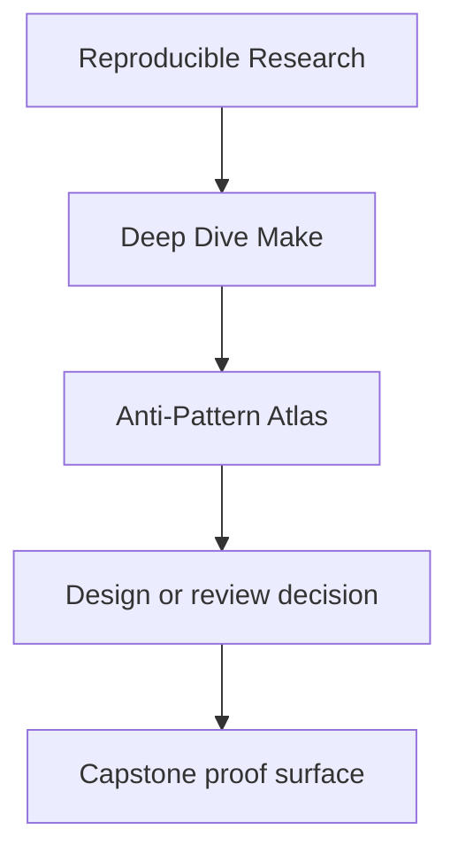
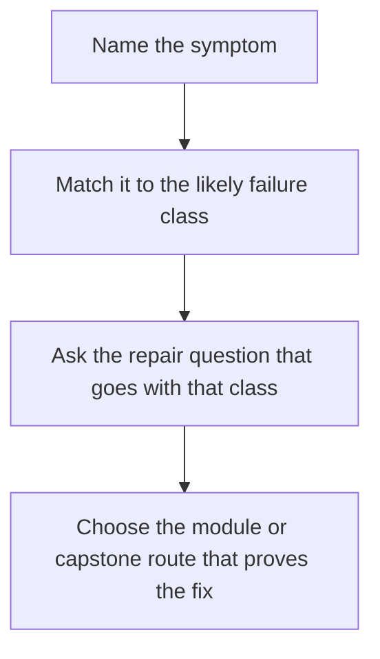

# Anti-Pattern Atlas

<!-- page-maps:start -->
## Reference Position

<!-- page-maps:end -->

Use this page when you recognize the smell before you recognize the lesson. A good atlas
turns "this build feels wrong" into a smaller statement about hidden state, missing
edges, unsafe publication, or ownership drift.

---

## Symptom-led lookup

| Symptom | Likely failure class | Ask this next | First route |
| --- | --- | --- | --- |
| `-j` breaks a target that looks fine in serial mode | shared mutable output or a missing dependency edge | which file is written by more than one recipe, or consumed before publication is complete | `make incident-audit` |
| a touched file does not trigger a rebuild | hidden input or dishonest stamp boundary | which input changed meaning without appearing in the prerequisite graph | `make selftest` |
| everything rebuilds and no one can explain why | unstable discovery, broad stamps, or variable precedence drift | which target changed its meaning, flags, or discovered inputs | `make profile-audit` |
| a generated file exists, but downstream users stay stale | generated output modeled as a side effect instead of a declared edge | where should the generated file appear in the graph, and who owns it | `make proof` |
| release outputs look correct, but no one can say why they are trustworthy | publication contract is weaker than the build contract | which bundle or manifest proves what was published | `make inspect` |
| the top-level `Makefile` keeps absorbing every concern | ownership collapsed across build layers | which rule belongs in `Makefile` and which belongs in `mk/*.mk` | `make walkthrough` |

---

## Recurring failure classes

| Failure class | Why it matters | Where the course teaches the repair |
| --- | --- | --- |
| phony ordering used instead of real file edges | it hides truth about what causes work | Modules 01-02, `repro/06-order-only-misuse.mk` |
| stamps used to hide meaningful state | it trades explicit inputs for wishful thinking | Modules 05-06, `mk/stamps.mk` |
| recursive or fragmented ownership by default | it makes the graph harder to reason about than the product | Modules 05 and 07, `ARCHITECTURE.md` |
| generated files treated as incidental | it breaks rebuild truth and downstream causality | Module 06, `repro/04-generated-header.mk` |
| shared temp files or append-only outputs | schedule changes start changing meaning | Modules 02 and 09, `repro/01-shared-log.mk`, `repro/05-mkdir-race.mk` |
| variable precedence left as folklore | a machine with different environment values tells a different story | Module 04, `show`, `show-e`, and `profile-audit` |
| publication done directly to final paths | partial artifacts become visible as if they were finished | Module 08, `mk/macros.mk` and the top-level recipes |
| observability bolted on after failure | incident review loses the evidence needed to explain cause | Module 09, `trace-count`, `selftest-report`, and audit bundles |

---

## Repair order

When you identify a likely anti-pattern, use this sequence:

1. name the failure class in one sentence
2. point to the output, edge, or boundary that is lying
3. choose the smallest capstone route that demonstrates the same defect or claim
4. repair the model before polishing the implementation

That order keeps the fix anchored to build truth instead of style preferences.

---

## Companion pages

Use these with the atlas:

- [`self-review-prompts.md`](self-review-prompts.md) for debugging order under pressure
- [`module-dependency-map.md`](module-dependency-map.md) for where the idea is taught in sequence
- [`capstone-map.md`](../capstone/capstone-map.md) for module-aware capstone routing
- [`repro-catalog.md`](../capstone/docs/repro-guide.md) for the curated failure pack
