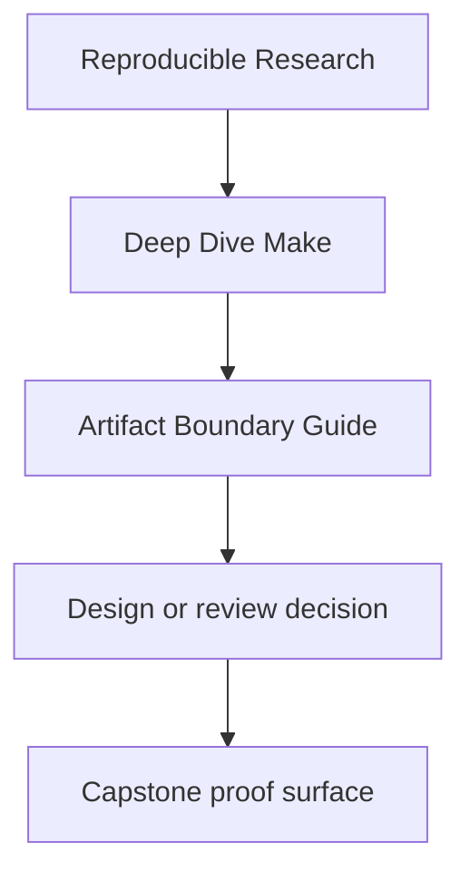
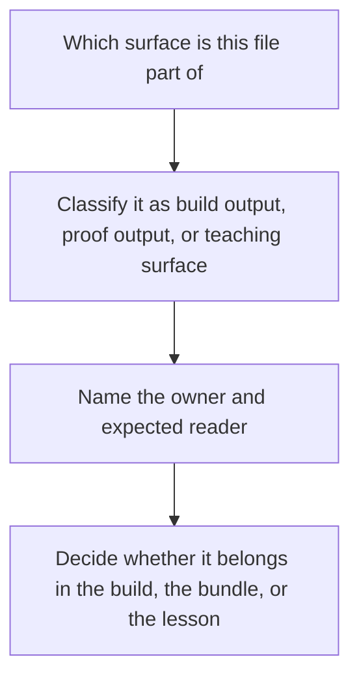

# Artifact Boundary Guide

<!-- page-maps:start -->
## Reference Position

<!-- page-maps:end -->

Deep Dive Make only stays clear if artifacts keep their roles. Use this page when a file
exists, but its purpose has started to blur: ordinary build output, supporting state,
review bundle evidence, or a controlled teaching specimen.

---

## The main boundary

| Surface | Intended reader | What belongs there |
| --- | --- | --- |
| build outputs | someone using the built result | `app`, `build/bin/*`, generated headers, and the `all` convergence sentinel |
| build state | the build system itself and maintainers inspecting it | `build/*.o`, `build/*.d`, stamp files, and other internal truth-maintenance artifacts |
| review bundles | a learner, reviewer, or steward | `artifacts/walkthrough/*`, `artifacts/proof/*`, and `artifacts/audit/*` with guides, route files, and manifests |
| release artifacts | someone receiving a distributable package | `dist.tar.gz` and source bundles under `artifacts/dist/` |
| teaching specimens | someone studying a failure class in isolation | `repro/*.mk` and the docs that explain how to read them |

---

## Boundary tests

Ask these questions before moving a file or adding a new output:

1. does this file exist because the product needs it, or because the review needs it
2. would deleting it break an ordinary build, a proof route, or only a lesson
3. is this output meant to be consumed directly, or only inspected as evidence
4. who should know its name without reading recipes

If the answer changes across readers, the artifact is probably in the wrong place or
missing a guide.

---

## Common boundary mistakes

| Mistake | Why it lowers the quality bar |
| --- | --- |
| treating `build/*.o` or `build/*.d` as learner deliverables | it confuses graph-maintenance state with the public contract |
| publishing proof bundles as if they were incidental cache | it hides the fact that those bundles are deliberate review surfaces |
| treating `repro/*.mk` as patterns to copy into production | it turns controlled failures into accidental advice |
| mixing attestation or packaging into the ordinary `all` path | it pollutes artifact identity with review and release work |
| adding undocumented outputs to `artifacts/` | it creates bundle sprawl with no reader contract |

---

## Useful companion pages

- [`public-targets.md`](public-targets.md) for the stable command surface
- [`capstone-file-guide.md`](../capstone/capstone-file-guide.md) for the learner-facing file map
- [`capstone-proof-checklist.md`](../capstone/capstone-proof-checklist.md) for the review route that bundles these surfaces together

