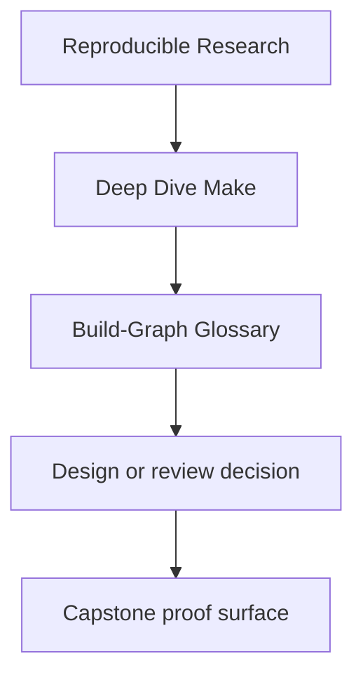
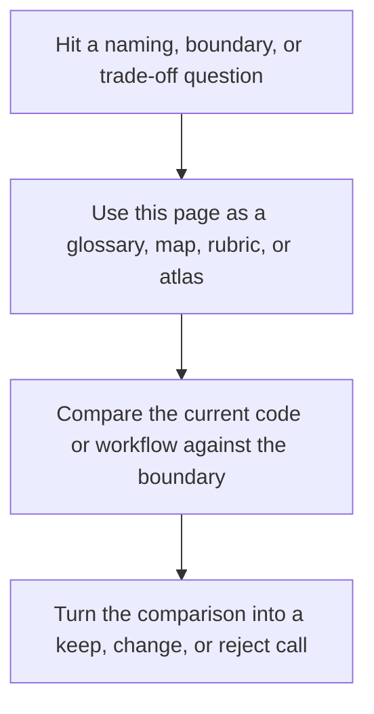

# Build-Graph Glossary

<!-- page-maps:start -->
## Reference Position

<!-- page-maps:end -->

Read the first diagram as a lookup map: this page is part of the review shelf, not a first-read narrative. Read the second diagram as the reference rhythm: arrive with a concrete ambiguity, compare the current work against the boundary on the page, then turn that comparison into a decision.

This glossary exists to keep the language of the course precise.

The goal is not to define every Make feature. The goal is to define the terms that the
course repeatedly depends on for reasoning.

---

## Core Terms

| Term | Meaning in this course |
| --- | --- |
| truthful DAG | a dependency graph that declares every semantically relevant edge |
| hidden input | an input that changes build meaning but is not modeled as a prerequisite or boundary file |
| atomic publication | publishing an output only after the producing command fully succeeds |
| convergence | the property that a successful build reaches an up-to-date state |
| parallel safety | the property that `-j` changes throughput, not result meaning |
| public target | a documented build entrypoint that humans and automation are allowed to depend on |
| implementation target | an internal helper target whose interface is not promised stable |

[Back to top](#top)

---

## Boundary Terms

| Term | Meaning in this course |
| --- | --- |
| stamp | a boundary file that records the state of a modeled non-file input |
| manifest | a file that records a set of inputs, outputs, or content identities deliberately |
| generator | a command or program that produces build artifacts from declared inputs |
| multi-output producer | one command that emits several coupled outputs |
| single writer | the rule that one logical output should have one authoritative producer |

[Back to top](#top)

---

## Operational Terms

| Term | Meaning in this course |
| --- | --- |
| proof loop | the repeatable command sequence used to verify a claim |
| failure signature | the observable symptom that points toward a known defect class |
| incident ladder | the ordered diagnostic sequence used under pressure |
| attestation | recorded build evidence that should not contaminate artifact identity |
| stewardship | long-term ownership of build contracts, review rules, and migration choices |

[Back to top](#top)

---

## Terms Often Confused

| Pair | Course distinction |
| --- | --- |
| order-only prerequisite vs real prerequisite | order-only controls sequencing, real prerequisite also models staleness |
| stamp vs shortcut | a real stamp captures modeled state; a shortcut stamp hides missing truth |
| help target vs public API | help may list the API, but the API is the documented stability promise |
| reproducible vs deterministic | deterministic behavior is a property of one build graph; reproducibility also depends on declared environment and inputs |

[Back to top](#top)
