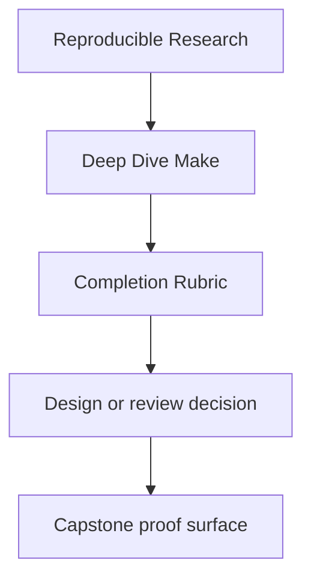
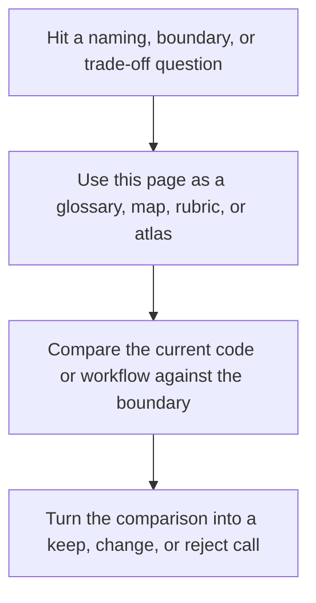

# Completion Rubric


<!-- page-maps:start -->
## Reference Position




<!-- page-maps:end -->

Read the first diagram as a lookup map: this page is part of the review shelf, not a first-read narrative. Read the second diagram as the reference rhythm: arrive with a concrete ambiguity, compare the current work against the boundary on the page, then turn that comparison into a decision.

This course should end with demonstrated judgment, not passive familiarity.

Use this rubric to decide whether someone has actually completed Deep Dive Make in a
meaningful way.

---

## Core Standards

You should be able to do all of this without guessing:

| Standard | Evidence |
| --- | --- |
| explain a rebuild | `make --trace` plus a correct explanation of the triggering edge |
| prove convergence | successful `make all && make -q all` or equivalent |
| diagnose a parallel failure class | correct identification of missing edge, shared state, multi-writer output, or non-atomic publish |
| name the public build API | correct distinction between stable entrypoints and internal helpers |
| review a build | short written review covering graph truth, publication, operations, and migration risk |

---

## Module Milestones

| Module range | Minimum evidence |
| --- | --- |
| 01-02 | a small truthful build and one repaired race or ordering defect |
| 03-05 | a stable proof loop with selftests, diagnostics, and explicit hardening assumptions |
| 06-08 | one correctly modeled generator boundary and one clear release contract |
| 09-10 | one incident ladder and one written review or migration recommendation |

---

## Module practice surfaces

Use this table when you need the shortest route from a module promise to a concrete build
surface and proof loop.

| Module | Primary practice surface | Main proof loop | Best capstone follow-up |
| --- | --- | --- | --- |
| 01 | tiny local C project | `make --trace all`, `make -q all` | inspect `capstone/Makefile` after local convergence makes sense |
| 02 | scaling simulator plus repro pack | `make -j2 all`, repro execution | inspect `capstone/repro/` and discovery surfaces |
| 03 | production simulator | `make selftest` | compare with `capstone/tests/run.sh` |
| 04 | scratch Makefiles | `make -n`, `make --trace`, `make -p` | use `show-origins` and capstone target surfaces |
| 05 | hardened local build | convergence, trace count, portability checks | inspect `mk/contract.mk` and `mk/stamps.mk` |
| 06 | generator playground | `make --trace all`, `make -q all` | trace `make --trace dyn` in the capstone |
| 07 | layered local project | `make help`, `make -p` | inspect `capstone/mk/*.mk` |
| 08 | local release surface | `make dist`, `make install`, `make -q dist` | inspect `dist` and `attest` in the capstone |
| 09 | measured working build | `make trace-count`, `make -p > build/make.dump` | compare with capstone selftest guardrails |
| 10 | written build review | review rubric plus proof commands | use the capstone as the review specimen |

---

## Three reusable proof loops

### Truth loop

Use when you are checking whether the graph itself is honest.

```sh
make --trace all
make all
make -q all
```

### Concurrency loop

Use when you are checking whether scheduling changes meaning.

```sh
make clean
make -j1 all
make clean
make -j2 all
```

### Diagnostics loop

Use when you are investigating a confusing behavior.

```sh
make -n <target>
make --trace <target>
make -p > build/make.dump
```

---

## Capstone Expectations

Completion does not require memorizing the capstone. It does require using it correctly.

You should be able to:

* run `make PROGRAM=reproducible-research/deep-dive-make test` and explain what it proves
* identify at least one hidden input modeled in the capstone
* identify at least one repro and describe the failure class it teaches
* explain why `attest` is separated from artifact identity

---

## Signs The Learner Is Not Done Yet

These are strong signals that more deliberate practice is needed:

* they can name features but cannot prove behavior
* they call every ordering problem a "Make quirk"
* they reach for `.PHONY` or stamps before explaining the graph truth
* they use the capstone as a script dump instead of as a proof specimen

---

## Best Final Exercise

A strong final exercise is a short review of a real Make-based repository with these
sections:

1. public targets
2. graph truth risks
3. publication risks
4. operational risks
5. migration or governance recommendation

That exercise reflects the real outcome of the course better than a trivia quiz.

---

## Best study habit

For each module:

1. run the local exercise first
2. write down what the proof command is supposed to demonstrate
3. run the proof command
4. enter the capstone only after the local result is legible

This keeps the course centered on comprehension instead of file tourism.
