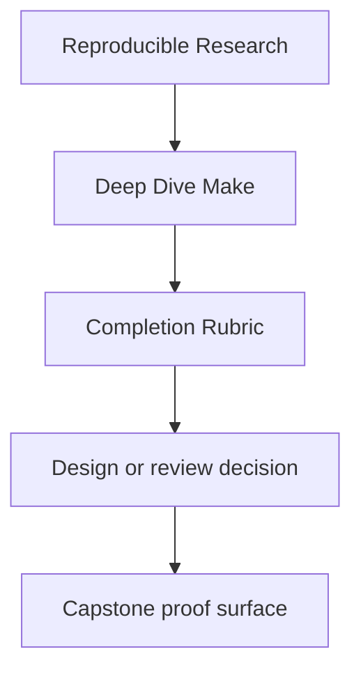
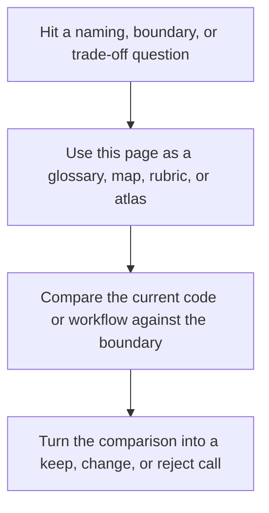

# Completion Rubric

<!-- page-maps:start -->
## Reference Position

<!-- page-maps:end -->

Read the first diagram as a lookup map: this page is part of the review shelf, not a first-read narrative. Read the second diagram as the reference rhythm: arrive with a concrete ambiguity, compare the current work against the boundary on the page, then turn that comparison into a decision.

This course should end with demonstrated judgment, not passive familiarity.

Use this rubric to decide whether a learner has actually completed Deep Dive Make in a
meaningful way.

---

## Core Standards

The learner should be able to do all of this without guessing:

| Standard | Evidence |
| --- | --- |
| explain a rebuild | `make --trace` plus a correct explanation of the triggering edge |
| prove convergence | successful `make all && make -q all` or equivalent |
| diagnose a parallel failure class | correct identification of missing edge, shared state, multi-writer output, or non-atomic publish |
| name the public build API | correct distinction between stable entrypoints and internal helpers |
| review a build | short written review covering graph truth, publication, operations, and migration risk |

[Back to top](#top)

---

## Module Milestones

| Module range | Minimum evidence |
| --- | --- |
| 01-02 | a small truthful build and one repaired race or ordering defect |
| 03-05 | a stable proof loop with selftests, diagnostics, and explicit hardening assumptions |
| 06-08 | one correctly modeled generator boundary and one clear release contract |
| 09-10 | one incident ladder and one written review or migration recommendation |

[Back to top](#top)

---

## Capstone Expectations

Completion does not require memorizing the capstone. It does require using it correctly.

The learner should be able to:

* run `make PROGRAM=reproducible-research/deep-dive-make test` and explain what it proves
* identify at least one hidden input modeled in the capstone
* identify at least one repro and describe the failure class it teaches
* explain why `attest` is separated from artifact identity

[Back to top](#top)

---

## Signs The Learner Is Not Done Yet

These are strong signals that more deliberate practice is needed:

* they can name features but cannot prove behavior
* they call every ordering problem a "Make quirk"
* they reach for `.PHONY` or stamps before explaining the graph truth
* they use the capstone as a script dump instead of as a proof specimen

[Back to top](#top)

---

## Best Final Exercise

A strong final exercise is a short review of a real Make-based repository with these
sections:

1. public targets
2. graph truth risks
3. publication risks
4. operational risks
5. migration or governance recommendation

That exercise reflects the real outcome of the course better than a trivia quiz.

[Back to top](#top)
