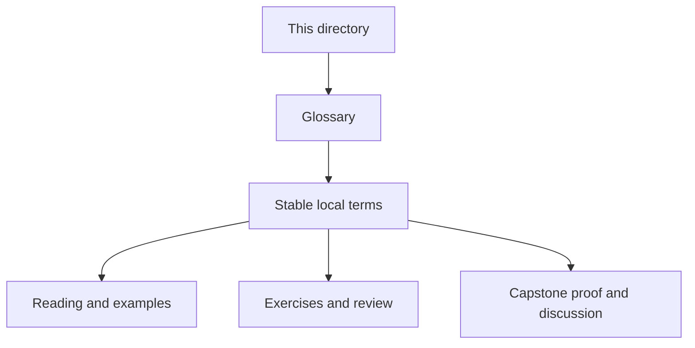
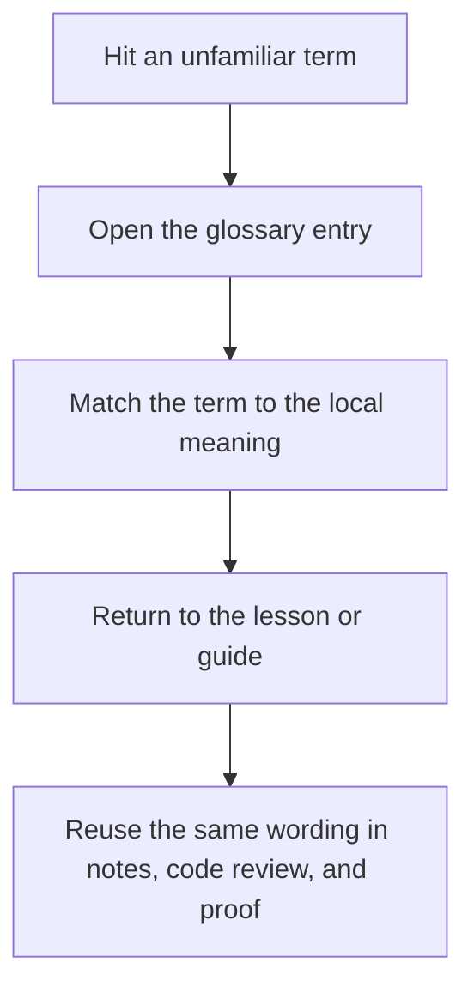

# Reference Glossary

<!-- page-maps:start -->
## Glossary Fit

<!-- page-maps:end -->

This glossary keeps Deep Dive Make's recurring terms stable across modules, reference
pages, and capstone review routes. Use it when a page is technically clear but the local
meaning of a word still feels slippery.

## How to use this glossary

Do not read this like a dictionary for its own sake. Open it when a term matters for a
decision: which page to read next, which boundary owns a change, or which proof route
should answer a question.

## Terms in this directory

| Term | Meaning in Deep Dive Make |
| --- | --- |
| Anti-Pattern Atlas | A symptom-led catalog of recurring build mistakes, used when you recognize a smell before you recognize the module that explains it. |
| Artifact Boundary Guide | The reference page that separates build outputs, review bundles, and teaching materials so publication and proof do not blur together. |
| Completion Rubric | The review standard for deciding whether a module, capstone change, or teaching surface is clear enough to keep as-is. |
| Concept Index | A lookup page that tells you where a concept is taught, reinforced, and proven across the program. |
| Incident Ladder | The debugging order for build incidents: start with intent, then trace causality, then escalate into smaller repros only when needed. |
| Mk Layer Guide | The description of what belongs in the top-level `Makefile` versus `mk/*.mk` helper layers. |
| Module Dependency Map | The reading-order map that shows which modules support later ones and which lessons should come first. |
| Practice Map | The crosswalk from module work to the capstone routes that corroborate the same ideas. |
| Public Targets | The stable command surface a learner or reviewer should rely on without reading every recipe in the repository. |
| Selftest Map | The page that explains how the selftest harness demonstrates convergence, schedule equivalence, and hidden-input detection. |
| Topic Boundaries | The page that distinguishes core course material from supporting context and out-of-scope extensions. |
