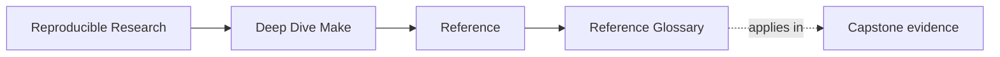
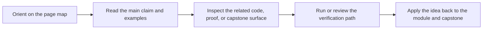

# Reference Glossary

<!-- page-maps:start -->
## Page Maps

<!-- page-maps:end -->

Use this page when a Deep Dive Make reference term is familiar enough to recognize but
still too fuzzy to choose confidently in review.

| Term | Meaning here |
| --- | --- |
| public target | a stable command surface review and maintenance work can rely on |
| graph truth | the property that dependencies and outputs reflect real build causality |
| convergence | the property that a successful build reaches an honestly up-to-date state |
| hidden input | a dependency that affects correctness but is easy to forget unless modeled explicitly |
| layer ownership | the question of whether behavior belongs in the top-level `Makefile`, a `mk/*.mk` layer, tests, or repros |
| proof bundle | a saved artifact set meant for later review rather than ordinary build consumption |
| failure specimen | a controlled broken example that isolates one failure class clearly |
| stewardship review | the stronger route used when a maintainer must judge the repository as a long-lived build specimen |
