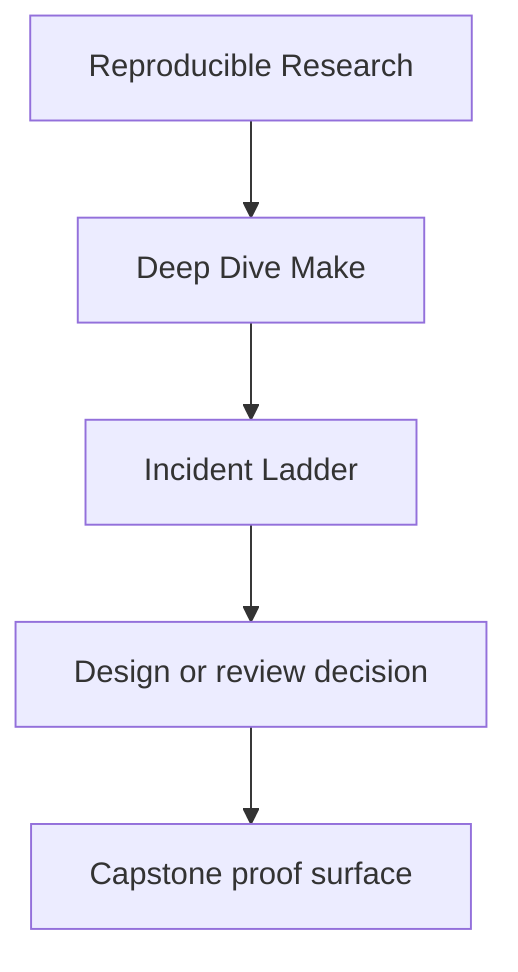
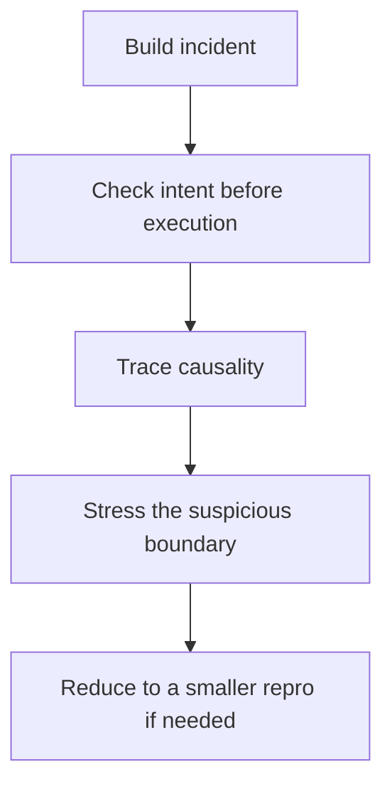

# Incident Ladder

<!-- page-maps:start -->
## Reference Position




<!-- page-maps:end -->

Use this page when a Make build is misbehaving and the main risk is confusion. The ladder
is an escalation order: do the cheapest clarifying step first, then move deeper only when
the current evidence stops being enough.

---

## 1. Check intent before execution

Ask what Make plans to do.

```sh
make -n <target>
```

Use this first when the wrong target runs, too many recipes fan out, or the default goal
looks suspicious.

---

## 2. Trace why work is happening

Ask why Make thinks the work is necessary.

```sh
make --trace <target>
```

This is the fastest route to a missing edge, stale prerequisite, or target whose meaning
changed without anyone noticing.

---

## 3. Inspect the evaluated build state

Ask what rules and variables Make actually ended up with.

```sh
make -p > build/make.dump
make show
make show-e
```

Use this when includes, overrides, or environment precedence are part of the problem.

---

## 4. Check convergence

Ask whether one successful build leaves the repository in a truthful up-to-date state.

```sh
make all
make -q all
```

If the second command still thinks work is needed, the build is not "mostly fine." It is
lying about state.

---

## 5. Change the schedule

Ask whether the graph stays truthful when scheduling changes.

```sh
make -j2 all
```

Parallel-only failures usually point to one of these:

- missing dependency edge
- shared mutable output
- non-atomic publication
- order-only prerequisite used in place of a real semantic dependency

---

## 6. Reduce to a smaller repro

If the build is still hard to explain, make the failure smaller before theorizing.

The target outcome is a tiny Makefile that preserves the defect class and removes
everything else. In this course, that often means checking `repro/` first and then
running the incident bundle route:

```sh
make incident-audit
```

That route captures the command, run output, and exit status so the review starts from
evidence instead of memory.

---

## Fast symptom table

| Symptom | First suspicion | First command |
| --- | --- | --- |
| unexpected rebuild | a prerequisite changed or discovery drifted | `make --trace <target>` |
| successful build never settles | hidden input or self-poisoning output | `make all && make -q all` |
| serial works but `-j` breaks | missing edge or shared state | `make -j2 all` |
| local behavior differs from another machine | variable precedence or portability drift | `make show-e` and `make portability-audit` |
| incident explanation is too hand-wavy | the repro is still too large | `make incident-audit` |

