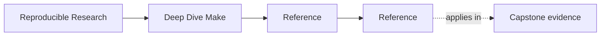
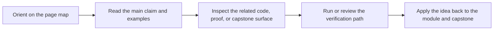

# Reference

<!-- page-maps:start -->
## Page Maps

<!-- page-maps:end -->

This shelf is for durable Make vocabulary, boundary questions, and completion standards.
Use it when the build concept is already recognizable and you need a stable review
surface for graph truth, public targets, proof routes, or stewardship.

## Choose the right reference route

| If your question is... | Best page |
| --- | --- |
| What does this term mean locally? | [Glossary](glossary.md) |
| Where does this idea sit in the course sequence? | [Module Dependency Map](module-dependency-map.md) |
| What should I practice or prove next? | [Practice Map](practice-map.md) |
| How should I review this build claim? | [Review Checklist](review-checklist.md) |
| Which sharper boundary question should I ask? | [Boundary Review Prompts](boundary-review-prompts.md) |
| How can I turn this idea into active recall? | [Self-Review Prompts](self-review-prompts.md) |
| What failure shape am I seeing? | [Anti-Pattern Atlas](anti-pattern-atlas.md) |
| What counts as genuinely complete understanding? | [Completion Rubric](completion-rubric.md) |
| Does this question belong in the course center or at its edge? | [Topic Boundaries](topic-boundaries.md) |

## What this shelf is for

- keeping graph truth, public target, artifact, and stewardship language stable
- turning build review into explicit keep, change, or reject calls
- connecting module order to local proof loops and capstone follow-up
- deciding whether a Make build deserves trust beyond one successful run

## Guide set

- [Glossary](glossary.md)
- [Module Dependency Map](module-dependency-map.md)
- [Practice Map](practice-map.md)
- [Review Checklist](review-checklist.md)
- [Boundary Review Prompts](boundary-review-prompts.md)
- [Self-Review Prompts](self-review-prompts.md)
- [Anti-Pattern Atlas](anti-pattern-atlas.md)
- [Completion Rubric](completion-rubric.md)
- [Topic Boundaries](topic-boundaries.md)

## Stop here when

- you know which reference page answers the current build or review question
- you can turn that page into one explicit judgment
- you know whether the next move is back to a module or into the capstone
