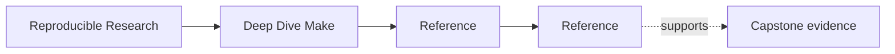
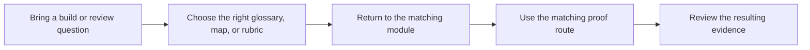

# Reference

<!-- page-maps:start -->
## Page Maps

<!-- page-maps:end -->

The reference surface holds the durable reading aids for Deep Dive Make. These pages are
for questions that recur across modules: vocabulary, learning order, stable target
surfaces, build layers, artifact boundaries, incident debugging order, and review
standards.

## Use This Section When

- you need the right vocabulary before reading a module again
- you want to know which target or layer is public and which is implementation detail
- you need the right proof route instead of the strongest one
- you are reviewing whether the course and capstone are keeping their promises

## Reference Pages

- [Module Dependency Map](module-dependency-map.md) for concept order and safe reading sequence
- [Build-Graph Glossary](build-graph-glossary.md) for durable terminology
- [Concept Index](concept-index.md) for locating where an idea is taught
- [Practice Map](practice-map.md) for module-to-proof routing
- [Public Targets](public-targets.md) for stable command surfaces
- [Incident Ladder](incident-ladder.md) for debugging order under pressure
- [Mk Layer Guide](mk-layer-guide.md) for the layered build architecture
- [Artifact Boundary Guide](artifact-boundary-guide.md) for separating outputs, proofs, and teaching surfaces
- [Selftest Map](selftest-map.md) for reading the build proof harness
- [Completion Rubric](completion-rubric.md) for course and repository review
