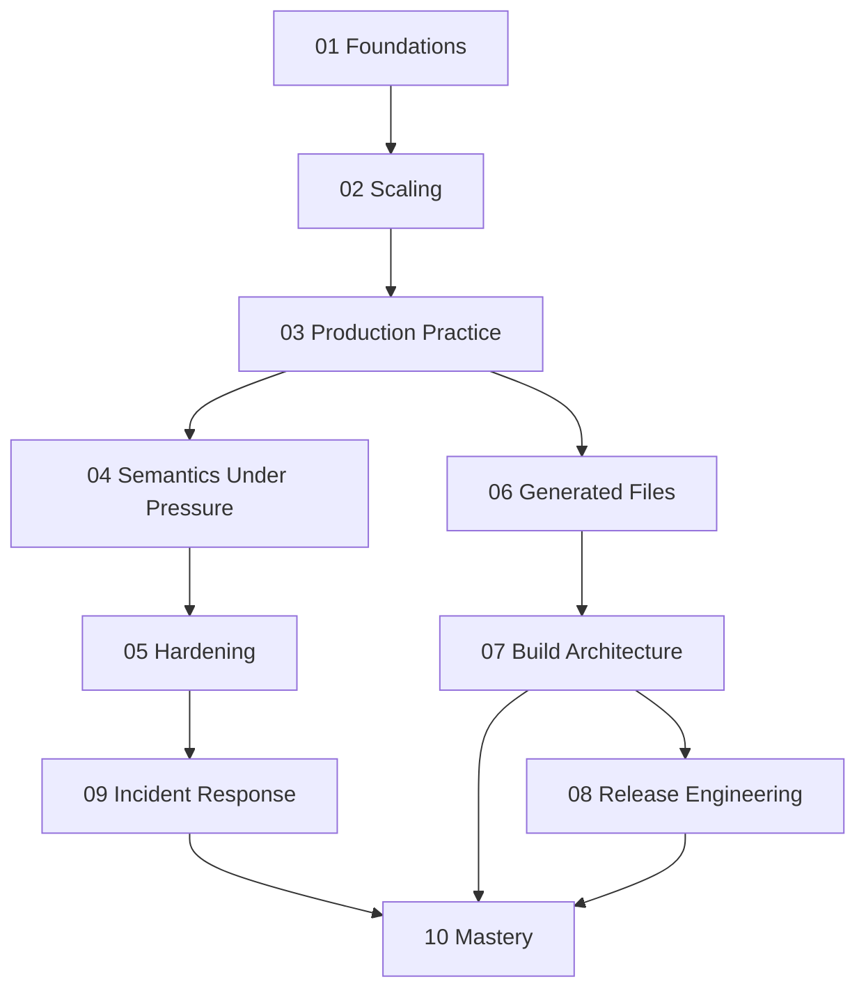

# Module Dependency Map

Use this page when you remember a Make concept but not why it appears where it does in
the course sequence.

## Main sequence

## Why the sequence looks like this

| Module | Depends most on | Reason |
| --- | --- | --- |
| 01 | none | graph truth and rebuild semantics are the floor beneath the course |
| 02 | 01 | scaling and `-j` pressure only matter after basic graph truth is clear |
| 03 | 01-02 | production practice needs a trustworthy graph before proving it |
| 04 | 01-03 | debugging and precedence are useful once the build already has structure |
| 05 | 03-04 | hardening depends on stable contracts and known failure modes |
| 06 | 03-05 | generated files are safe only after truth and boundary discipline are already in place |
| 07 | 02-06 | architecture decisions depend on graph truth plus boundary discipline |
| 08 | 03-07 | release engineering depends on a stable public build surface |
| 09 | 03-08 | incident response assumes the build already expresses its contracts clearly |
| 10 | all earlier modules | mastery review needs the whole build model together |

## Fastest safe paths

- first full pass: read Modules 01 through 10 in order
- working maintainer: start with Modules 03, 05, 07, and 09, then backfill earlier modules when graph truth gets fuzzy
- build steward: start with Modules 03, 07, 08, 09, and 10, then revisit earlier modules when a policy or artifact boundary points backward
