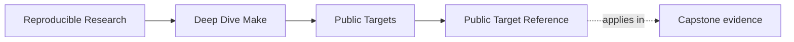
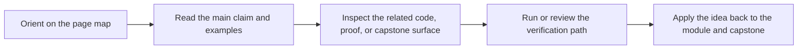

<a id="top"></a>

# Public Target Reference


<!-- page-maps:start -->
## Page Maps




<!-- page-maps:end -->

This page documents the stable command surfaces a learner, maintainer, or reviewer should
care about first.

The goal is to make the build API legible without requiring a scan of multiple Makefiles.

---

## Program-Level Targets

These live in `programs/reproducible-research/deep-dive-make/Makefile`.

| Target | Purpose | Use when |
| --- | --- | --- |
| `help` | list local development entrypoints | you are orienting yourself in the program directory |
| `test` | run the capstone selftest from the program root | you want one course-level verification command |
| `capstone` | build the capstone | you want artifacts without the full selftest |
| `capstone-selftest` | run the capstone proof harness | you are validating the reference build |
| `capstone-hardened` | run selftest plus audits and runtime checks | you want the strongest built-in validation |
| `inspect` | build the learner-facing inspection bundle | you want the smallest bounded review route |
| `capstone-walkthrough` | build the learner-facing walkthrough bundle | you want the bounded first-pass capstone route |
| `capstone-verify-report` | build the saved selftest report bundle | you want durable executed proof output |
| `capstone-confirm` | run the strongest shared confirmation route | you want the published review and validation surface |
| `capstone-clean` | clear capstone outputs | you need a clean build state |

[Back to top](#top)

---

## Capstone Targets

These live in `capstone/Makefile`.

| Target | Promise |
| --- | --- |
| `all` | build the main executable and dynamic binaries, then converge |
| `test` | run runtime behavior checks on built artifacts |
| `selftest` | prove convergence, serial/parallel equivalence, and a negative hidden-input case |
| `inspect` | alias the contract-audit route with learner review naming |
| `verify-report` | alias the selftest report with shared catalog naming |
| `walkthrough` | write the learner-facing walkthrough bundle |
| `tour` | print the recommended first reading route |
| `discovery-audit` | assert deterministic discovery order |
| `repro` | print the repro pack entrypoints |
| `attest` | write evidence without contaminating artifact identity |
| `trace-count` | report a lightweight observability metric |
| `portability-audit` | print tool and feature assumptions |
| `confirm` | alias the strongest capstone confirmation route |
| `hardened` | combine selftest, audits, attestations, and runtime checks |

[Back to top](#top)

---

## Stability Rules

Treat these as stable entrypoints:

* program-level `test`
* capstone `all`
* capstone `test`
* capstone `selftest`
* capstone `inspect`
* capstone `verify-report`
* capstone `hardened`
* capstone `confirm`
* capstone `help`
* capstone `walkthrough`
* capstone `tour`

Treat internal helper rules and file-specific recipes as implementation detail unless they
are explicitly documented here or in `help`.

[Back to top](#top)

---

## Best First Commands

If you are new to the course:

```sh
make PROGRAM=reproducible-research/deep-dive-make capstone-walkthrough
make PROGRAM=reproducible-research/deep-dive-make inspect
gmake -C capstone help
gmake -C capstone tour
gmake -C capstone selftest
```

If you are reviewing the course as a system:

```sh
make PROGRAM=reproducible-research/deep-dive-make test
make PROGRAM=reproducible-research/deep-dive-make capstone-confirm
```

[Back to top](#top)

---

## Best Target By Question

| Question | Smallest honest target |
| --- | --- |
| what is promised publicly | `inspect` |
| what proves the build contract | `selftest` |
| what saves durable proof | `verify-report` |
| what reviews one failure class | `incident-audit` |
| what reviews policy and observability boundaries | `profile-audit` |
| what bundles the sanctioned review route | `proof` |
| what performs the strongest stewardship pass | `confirm` |

[Back to top](#top)
