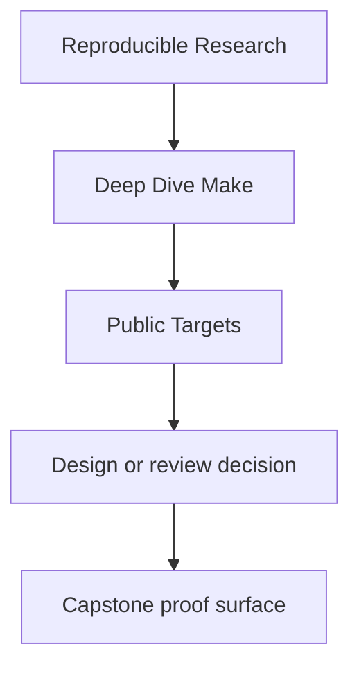
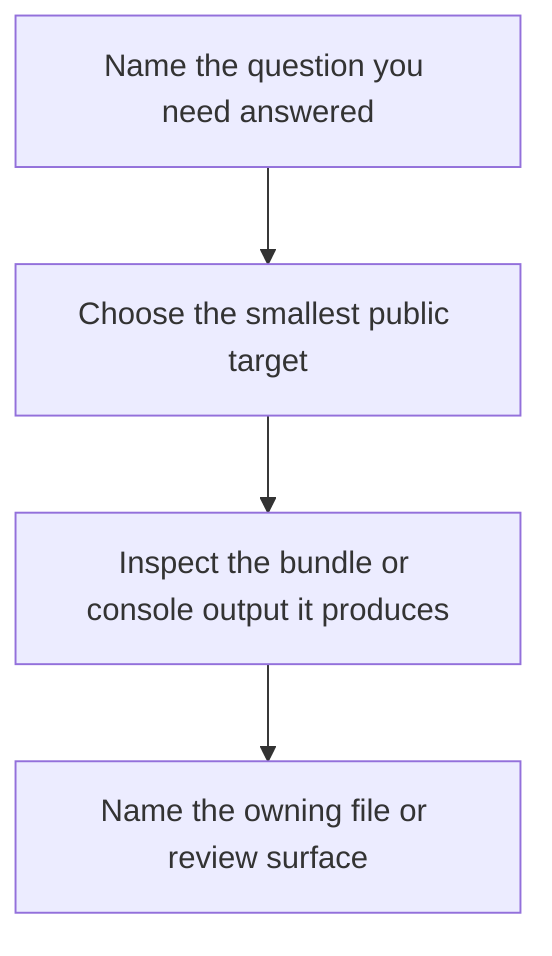

<a id="top"></a>

# Public Targets

<!-- page-maps:start -->
## Reference Position




<!-- page-maps:end -->

This page documents the stable command surface for Deep Dive Make. Use it to answer
"which command should I trust first?" without reading every recipe in both Makefiles.

---

## Program-level targets

These live in `programs/reproducible-research/deep-dive-make/Makefile`.

| Target | What it does | Use when |
| --- | --- | --- |
| `help` | lists the program-level entrypoints | you are orienting yourself at the program root |
| `test` | runs the capstone selftest through the program wrapper | you want one course-level verification command |
| `capstone` | builds the capstone outputs | you need artifacts without the broader audits |
| `capstone-selftest` | runs the capstone proof harness | you are validating build truth |
| `capstone-hardened` | runs the strongest built-in validation set | you want the capstone's full confirmation route |
| `capstone-tour` | prints the shortest review route and writes the tour bundle | you need a quick entry into the repository |
| `capstone-walkthrough` | writes the bounded first-pass walkthrough bundle | you want the learner-first reading route |
| `capstone-contract-audit` | writes the public-contract audit bundle | you are reviewing the published target surface |
| `capstone-incident-audit` | writes one executed incident bundle | you want one failure class with captured evidence |
| `capstone-verify-report` | writes the saved selftest report bundle | you need durable proof output |
| `capstone-profile-audit` | writes the execution-profile audit bundle | you are reviewing policy and precedence boundaries |
| `capstone-confirm` | runs the strongest shared stewardship route | you are closing a review loop |
| `inspect` | aliases `capstone/contract-audit` from the program root | you want the smallest honest public-contract review route |
| `proof` | writes the sanctioned bundle set from the program root | you need the multi-bundle stewardship route |

[Back to top](#top)

---

## Capstone targets

These live in `capstone/Makefile`.

| Target | What it proves or produces |
| --- | --- |
| `help` | the stable public interface and supported variables |
| `all` | the ordinary build result and convergence sentinel |
| `test` | runtime behavior checks on the built outputs |
| `selftest` | convergence, serial/parallel equivalence, and hidden-input detection |
| `walkthrough` | the learner-first walkthrough bundle |
| `tour` | the shortest printed repository route plus a focused tour bundle |
| `contract-audit` | the public-contract review bundle |
| `inspect` | the same contract audit route under learner-facing naming |
| `incident-audit` | one executed repro bundle with captured command and output |
| `profile-audit` | the execution-policy and precedence review bundle |
| `selftest-report` | the saved selftest evidence bundle |
| `verify-report` | the same selftest bundle under shared catalog naming |
| `proof` | the sanctioned set of walkthrough, selftest, contract, incident, and profile bundles |
| `confirm` | the strongest named review route |
| `hardened` | selftest, audits, attestation, and runtime checks together |
| `source-baseline-check` | the check that source packaging would not include local build residue |
| `source-bundle` | the tracked-source archive for learner or review distribution |

[Back to top](#top)

---

## Stable entrypoints

Treat these as the command surface the course and review material are allowed to rely on:

- program root: `help`, `test`, `inspect`, `proof`, `capstone-walkthrough`, `capstone-confirm`
- capstone root: `help`, `all`, `test`, `selftest`, `walkthrough`, `tour`, `inspect`,
  `incident-audit`, `profile-audit`, `verify-report`, `proof`, `confirm`

Treat helper recipes, temporary file rules, and layer-specific internals as implementation
detail unless they are exposed by `help` or documented in one of the capstone guides.

[Back to top](#top)

---

## Choose the smallest honest command

| Question | Start here |
| --- | --- |
| what does this repository promise publicly | `make inspect` |
| what does the build prove about itself | `make selftest` |
| how do I save proof output for review later | `make verify-report` |
| which failure class should I study with evidence | `make incident-audit` |
| what does this repository assume about tools and variable sources | `make profile-audit` |
| what is the first bounded route for a new reader | `make walkthrough` |
| what is the strongest shared stewardship route | `make confirm` |

[Back to top](#top)

---

## Good first commands

From the program root:

```sh
make PROGRAM=reproducible-research/deep-dive-make capstone-walkthrough
make PROGRAM=reproducible-research/deep-dive-make inspect
make PROGRAM=reproducible-research/deep-dive-make test
```

Inside `capstone/`:

```sh
gmake walkthrough
gmake help
gmake selftest
```

Use `gmake` on macOS inside `capstone/`, because `/usr/bin/make` is BSD Make rather than
GNU Make.

[Back to top](#top)
