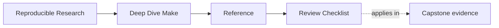
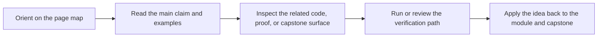

# Review Checklist

<!-- page-maps:start -->
## Page Maps

<!-- page-maps:end -->

Use this checklist when reviewing a Make build, module exercise, or capstone change. The
goal is to turn build feelings into explicit review judgments.

## Graph truth

- Can you explain why work happens with a real edge or input rather than a superstition?
- Does one successful build converge, or does the graph still lie on the second pass?
- Would changing the schedule alter artifact meaning or only throughput?

## Public contract

- Which targets are truly public, and which are only helper implementation detail?
- Does the documented command surface match what `help` exposes?
- Would a new maintainer know which target to trust first without recipe archaeology?

## Layer ownership

- Which layer should own this behavior: top-level `Makefile`, `mk/*.mk`, tests, or repros?
- Does the current placement make the build easier to review or only more indirect?
- Does the review path make the right file discoverable without oral history?

## Artifact and proof boundaries

- Which outputs are build results, which are review evidence, and which are only failure specimens?
- Is proof output kept separate from artifact identity?
- Does the repro material isolate one failure class clearly without masquerading as production advice?

## Stewardship

- Which command gives the narrowest honest proof for the current claim?
- Which layer owns the behavior under review: top-level `Makefile`, `mk/*.mk`, tests, or repros?
- Which change would you reject because it hides the graph more than it helps?
