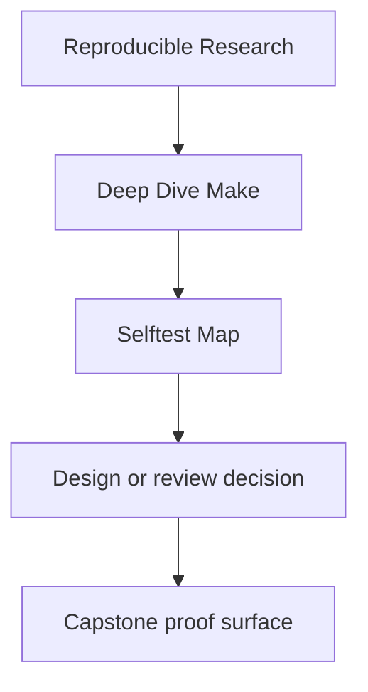
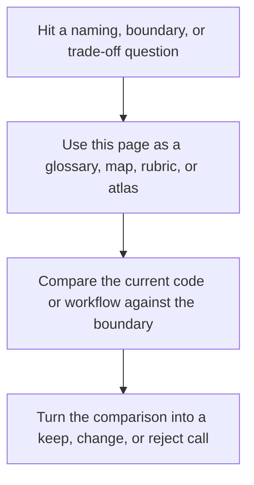

# Selftest Map

<!-- page-maps:start -->
## Reference Position

<!-- page-maps:end -->

Read the first diagram as a lookup map: this page is part of the review shelf, not a first-read narrative. Read the second diagram as the reference rhythm: arrive with a concrete ambiguity, compare the current work against the boundary on the page, then turn that comparison into a decision.

`selftest` is the most important executable proof in Deep Dive Make. This page maps each
step of the harness to the build claim it is defending.

Use it when you want to understand why `selftest` is stronger than `make all`.

---

## Selftest Steps

| Step in `tests/run.sh` | What it proves | Main files |
| --- | --- | --- |
| convergence | a successful build reaches an up-to-date state | `capstone/Makefile`, `capstone/tests/run.sh` |
| serial-parallel equivalence | `-j` changes throughput, not artifact meaning | `capstone/tests/run.sh`, `capstone/repro/` |
| trace guardrail | observability cost is bounded instead of drifting silently | `capstone/tests/run.sh`, `capstone/Makefile` |
| hidden input detection | the harness can detect a lying graph rather than only happy paths | `capstone/tests/run.sh`, `capstone/mk/stamps.mk` |

[Back to top](#top)

---

## Why This Matters

`make all` tells you the build succeeded once. `selftest` tells you whether the build
contract is still honest.

That distinction is why the course keeps returning to `selftest` when it talks about
proof, not only compilation.
When you need that proof preserved as a review bundle, use
`make PROGRAM=reproducible-research/deep-dive-make capstone-verify-report` and read the
capstone's local [`SELFTEST_GUIDE.md`](https://github.com/bijux/bijux-masterclass/blob/master/programs/reproducible-research/deep-dive-make/capstone/SELFTEST_GUIDE.md).

[Back to top](#top)

---

## Best Reading Order

1. `capstone/Makefile`
2. `capstone/tests/run.sh`
3. this page
4. `make PROGRAM=reproducible-research/deep-dive-make test`

That order keeps the learner anchored in contract, then harness, then executed proof.

[Back to top](#top)

---

## Best Companion Pages

Use these pages with this map:

* [`capstone-proof-checklist.md`](../capstone/capstone-proof-checklist.md)
* [`proof-matrix.md`](../guides/proof-matrix.md)
* [`capstone-review-worksheet.md`](../capstone/capstone-review-worksheet.md)

[Back to top](#top)
