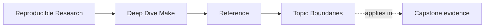
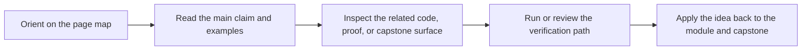

# Topic Boundaries

<!-- page-maps:start -->
## Page Maps

<!-- page-maps:end -->

Read the first diagram as a lookup map: this page is part of the review shelf, not a first-read narrative. Read the second diagram as the reference rhythm: arrive with a concrete ambiguity, compare the current work against the boundary on the page, then turn that comparison into a decision.

This page answers a question the rest of the course only implied: which Make topics are
core to this program, which ones support the core, and which ones are intentionally
treated as boundaries rather than as central course goals.

Use it when the course feels incomplete, too opinionated, or too selective. The point is
to make that selectivity explicit instead of accidental.

---

## Core Topics This Course Must Teach Well

These are the non-negotiable topics. If these are unclear, the course is not doing its
job.

| Topic family | Why it is core | Primary modules | Typical proof |
| --- | --- | --- | --- |
| truthful dependency graphs | Make is only trustworthy when edges are real | 01, 02, 06 | `make --trace`, convergence, depfile checks |
| parallel safety | `-j` must change throughput, not meaning | 02, 03, 05 | serial versus parallel equivalence |
| deterministic build behavior | flaky rebuild meaning destroys confidence | 02, 03, 09 | selftest, rooted discovery, incident evidence |
| public target contracts | review and maintenance need a stable build API | 03, 07, 08 | `make help`, contract audit, review bundles |
| generated-file boundaries | generators are where build truth often collapses | 05, 06 | generated-header routes and repros |
| release and publication contracts | outputs need a trustworthy downstream surface | 06, 08 | dist, attest, install, contract audit |
| operational review and migration judgment | a long-lived build needs stewardship, not only syntax | 09, 10 | incident audit, review dump, migration rubric |

---

## Supporting Topics That Matter, But Serve The Core

These topics matter because they make the core topics legible and enforceable.

| Topic family | How this course uses it | Where it appears |
| --- | --- | --- |
| variable precedence and `origin` | to explain why a build behaved differently | Module 04 |
| include and restart behavior | to keep layered builds truthful and debuggable | Modules 04, 07 |
| jobserver and recursion | to stop scalability from corrupting semantics | Modules 05, 07 |
| portability constraints | to make boundaries explicit instead of folkloric | Module 05 |
| observability surfaces | to turn incidents into explainable evidence | Module 09 |
| build macros | to support reuse without inventing a private language | Module 07 |

These topics are important, but they are never the final destination. The destination is
always a more trustworthy build.

---

## Boundaries This Course Names Deliberately

These are real topics, but they are not treated as the main point of Deep Dive Make.

| Boundary topic | Why it is not the center of this course | What we do instead |
| --- | --- | --- |
| shell programming craft | the course teaches build semantics, not shell language depth | keep shell logic thin and explicitly bounded |
| compiler internals | correctness does not require turning the course into a C toolchain guide | use the C project as pressure, not as the main subject |
| package-manager design | release contracts matter more here than ecosystem packaging politics | keep focus on artifact boundaries and installation contracts |
| CI platform administration | CI is a proof surface, not the main topic | teach stable targets and deterministic checks instead |
| generalized workflow orchestration | Make is one tool among several | Module 10 teaches when to stop using Make |

When you want more on one of these topics, the honest answer is not “the course
covers everything.” The honest answer is “the course touches this where it affects build
truth, then hands off.”

---

## Topics People Often Expect But Should Not Overweight

These topics are easy to fetishize and easy to teach badly:

* clever macro tricks that hide meaning instead of clarifying it
* recursive Make patterns treated as architecture rather than as controlled boundaries
* stamp files used as tradition instead of as explicit modeled state
* `eval` used as a magic tool rather than a quarantined advanced mechanism
* portability folklore that is never connected back to the graph contract

The course mentions these only when they sharpen judgment. It does not treat them as a
badge of Make sophistication.

---

## Blind Spots This Page Protects Against

Without an explicit boundary page, it is easy to come away with the wrong conclusions:

* “The course forgot shell and compiler topics.”
  It did not forget them. It scoped them to what Make truth actually depends on.
* “The course should teach every GNU Make feature equally.”
  It should not. Some features matter far more to correctness than others.
* “If a build works once, the advanced topics are optional.”
  They are not. Production correctness appears later, under pressure.
* “Make itself should solve every orchestration problem.”
  Module 10 exists precisely to prevent that mistake.

---

## Best Companion Pages

Use these with this page:

* [`module-dependency-map.md`](module-dependency-map.md) to find where a topic is actually taught
* [`module-dependency-map.md`](module-dependency-map.md) to see the safe learning order
* [`review-checklist.md`](review-checklist.md) to separate the stable API from implementation detail
* [`capstone-map.md`](../capstone/capstone-map.md) to choose the smallest honest proof route
