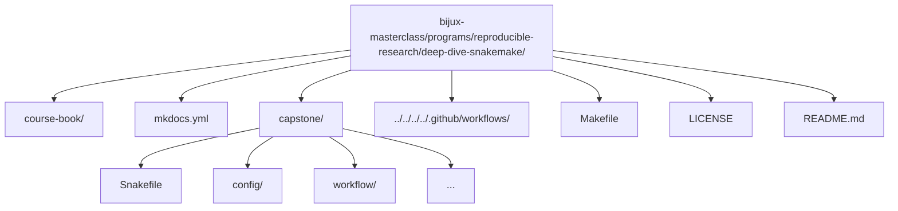

# Deep Dive Snakemake

A program guide and executable capstone that teaches **Snakemake as a workflow engine**—not merely a collection of rules and scripts. The objective is to enable the creation of workflows that feature **explicit contracts, safe dynamic behavior, atomic outputs, reproducible execution, and built-in validation**, from first-contact workflow design to long-lived workflow stewardship.

> CI executes full confirmation runs including workflow execution and artifact validation.

---

## Who this program is for

- Engineers who already know basic Snakemake syntax and now need stronger workflow design judgment
- Engineers and researchers who want a beginner-to-mastery path instead of scattered Snakemake snippets
- Researchers and platform teams maintaining pipelines that must survive CI, shared filesystems, and long-lived change
- Reviewers who want concrete criteria for deciding whether a workflow is robust or merely convenient

## Who this program is not for

- Readers who only want isolated snippets without understanding workflow contracts
- Teams trying to debug executor behavior before they understand their workflow semantics

## What this is

Many Snakemake workflows function adequately in simple cases but encounter issues under scale: implicit dependencies, checkpoint misuse, non-atomic outputs, configuration drift, or reproducibility failures across environments.

**Deep Dive Snakemake** provides a structured approach to robust design. It emphasizes a strict contract:

- **Explicit inputs/outputs**: every dependency and product is declared and enforced.
- **Atomic publication**: outputs are written safely with no partial artifacts.
- **Dynamic safety**: checkpoints and re-evaluation used correctly without races or surprises.
- **Configuration discipline**: validated schemas and modular composition.
- **Reproducibility**: profiles, manifests, and integrity checks for verifiable runs.
- **Self-validation**: wrapper-driven checks confirm correctness end-to-end.

This repository offers a structured beginner-to-mastery path through Snakemake semantics: understanding its guarantees, limitations, and patterns that ensure workflows remain reliable as complexity increases.

The repository now separates four surfaces clearly:

- `course-book/guides/` for learner entry, pressure routes, promise maps, checkpoints, and proof sizing
- `course-book/capstone/` for workflow entry, command routing, publish review, and profile review
- `course-book/reference/` for stable maps, glossary pages, anti-pattern routing, and review checklists
- `course-book/module-00-orientation/` through `course-book/module-10-*/` for the actual learning arc

Use the course in this order:

1. `course-book/guides/start-here.md`
2. `course-book/guides/pressure-routes.md`
3. `course-book/guides/course-guide.md`
4. `course-book/guides/module-promise-map.md`
5. `course-book/guides/module-checkpoints.md`
6. `course-book/module-00-orientation/index.md`
7. Modules `01` to `10` in order
8. `course-book/guides/proof-ladder.md`, `course-book/capstone/index.md`, and `course-book/capstone/capstone-map.md` once the local model is clear

[Back to top](#top)

---

## What you should be able to do after this program

- explain why a workflow re-runs using evidence instead of intuition
- distinguish a truthful dynamic DAG from a workflow that only appears to work
- separate workflow logic, profile policy, and published artifact contracts cleanly
- extend a pipeline without weakening its publish boundary or provenance story
- review a Snakemake repository for hidden coupling, poison artifacts, and reproducibility gaps

[Back to top](#top)

---

## What you get

### 1) The program guide

A compact, focused handbook with a full 10-module progression:

- **01 — First Principles**: file contracts, targets, dry-runs, and the basic Snakemake mental model
- **02 — Dynamic DAGs**: checkpoints, deterministic discovery, integrity, and dynamic safety
- **03 — Production Operation**: profiles, retries, staging, and governance
- **04 — Scaling Patterns**: modularity, interfaces, CI gates, and executor-proof semantics
- **05 — Rule Boundaries**: scripts, wrappers, environments, and helper-code discipline
- **06 — Publish Contracts**: versioned outputs, manifests, reports, and downstream trust
- **07 — Workflow Architecture**: modules, file APIs, repository structure, and reuse
- **08 — Operating Contexts**: profiles, executors, storage, and staging policy
- **09 — Incident Response**: performance, observability, and workflow debugging under pressure
- **10 — Mastery**: governance, migration, anti-patterns, and tool-boundary judgment

Read on the website: https://bijux.io/bijux-masterclass/reproducible-research/deep-dive-snakemake/

### 2) The executable capstone

`capstone/` is a complete end-to-end pipeline on toy FASTQ data that embodies the principles above, demonstrating:

- checkpoint-driven sample discovery
- per-sample processing stages
- summary and report generation
- versioned `publish/v1/` outputs
- checksummed manifest and artifact sanity checks
- a Make-driven verification flow

### 3) Review surfaces that keep the course honest

The course now includes dedicated support pages for:

- topic boundaries and blind spots
- module promise tracking
- module-end checkpoints
- anti-pattern routing
- proof sizing and capstone escalation

[Back to top](#top)

---

## Recommended background

- Comfortable shell usage and basic Python workflow tooling
- Basic Snakemake familiarity: rules, wildcards, `snakemake -n`, and dry-run interpretation
- Willingness to treat workflow design as an engineering contract rather than as glue code

[Back to top](#top)

---

## Quick start

Prerequisites:
- Python 3.11+
- `make`

From the repository root:

### Preview the course book locally

```bash
make PROGRAM=reproducible-research/deep-dive-snakemake docs-serve
```

Open the local URL displayed by MkDocs.

### Run the capstone reference workflow

```bash
make PROGRAM=reproducible-research/deep-dive-snakemake capstone-walkthrough
make PROGRAM=reproducible-research/deep-dive-snakemake capstone-tour
make PROGRAM=reproducible-research/deep-dive-snakemake test
```

This executes formatting/linting/tests, a dry-run, full workflow execution, and artifact validation.

Use `capstone-walkthrough` first, `capstone-tour` when you need an executed repository
route, and `test` for the ordinary proof pass.

On a fresh machine, prefer
`make PROGRAM=reproducible-research/deep-dive-snakemake capstone-bootstrap-confirm`
before relying on any global `snakemake` install. The exact setup contract lives in
`course-book/guides/platform-setup.md`.

[Back to top](#top)

---

## How to study this program well

1. Start with `course-book/guides/start-here.md`, then `course-book/guides/pressure-routes.md` if your context is not calm first-contact study.
2. Use `course-book/guides/module-promise-map.md` and `course-book/guides/module-checkpoints.md` to keep the module arc honest as you go.
3. Work through Modules 01 to 10 in order because later workflow patterns depend on earlier file-contract discipline.
4. Use `course-book/guides/proof-ladder.md`, `course-book/capstone/index.md`, `course-book/capstone/capstone-map.md`, and `course-book/guides/proof-matrix.md` when you need to enter the reference workflow deliberately instead of browsing randomly.
5. Re-run the capstone proof targets regularly so the workflow stays executable in your head, not only in prose.
6. Use dry-runs, summaries, and proof artifacts as learning tools, not only as debugging tools.

[Back to top](#top)

---

## How to know you are succeeding

- You can explain every published artifact and why it belongs at the publish boundary.
- You can describe what a checkpoint is allowed to discover and what it must never hide.
- You can distinguish executor policy from workflow semantics.
- You can review a workflow and identify hidden coupling, poison artifacts, or provenance gaps quickly.

[Back to top](#top)

---

## Module map

| Module | Title | Main focus |
| --- | --- | --- |
| `00` | Orientation and Study Practice | establish the learner route, proof surfaces, and capstone timing |
| `01` | File Contracts and Workflow Graph Truth | teach the workflow as a file-driven DAG instead of a script |
| `02` | Dynamic DAGs, Discovery, and Integrity | teach deterministic discovery, checkpoint discipline, and publish integrity |
| `03` | Production Operations and Policy Boundaries | teach profiles, recovery policy, staging discipline, and production proof routes |
| `04` | Scaling Workflows and Interface Boundaries | scale the workflow without losing explicit interfaces |
| `05` | Software Boundaries and Reproducible Rules | keep helper code and rule meaning in the right layer |
| `06` | Publishing and Downstream Contracts | make the public artifact boundary versioned and trustworthy |
| `07` | Workflow Architecture and File APIs | organize the repository so ownership stays visible |
| `08` | Operating Contexts and Execution Policy | compare local, CI, and cluster policy without semantic drift |
| `09` | Observability, Performance, and Incident Response | review logs, benchmarks, and incidents with explicit evidence |
| `10` | Governance, Migration, and Tool Boundaries | finish with stewardship, migration, and tool-boundary judgment |

[Back to top](#top)

---

## Repository layout



[Back to top](#top)

---

## Capstone promise

The capstone is the course’s executable proof. It is not decorative. It exists so that
the big claims in the course can always be located in runnable workflow behavior:

- explicit discovery instead of hidden sample state
- versioned publishing instead of informal results directories
- profiles as policy instead of tribal command lines
- verification gates instead of “it ran once” confidence

[Back to top](#top)

---

## Contributing

Contributions that enhance correctness, clarity, or reproducibility are welcome (improvements to documentation, exercises, or capstone hardening).

1. Fork and clone `bijux-masterclass`.
2. Implement a focused change (documentation or capstone).
3. From the monorepo root, verify:
   ```bash
   make PROGRAM=reproducible-research/deep-dive-snakemake test
   ```
4. Open a pull request against `master` or `main`.

[Back to top](#top)

---

## License

MIT — see the repository root [LICENSE](https://github.com/bijux/bijux-masterclass/blob/master/LICENSE). © 2025 Bijan Mousavi <bijan@bijux.io>.

[Back to top](#top)
