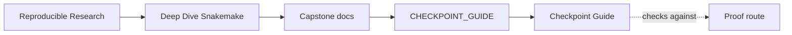
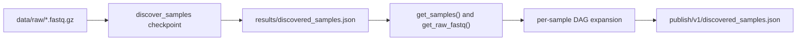

# Checkpoint Guide

<!-- page-maps:start -->
## Guide Maps

<!-- page-maps:end -->

This guide explains the only genuinely dynamic part of the workflow. Without it, the
capstone risks feeling like the sample list appears by magic. With it, the learner can
see that discovery is a visible contract with a durable artifact and a controlled
re-evaluation point.

---

## Checkpoint Claim

The checkpoint exists to make sample discovery explicit:

- the workflow scans `data/raw/` once through a named rule
- it writes the discovered sample registry to JSON
- helper functions read that registry to decide which sample-specific jobs exist
- the published boundary preserves the same discovery artifact for later review

This is dynamic DAG behavior, but it is not hidden DAG behavior.

---

## Where To Read The Story

1. `Snakefile` for `checkpoint discover_samples` and `rule publish_discovered_samples`
2. `workflow/rules/common.smk` for `discovery_payload()`, `get_samples()`, and `get_raw_fastq()`
3. `publish/v1/discovered_samples.json` for the reviewable result
4. `WORKFLOW_STAGE_GUIDE.md` for where discovery fits in the larger workflow

---

## What The Artifact Must Settle

`discovered_samples.json` should answer:

- which files were discovered
- how many files were seen
- which sample names were created
- whether each sample is treated as `SE` or `PE`
- which read paths belong to each sample

If that file cannot answer those questions, the checkpoint is not honest enough for this
course.

---

## Review Questions

- Which source file would you change if sample naming rules changed?
- Which source file would you change if paired-end support became real instead of deferred?
- Which artifact would you inspect before blaming downstream rules for a missing sample?
- Which part of the workflow proves that dynamic discovery became durable evidence?

