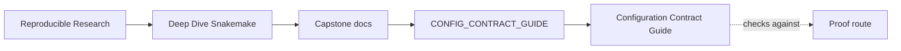
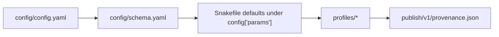

# Configuration Contract Guide

<!-- page-maps:start -->
## Guide Maps

<!-- page-maps:end -->

This guide explains a subtle but important part of the capstone: configuration truth is
assembled in layers. If a learner only reads `config/config.yaml`, they will miss the
defaults that `Snakefile` adds, the execution policy that profiles add, and the
materialized view that provenance finally records.

---

## Configuration Claim

The capstone keeps configuration honest by separating four jobs:

- `config/config.yaml` supplies the learner-edited repository settings
- `config/schema.yaml` rejects invalid repository settings
- `Snakefile` fills in the durable defaults that the course wants to teach
- `profiles/` change execution policy without changing analytical meaning

The materialized truth of those layers appears later in `publish/v1/provenance.json`.

---

## Read In This Order

1. `config/config.yaml`
2. `config/schema.yaml`
3. `Snakefile`
4. `profiles/`
5. `publish/v1/provenance.json`

Run `make config-summary` when you want the shortest honest artifact that combines the
repository config with the materialized run record.

That route moves from explicit user settings, to validation rules, to default injection,
to operating policy, and finally to the fully materialized run record.

---

## What Each Layer Is Allowed To Change

| Layer | Can change | Must not hide |
| --- | --- | --- |
| `config/config.yaml` | repository-level settings such as discovery mode and named sample inputs | implicit defaults that only exist in someone’s head |
| `config/schema.yaml` | validation rules and type constraints for learner-edited config | runtime-only defaults or publish semantics |
| `Snakefile` | stable defaults for params, directories, and publish version | executor policy or hidden analytical branches |
| `profiles/` | scheduling, latency, logging, and executor-facing policy | analytical meaning or sample identity |
| `provenance.json` | nothing; it records the resolved run state | ambiguity about what configuration actually ran |

---

## Review Questions

- Which setting belongs in the repository config, and which belongs in a profile?
- Which defaults are teaching defaults from `Snakefile`, not user-edited config?
- Which file proves what actually ran after all defaults and policy layers resolved?
- Which change would require a rerun because it affects analytical meaning instead of operating policy?
