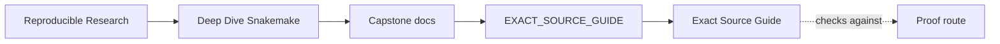
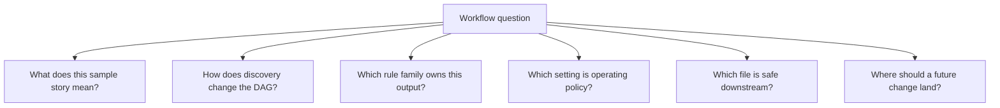

# Exact Source Guide

<!-- page-maps:start -->
## Guide Maps

<!-- page-maps:end -->

This guide exists for one reason: a learner should not need to scan the whole
repository to answer a narrow question. Each row below gives the smallest honest source
route for a real review question.

---

## Question-To-File Route

| If the question is... | Start here | Then read |
| --- | --- | --- |
| what biological story does this workflow tell? | `DOMAIN_GUIDE.md` | `README.md`, `FILE_API.md` |
| how does sample discovery work? | `CHECKPOINT_GUIDE.md` | `Snakefile`, `workflow/rules/common.smk` |
| which rule family owns this stage? | `WORKFLOW_STAGE_GUIDE.md` | `Snakefile`, the matching `workflow/rules/*.smk` file |
| which layer should own this change? | `ARCHITECTURE.md` | `EXTENSION_GUIDE.md` |
| which profile or config file changes execution policy? | `PROFILE_AUDIT_GUIDE.md` | `profiles/`, `config/`, `Makefile` |
| which published files are safe to trust downstream? | `PUBLISH_REVIEW_GUIDE.md` | `FILE_API.md`, `publish/v1/`, `scripts/verify_publish.py` |
| which command gives the narrowest honest proof? | `PROOF_GUIDE.md` | `Makefile`, `TOUR.md`, bundle `route.txt` files |
| where should I inspect executed evidence first? | `TOUR.md` | `summary.txt`, `run.txt`, `verify.txt`, publish artifacts |

---

## Reading Discipline

- Start with the guide that matches the question, not the biggest guide.
- Move from guide to owning file, not from file to random file.
- Read the generated artifact when the claim is about evidence, not just source code.
- Escalate from walkthrough to tour to proof only when the smaller route stopped being honest.

---

## Review Questions

- Which question are you actually trying to answer right now?
- Which file is the owning surface, and which file is only supporting context?
- Which generated artifact must agree with the source before you trust the claim?
- Which guide would you hand to a learner so they avoid opening ten files too early?

