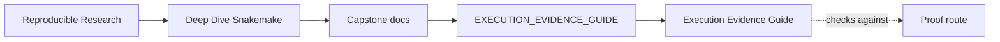
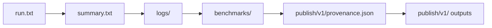

# Execution Evidence Guide

<!-- page-maps:start -->
## Guide Maps

<!-- page-maps:end -->

This guide explains how to read executed evidence without flattening every question into
"did the workflow run?" Different evidence surfaces answer different questions, and the
capstone becomes much easier to review when those roles are explicit.

---

## Evidence Claim

Executed evidence should separate at least five questions:

- what Snakemake planned and executed
- what each rule logged while it ran
- what performance and size signals benchmarks captured
- what configuration and runtime identity provenance recorded
- what stable outputs were finally published

If one surface has to answer all five, review gets noisy fast.

---

## Which Surface Answers Which Question

| Surface | Best question it answers |
| --- | --- |
| `run.txt` | what happened during the real Snakemake execution |
| `summary.txt` | which outputs exist, were rebuilt, or remained up to date |
| `logs/` | what a specific rule reported while it ran |
| `benchmarks/` | what time and resource-adjacent evidence was recorded per rule |
| `publish/v1/provenance.json` | what configuration, toolchain, and environment identity produced the run |
| `publish/v1/` | what stable outputs survived promotion into the public contract |

---

## Reading Route

1. `TOUR.md`
2. `run.txt`
3. `summary.txt`
4. `logs/` for one concrete rule
5. `benchmarks/` for the matching rule
6. `publish/v1/provenance.json`
7. `publish/v1/`

---

## Review Questions

- Which evidence surface answers the current question with the least noise?
- Which rule log should you open before changing a rule contract?
- Which benchmark file matters if a maintainer claims performance-sensitive drift?
- Which provenance field matters first if a run changed even though the repository did not?

