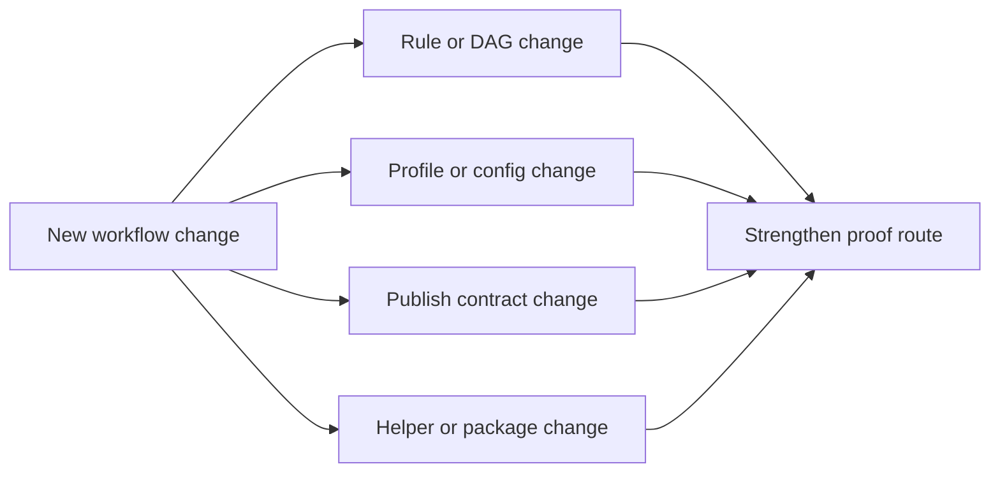
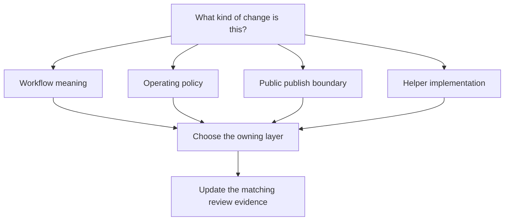

# Extension Guide

<!-- page-maps:start -->
## Guide Maps

<!-- page-maps:end -->

This guide explains how to extend the capstone without weakening the boundary story the
course depends on.

---

## If The Change Is Workflow Meaning

- prefer `Snakefile`, `workflow/rules/`, or `workflow/modules/`
- keep the new rule contracts visible
- strengthen walkthrough, dry-run, and tour evidence

[Back to top](#top)

---

## If The Change Is Operating Policy

- prefer `profiles/` or validated config surfaces
- keep the change operational rather than analytical
- prove the boundary again with `make profile-audit`

[Back to top](#top)

---

## If The Change Is Public Publish Contract

- prefer `FILE_API.md`, publish rules, and verification surfaces
- treat versioned publish changes as trust-boundary changes, not convenience edits
- strengthen `make verify-report` and publish review documentation

[Back to top](#top)

---

## If The Change Is Helper Implementation

- prefer `workflow/scripts/` for workflow-adjacent helpers
- prefer `src/capstone/` for reusable implementation code
- do not let helper code bury visible workflow meaning

Use `MODULE_BOUNDARY_GUIDE.md` when the question is not just "which file," but which
kind of reusable surface should own the change.

[Back to top](#top)

---

## Final Review Question

If another maintainer saw this change a year later, would the owning layer still feel
obvious from the repository structure and proof surface?

[Back to top](#top)
